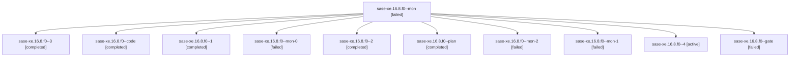

# Family: sase-xe.16.8.f0

[Agent Hoods](../README.md) / [bbugyi200](../users/bbugyi200/README.md) / [athena](../users/bbugyi200/machines/athena/README.md) / [sase-xe](../users/bbugyi200/machines/athena/hoods/sase-xe/README.md) / sase-xe.16.8.f0

Owner: `bbugyi200.athena` · Hood: `sase-xe` · Members: 11

## Lineage

The diagram is an optional enhancement; the ordered table below contains the same lineage in accessible text.

| Role | Agent | State | Model / provider | Timing | Commits | Prompt | Chat |
|---|---|---|---|---|---:|---|---|
| mon | sase-xe.16.8.f0--mon | failed | gpt-5.5 / codex | 2026-09-08T16:34:26.635594+00:00 → 2026-09-08T17:52:49.334852+00:00 | 0 | — | [Chat](../agents/bbugyi200.athena.sase-xe.16.8.f0--mon/chat.md) |
| 3 | sase-xe.16.8.f0--3 | completed | gpt-5.5 / codex | 2026-09-08T21:27:14.918940+00:00 → 2026-09-08T21:41:35.468513+00:00 | 0 | [Prompt](../agents/bbugyi200.athena.sase-xe.16.8.f0--3/prompt.md) | [Chat](../agents/bbugyi200.athena.sase-xe.16.8.f0--3/chat.md) |
| code | sase-xe.16.8.f0--code | completed | gpt-5.5 / codex | 2026-09-08T15:28:41.569700+00:00 → 2026-09-08T16:35:55.934095+00:00 | 0 | [Prompt](../agents/bbugyi200.athena.sase-xe.16.8.f0--code/prompt.md) | [Chat](../agents/bbugyi200.athena.sase-xe.16.8.f0--code/chat.md) |
| 1 | sase-xe.16.8.f0--1 | completed | gpt-5.5 / codex | 2026-09-08T17:53:34.446055+00:00 → 2026-09-08T18:18:42.783814+00:00 | 0 | [Prompt](../agents/bbugyi200.athena.sase-xe.16.8.f0--1/prompt.md) | [Chat](../agents/bbugyi200.athena.sase-xe.16.8.f0--1/chat.md) |
| mon-0 | sase-xe.16.8.f0--mon-0 | failed | gpt-5.5 / codex | 2026-09-08T18:17:35.701242+00:00 → 2026-09-08T18:54:56.502023+00:00 | 0 | — | [Chat](../agents/bbugyi200.athena.sase-xe.16.8.f0--mon-0/chat.md) |
| 2 | sase-xe.16.8.f0--2 | completed | gpt-5.5 / codex | 2026-09-08T18:55:34.316631+00:00 → 2026-09-08T19:26:00.705096+00:00 | 0 | [Prompt](../agents/bbugyi200.athena.sase-xe.16.8.f0--2/prompt.md) | [Chat](../agents/bbugyi200.athena.sase-xe.16.8.f0--2/chat.md) |
| plan | sase-xe.16.8.f0--plan | completed | claude-fable-5 / claude | 2026-09-08T15:12:47.754711+00:00 → 2026-09-08T15:24:17.551888+00:00 | 0 | [Prompt](../agents/bbugyi200.athena.sase-xe.16.8.f0--plan/prompt.md) | [Chat](../agents/bbugyi200.athena.sase-xe.16.8.f0--plan/chat.md) |
| mon-2 | sase-xe.16.8.f0--mon-2 | failed | gpt-5.5 / codex | 2026-09-08T21:41:23.462427+00:00 → 2026-09-08T22:07:30.510064+00:00 | 0 | — | [Chat](../agents/bbugyi200.athena.sase-xe.16.8.f0--mon-2/chat.md) |
| mon-1 | sase-xe.16.8.f0--mon-1 | failed | gpt-5.5 / codex | 2026-09-08T19:25:38.451880+00:00 → 2026-09-08T21:26:51.470932+00:00 | 0 | — | [Chat](../agents/bbugyi200.athena.sase-xe.16.8.f0--mon-1/chat.md) |
| 4 | sase-xe.16.8.f0--4 | active | gpt-5.5 / codex | 2026-09-08T22:07:53.037341+00:00 | [2](../agents/bbugyi200.athena.sase-xe.16.8.f0--4/README.md#commits) | [Prompt](../agents/bbugyi200.athena.sase-xe.16.8.f0--4/prompt.md) | — |
| gate | sase-xe.16.8.f0--gate | failed | claude-fable-5 / claude | 2026-09-08T15:23:35.994094+00:00 → 2026-09-08T15:28:14.443250+00:00 | 0 | — | [Chat](../agents/bbugyi200.athena.sase-xe.16.8.f0--gate/chat.md) |

## Commits

| Role | Repo | Commit | Subject | Committed |
|---|---|---|---|---|
| 4 | sase | [`a5e642c`](https://github.com/sase-org/sase/commit/a5e642c929a07fde7fd76b3be34439ce42c897bf) | fix(sdd): harden sidecar clone materialization | 2026-09-08 18:24:06 EDT |
| 4 | sase | [`5b8ee98`](https://github.com/sase-org/sase/commit/5b8ee98ce19a11e2d6f96abe7bf73eecf022318f) | fix(core): keep eligibility schema helper private | 2026-09-08 19:30:24 EDT |

## Neighbors

| Agent | Relation | State |
|---|---|---|
| [sase-xe.16.8](../agents/bbugyi200.athena.sase-xe.16.8/README.md) | ancestor | completed |
| [sase-xe.16.1](bbugyi200.athena.sase-xe.16.1.md) (family · 3) | sase-xe.16 hood | completed 2, failed 1 |
| [sase-xe.16.10](bbugyi200.athena.sase-xe.16.10.md) (family · 5) | sase-xe.16 hood | active 3, failed 2 |
| [sase-xe.16.2](../agents/bbugyi200.athena.sase-xe.16.2/README.md) | sase-xe.16 hood | completed |
| [sase-xe.16.3](../agents/bbugyi200.athena.sase-xe.16.3/README.md) | sase-xe.16 hood | completed |
| [sase-xe.16.4](../agents/bbugyi200.athena.sase-xe.16.4/README.md) | sase-xe.16 hood | completed |
| [sase-xe.16.5](../agents/bbugyi200.athena.sase-xe.16.5/README.md) | sase-xe.16 hood | completed |
| [sase-xe.16.6](bbugyi200.athena.sase-xe.16.6.md) (family · 3) | sase-xe.16 hood | completed 2, failed 1 |
| [sase-xe.16.7](../agents/bbugyi200.athena.sase-xe.16.7/README.md) | sase-xe.16 hood | completed |
| [sase-xe.16.9](bbugyi200.athena.sase-xe.16.9.md) (family · 3) | sase-xe.16 hood | completed 2, failed 1 |
| [sase-xe.16.land](../agents/bbugyi200.athena.sase-xe.16.land/README.md) | sase-xe.16 hood | waiting |
| [sase-xe.1](../agents/bbugyi200.athena.sase-xe.1/README.md) | sase-xe hood | active |
| [sase-xe.10](bbugyi200.athena.sase-xe.10.md) (family · 3) | sase-xe hood | completed 2, failed 1 |
| [sase-xe.10](../agents/bbugyi200.athena.sase-xe.10/README.md) | sase-xe hood | waiting |
| [sase-xe.11](bbugyi200.athena.sase-xe.11.md) (family · 3) | sase-xe hood | completed 2, failed 1 |
| [sase-xe.12](bbugyi200.athena.sase-xe.12.md) (family · 3) | sase-xe hood | completed 2, failed 1 |
| [sase-xe.13](bbugyi200.athena.sase-xe.13.md) (family · 3) | sase-xe hood | completed 2, failed 1 |
| [sase-xe.13](../agents/bbugyi200.athena.sase-xe.13/README.md) | sase-xe hood | waiting |
| [sase-xe.14](bbugyi200.athena.sase-xe.14.md) (family · 3) | sase-xe hood | completed 2, failed 1 |
| [sase-xe.14.f0](bbugyi200.athena.sase-xe.14.f0.md) (family · 5) | sase-xe hood | completed 1, dismissed 1, failed 3 |
| [sase-xe.15](bbugyi200.athena.sase-xe.15.md) (family · 6) | sase-xe hood | active 1, completed 2, dismissed 1, failed 2 |
| [sase-xe.15](../agents/bbugyi200.athena.sase-xe.15/README.md) | sase-xe hood | waiting |
| [sase-xe.2](bbugyi200.athena.sase-xe.2.md) (family · 3) | sase-xe hood | active 1, dismissed 1, failed 1 |
| [sase-xe.3](../agents/bbugyi200.athena.sase-xe.3/README.md) | sase-xe hood | completed |
| [sase-xe.4](bbugyi200.athena.sase-xe.4.md) (family · 3) | sase-xe hood | completed 2, failed 1 |
| [sase-xe.5](bbugyi200.athena.sase-xe.5.md) (family · 3) | sase-xe hood | completed 2, failed 1 |
| [sase-xe.5](../agents/bbugyi200.athena.sase-xe.5/README.md) | sase-xe hood | waiting |
| [sase-xe.6](../agents/bbugyi200.athena.sase-xe.6/README.md) | sase-xe hood | dismissed |
| [sase-xe.7](bbugyi200.athena.sase-xe.7.md) (family · 3) | sase-xe hood | failed 3 |
| [sase-xe.7.f0](../agents/bbugyi200.athena.sase-xe.7.f0/README.md) | sase-xe hood | dismissed |
| [sase-xe.8](bbugyi200.athena.sase-xe.8.md) (family · 3) | sase-xe hood | completed 2, failed 1 |
| [sase-xe.8](../agents/bbugyi200.athena.sase-xe.8/README.md) | sase-xe hood | waiting |
| [sase-xe.9](../agents/bbugyi200.athena.sase-xe.9/README.md) | sase-xe hood | completed |
| [sase-xe.land](bbugyi200.athena.sase-xe.land.md) (family · 3) | sase-xe hood | completed 2, failed 1 |
| [sase-xe.land](../agents/bbugyi200.athena.sase-xe.land/README.md) | sase-xe hood | waiting |
