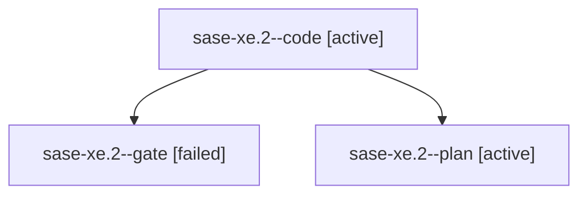

# Family: sase-xe.2

[Agent Hoods](../README.md) / [bbugyi200](../users/bbugyi200/README.md) / [athena](../users/bbugyi200/machines/athena/README.md) / [sase-xe](../users/bbugyi200/machines/athena/hoods/sase-xe/README.md) / sase-xe.2

Owner: `bbugyi200.athena` · Hood: `sase-xe` · Members: 3 · Bead: [sase-xe.2](https://github.com/sase-org/sase--beads/blob/main/pages/sase-xe/sase-xe.2.md)

## Lineage

The diagram is an optional enhancement; the ordered table below contains the same lineage in accessible text.

| Role | Agent | State | Model / provider | Timing | Commits | Prompt | Chat |
|---|---|---|---|---|---:|---|---|
| code | sase-xe.2--code | active | gpt-5.5 / codex | 2026-09-06T18:19:39.223752+00:00 | 0 | — | — |
| gate | sase-xe.2--gate | failed | gpt-5.6-sol / codex | 2026-09-06T18:19:20.131104+00:00 → 2026-09-06T18:19:26.432211+00:00 | 0 | — | [Chat](../agents/bbugyi200.athena.sase-xe.2--gate/chat.md) |
| plan | sase-xe.2--plan | active | gpt-5.6-sol / codex | 2026-09-06T18:09:58.980716+00:00 | 0 | [Prompt](../agents/bbugyi200.athena.sase-xe.2--plan/prompt.md) | [Chat](../agents/bbugyi200.athena.sase-xe.2--plan/chat.md) |

## Neighbors

| Agent | Relation | State |
|---|---|---|
| [sase-xe.1](../agents/bbugyi200.athena.sase-xe.1/README.md) | sase-xe hood | active |
| [sase-xe.10](../agents/bbugyi200.athena.sase-xe.10/README.md) | sase-xe hood | waiting |
| [sase-xe.11](../agents/bbugyi200.athena.sase-xe.11/README.md) | sase-xe hood | waiting |
| [sase-xe.12](../agents/bbugyi200.athena.sase-xe.12/README.md) | sase-xe hood | waiting |
| [sase-xe.13](../agents/bbugyi200.athena.sase-xe.13/README.md) | sase-xe hood | waiting |
| [sase-xe.14](../agents/bbugyi200.athena.sase-xe.14/README.md) | sase-xe hood | waiting |
| [sase-xe.15](../agents/bbugyi200.athena.sase-xe.15/README.md) | sase-xe hood | waiting |
| [sase-xe.3](../agents/bbugyi200.athena.sase-xe.3/README.md) | sase-xe hood | waiting |
| [sase-xe.4](../agents/bbugyi200.athena.sase-xe.4/README.md) | sase-xe hood | waiting |
| [sase-xe.5](../agents/bbugyi200.athena.sase-xe.5/README.md) | sase-xe hood | waiting |
| [sase-xe.6](../agents/bbugyi200.athena.sase-xe.6/README.md) | sase-xe hood | waiting |
| [sase-xe.7](../agents/bbugyi200.athena.sase-xe.7/README.md) | sase-xe hood | waiting |
| [sase-xe.8](../agents/bbugyi200.athena.sase-xe.8/README.md) | sase-xe hood | waiting |
| [sase-xe.9](../agents/bbugyi200.athena.sase-xe.9/README.md) | sase-xe hood | waiting |
| [sase-xe.land](../agents/bbugyi200.athena.sase-xe.land/README.md) | sase-xe hood | waiting |
