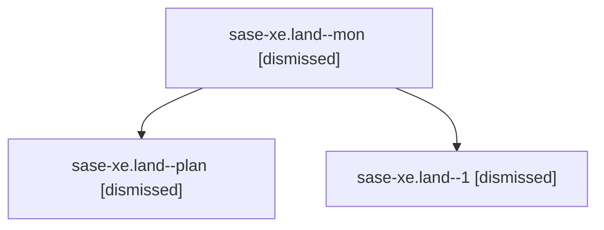

# Family: sase-xe.land

[Agent Hoods](../README.md) / [bbugyi200](../users/bbugyi200/README.md) / [athena](../users/bbugyi200/machines/athena/README.md) / [sase-xe](../users/bbugyi200/machines/athena/hoods/sase-xe/README.md) / sase-xe.land

Owner: `bbugyi200.athena` · Hood: `sase-xe` · Members: 3

## Lineage

The diagram is an optional enhancement; the ordered table below contains the same lineage in accessible text.

| Role | Agent | State | Model / provider | Timing | Commits | Prompt | Chat |
|---|---|---|---|---|---:|---|---|
| mon | sase-xe.land--mon | dismissed | claude-fable-5 / claude | 2026-09-07T20:09:01.586582 → 2026-09-07T20:34:03.696429 | 0 | — | [Chat](../agents/bbugyi200.athena.sase-xe.land--mon/chat.md) |
| plan | sase-xe.land--plan | dismissed | claude-fable-5 / claude | 2026-09-07T17:26:20.313387 → 2026-09-07T20:09:19.854698 | 0 | [Prompt](../agents/bbugyi200.athena.sase-xe.land--plan/prompt.md) | [Chat](../agents/bbugyi200.athena.sase-xe.land--plan/chat.md) |
| 1 | sase-xe.land--1 | dismissed | claude-fable-5 / claude | 2026-09-07T20:35:54.148939 → 2026-09-07T21:18:17.627003 | 0 | [Prompt](../agents/bbugyi200.athena.sase-xe.land--1/prompt.md) | [Chat](../agents/bbugyi200.athena.sase-xe.land--1/chat.md) |

## Commits

| Role | Repo | Commit | Subject | Committed |
|---|---|---|---|---|
| — | sase | [`8e00e74`](https://github.com/sase-org/sase/commit/8e00e742be932d81064cb69bc5aa3b417023b4e6) | feat(dispatch): integrate and harden remote dispatch during the sase-xe landing | 2026-09-07 21:09:26 EDT |

## Neighbors

| Agent | Relation | State |
|---|---|---|
| [sase-xe.1](../agents/bbugyi200.athena.sase-xe.1/README.md) | sase-xe hood | active |
| [sase-xe.10](bbugyi200.athena.sase-xe.10.md) (family · 3) | sase-xe hood | completed 1, dismissed 2 |
| [sase-xe.10](../agents/bbugyi200.athena.sase-xe.10/README.md) | sase-xe hood | waiting |
| [sase-xe.11](bbugyi200.athena.sase-xe.11.md) (family · 3) | sase-xe hood | completed 1, dismissed 2 |
| [sase-xe.12](bbugyi200.athena.sase-xe.12.md) (family · 3) | sase-xe hood | completed 1, dismissed 2 |
| [sase-xe.13](bbugyi200.athena.sase-xe.13.md) (family · 3) | sase-xe hood | completed 1, dismissed 2 |
| [sase-xe.13](../agents/bbugyi200.athena.sase-xe.13/README.md) | sase-xe hood | waiting |
| [sase-xe.14](bbugyi200.athena.sase-xe.14.md) (family · 3) | sase-xe hood | completed 1, dismissed 2 |
| [sase-xe.14.f0](bbugyi200.athena.sase-xe.14.f0.md) (family · 5) | sase-xe hood | active 1, completed 1, failed 3 |
| [sase-xe.15](bbugyi200.athena.sase-xe.15.md) (family · 6) | sase-xe hood | active 2, completed 2, failed 2 |
| [sase-xe.15](../agents/bbugyi200.athena.sase-xe.15/README.md) | sase-xe hood | waiting |
| [sase-xe.16.1](bbugyi200.athena.sase-xe.16.1.md) (family · 3) | sase-xe hood | completed 2, failed 1 |
| [sase-xe.16.10](bbugyi200.athena.sase-xe.16.10.md) (family · 5) | sase-xe hood | active 1, completed 2, failed 2 |
| [sase-xe.16.11.1](../agents/bbugyi200.athena.sase-xe.16.11.1/README.md) | sase-xe hood | completed |
| [sase-xe.16.11.2](../agents/bbugyi200.athena.sase-xe.16.11.2/README.md) | sase-xe hood | completed |
| [sase-xe.16.11.3](bbugyi200.athena.sase-xe.16.11.3.md) (family · 7) | sase-xe hood | completed 4, failed 3 |
| [sase-xe.16.11.4](../agents/bbugyi200.athena.sase-xe.16.11.4/README.md) | sase-xe hood | completed |
| [sase-xe.16.11.5](../agents/bbugyi200.athena.sase-xe.16.11.5/README.md) | sase-xe hood | completed |
| [sase-xe.16.11.6.1](../agents/bbugyi200.athena.sase-xe.16.11.6.1/README.md) | sase-xe hood | active |
| [sase-xe.16.11.6.2](../agents/bbugyi200.athena.sase-xe.16.11.6.2/README.md) | sase-xe hood | waiting |
| [sase-xe.16.11.6.3](../agents/bbugyi200.athena.sase-xe.16.11.6.3/README.md) | sase-xe hood | waiting |
| [sase-xe.16.11.6.4](../agents/bbugyi200.athena.sase-xe.16.11.6.4/README.md) | sase-xe hood | waiting |
| [sase-xe.16.11.6.5](../agents/bbugyi200.athena.sase-xe.16.11.6.5/README.md) | sase-xe hood | waiting |
| [sase-xe.16.11.6.6](../agents/bbugyi200.athena.sase-xe.16.11.6.6/README.md) | sase-xe hood | waiting |
| [sase-xe.16.11.6.land](../agents/bbugyi200.athena.sase-xe.16.11.6.land/README.md) | sase-xe hood | active |
| [sase-xe.16.11.7.1](../agents/bbugyi200.athena.sase-xe.16.11.7.1/README.md) | sase-xe hood | completed |
| [sase-xe.16.11.7.10](../agents/bbugyi200.athena.sase-xe.16.11.7.10/README.md) | sase-xe hood | active |
| [sase-xe.16.11.7.11](../agents/bbugyi200.athena.sase-xe.16.11.7.11/README.md) | sase-xe hood | completed |
| [sase-xe.16.11.7.12](../agents/bbugyi200.athena.sase-xe.16.11.7.12/README.md) | sase-xe hood | completed |
| [sase-xe.16.11.7.13](../agents/bbugyi200.athena.sase-xe.16.11.7.13/README.md) | sase-xe hood | completed |
| [sase-xe.16.11.7.14.1](bbugyi200.athena.sase-xe.16.11.7.14.1.md) (family · 3) | sase-xe hood | completed 2, failed 1 |
| [sase-xe.16.11.7.14.2](../agents/bbugyi200.athena.sase-xe.16.11.7.14.2/README.md) | sase-xe hood | completed |
| [sase-xe.16.11.7.14.3](../agents/bbugyi200.athena.sase-xe.16.11.7.14.3/README.md) | sase-xe hood | completed |
| [sase-xe.16.11.7.14.4](../agents/bbugyi200.athena.sase-xe.16.11.7.14.4/README.md) | sase-xe hood | completed |
| [sase-xe.16.11.7.14.5](bbugyi200.athena.sase-xe.16.11.7.14.5.md) (family · 3) | sase-xe hood | completed 2, failed 1 |
| [sase-xe.16.11.7.14.6.1](bbugyi200.athena.sase-xe.16.11.7.14.6.1.md) (family · 7) | sase-xe hood | completed 4, failed 3 |
| [sase-xe.16.11.7.14.6.2](../agents/bbugyi200.athena.sase-xe.16.11.7.14.6.2/README.md) | sase-xe hood | completed |
| [sase-xe.16.11.7.14.6.3](bbugyi200.athena.sase-xe.16.11.7.14.6.3.md) (family · 3) | sase-xe hood | completed 2, failed 1 |
| [sase-xe.16.11.7.14.6.4](../agents/bbugyi200.athena.sase-xe.16.11.7.14.6.4/README.md) | sase-xe hood | completed |
| [sase-xe.16.11.7.14.6.4.f0](bbugyi200.athena.sase-xe.16.11.7.14.6.4.f0.md) (family · 9) | sase-xe hood | completed 5, failed 4 |
| [sase-xe.16.11.7.14.6.5](../agents/bbugyi200.athena.sase-xe.16.11.7.14.6.5/README.md) | sase-xe hood | completed |
| [sase-xe.16.11.7.14.6.6](bbugyi200.athena.sase-xe.16.11.7.14.6.6.md) (family · 2) | sase-xe hood | completed 1, failed 1 |
| [sase-xe.16.11.7.14.6.7.1](../agents/bbugyi200.athena.sase-xe.16.11.7.14.6.7.1/README.md) | sase-xe hood | active |
| [sase-xe.16.11.7.14.6.7.2](../agents/bbugyi200.athena.sase-xe.16.11.7.14.6.7.2/README.md) | sase-xe hood | completed |
| [sase-xe.16.11.7.14.6.7.3](../agents/bbugyi200.athena.sase-xe.16.11.7.14.6.7.3/README.md) | sase-xe hood | waiting |
| [sase-xe.16.11.7.14.6.7.4](../agents/bbugyi200.athena.sase-xe.16.11.7.14.6.7.4/README.md) | sase-xe hood | waiting |
| [sase-xe.16.11.7.14.6.7.5](../agents/bbugyi200.athena.sase-xe.16.11.7.14.6.7.5/README.md) | sase-xe hood | waiting |
| [sase-xe.16.11.7.14.6.7.6](../agents/bbugyi200.athena.sase-xe.16.11.7.14.6.7.6/README.md) | sase-xe hood | waiting |
| [sase-xe.16.11.7.14.6.7.land](../agents/bbugyi200.athena.sase-xe.16.11.7.14.6.7.land/README.md) | sase-xe hood | waiting |
| [sase-xe.16.11.7.14.6.land](../agents/bbugyi200.athena.sase-xe.16.11.7.14.6.land/README.md) | sase-xe hood | waiting |
| … and 34 more in the [hood roster](../users/bbugyi200/machines/athena/hoods/sase-xe/README.md) | sase-xe hood | — |
