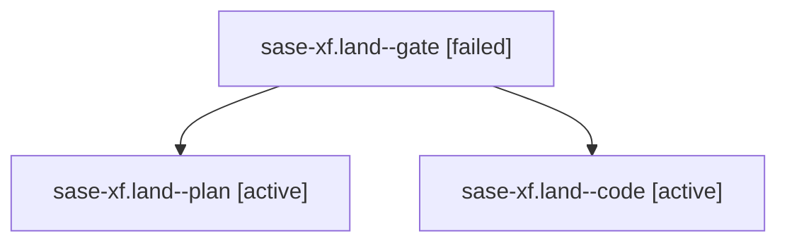

# Family: sase-xf.land

[Agent Hoods](../README.md) / [bbugyi200](../users/bbugyi200/README.md) / [athena](../users/bbugyi200/machines/athena/README.md) / [sase-xf](../users/bbugyi200/machines/athena/hoods/sase-xf/README.md) / sase-xf.land

Owner: `bbugyi200.athena` · Hood: `sase-xf` · Members: 3 · Bead: [sase-xf](https://github.com/sase-org/sase--beads/blob/main/pages/sase-xf/README.md)

## Lineage

The diagram is an optional enhancement; the ordered table below contains the same lineage in accessible text.

| Role | Agent | State | Model / provider | Timing | Commits | Prompt | Chat |
|---|---|---|---|---|---:|---|---|
| gate | sase-xf.land--gate | failed | gpt-5.6-sol / codex | 2026-09-07T05:10:50.010207+00:00 → 2026-09-07T05:10:56.918110+00:00 | 0 | — | [Chat](../agents/bbugyi200.athena.sase-xf.land--gate/chat.md) |
| plan | sase-xf.land--plan | active | gpt-5.6-sol / codex | 2026-09-07T05:02:32.162855+00:00 | 0 | [Prompt](../agents/bbugyi200.athena.sase-xf.land--plan/prompt.md) | [Chat](../agents/bbugyi200.athena.sase-xf.land--plan/chat.md) |
| code | sase-xf.land--code | active | gpt-5.5 / codex | 2026-09-07T05:11:12.880161+00:00 | [1](../agents/bbugyi200.athena.sase-xf.land--code/README.md#commits) | — | — |

## Commits

| Role | Repo | Commit | Subject | Committed |
|---|---|---|---|---|
| code | sase | [`5db3185`](https://github.com/sase-org/sase/commit/5db318521be61fd497dbbc94929d820f9e6f074e) | fix(tui): show unavailable provider priorities | 2026-09-07 01:42:10 EDT |

## Neighbors

| Agent | Relation | State |
|---|---|---|
| [sase-xf.1](../agents/bbugyi200.athena.sase-xf.1/README.md) | sase-xf hood | completed |
| [sase-xf.2](../agents/bbugyi200.athena.sase-xf.2/README.md) | sase-xf hood | completed |
| [sase-xf.3](../agents/bbugyi200.athena.sase-xf.3/README.md) | sase-xf hood | completed |
