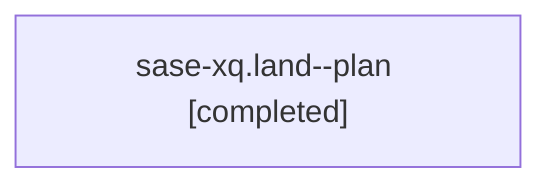

# Family: sase-xq.land

[Agent Hoods](../README.md) / [bbugyi200](../users/bbugyi200/README.md) / [athena](../users/bbugyi200/machines/athena/README.md) / [sase-xq](../users/bbugyi200/machines/athena/hoods/sase-xq/README.md) / sase-xq.land

Owner: `bbugyi200.athena` · Hood: `sase-xq` · Members: 1 · Bead: [sase-xq](https://github.com/sase-org/sase--beads/blob/main/pages/sase-xq/README.md)

## Lineage

The diagram is an optional enhancement; the ordered table below contains the same lineage in accessible text.

| Role | Agent | State | Model / provider | Timing | Commits | Prompt | Chat |
|---|---|---|---|---|---:|---|---|
| plan | sase-xq.land--plan | completed | gpt-5.6-sol / codex | 2026-09-07T00:32:34.356642+00:00 → 2026-09-07T00:43:34.054670+00:00 | 0 | [Prompt](../agents/bbugyi200.athena.sase-xq.land--plan/prompt.md) | [Chat](../agents/bbugyi200.athena.sase-xq.land--plan/chat.md) |

## Neighbors

| Agent | Relation | State |
|---|---|---|
| [sase-xq.1](../agents/bbugyi200.athena.sase-xq.1/README.md) | sase-xq hood | completed |
| [sase-xq.2](../agents/bbugyi200.athena.sase-xq.2/README.md) | sase-xq hood | completed |
| [sase-xq.3](../agents/bbugyi200.athena.sase-xq.3/README.md) | sase-xq hood | completed |
