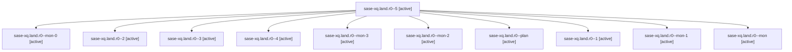

# Family: sase-xq.land.r0

[Agent Hoods](../README.md) / [bbugyi200](../users/bbugyi200/README.md) / [athena](../users/bbugyi200/machines/athena/README.md) / [sase-xq](../users/bbugyi200/machines/athena/hoods/sase-xq/README.md) / sase-xq.land.r0

Owner: `bbugyi200.athena` · Hood: `sase-xq` · Members: 11 · Bead: [sase-xq](https://github.com/sase-org/sase--beads/blob/main/pages/sase-xq/README.md)

## Lineage

The diagram is an optional enhancement; the ordered table below contains the same lineage in accessible text.

| Role | Agent | State | Model / provider | Timing | Commits | Prompt | Chat |
|---|---|---|---|---|---:|---|---|
| 5 | sase-xq.land.r0--5 | active | gpt-6-astra / codex | 2026-09-07T06:21:05.566388+00:00 | [1](../agents/bbugyi200.athena.sase-xq.land.r0--5/README.md#commits) | [Prompt](../agents/bbugyi200.athena.sase-xq.land.r0--5/prompt.md) | [Chat](../agents/bbugyi200.athena.sase-xq.land.r0--5/chat.md) |
| mon-0 | sase-xq.land.r0--mon-0 | active | gpt-6-astra / codex | 2026-09-07T03:01:54.209735+00:00 | 0 | — | [Chat](../agents/bbugyi200.athena.sase-xq.land.r0--mon-0/chat.md) |
| 2 | sase-xq.land.r0--2 | active | gpt-6-astra / codex | 2026-09-07T03:58:27.721054+00:00 | 0 | [Prompt](../agents/bbugyi200.athena.sase-xq.land.r0--2/prompt.md) | [Chat](../agents/bbugyi200.athena.sase-xq.land.r0--2/chat.md) |
| 3 | sase-xq.land.r0--3 | active | gpt-6-astra / codex | 2026-09-07T05:30:32.667405+00:00 | 0 | [Prompt](../agents/bbugyi200.athena.sase-xq.land.r0--3/prompt.md) | [Chat](../agents/bbugyi200.athena.sase-xq.land.r0--3/chat.md) |
| 4 | sase-xq.land.r0--4 | active | gpt-6-astra / codex | 2026-09-07T05:39:38.569425+00:00 | 0 | [Prompt](../agents/bbugyi200.athena.sase-xq.land.r0--4/prompt.md) | [Chat](../agents/bbugyi200.athena.sase-xq.land.r0--4/chat.md) |
| mon-3 | sase-xq.land.r0--mon-3 | active | gpt-6-astra / codex | 2026-09-07T05:47:05.539067+00:00 | 0 | — | [Chat](../agents/bbugyi200.athena.sase-xq.land.r0--mon-3/chat.md) |
| mon-2 | sase-xq.land.r0--mon-2 | active | gpt-6-astra / codex | 2026-09-07T05:36:55.038799+00:00 | 0 | — | [Chat](../agents/bbugyi200.athena.sase-xq.land.r0--mon-2/chat.md) |
| plan | sase-xq.land.r0--plan | active | gpt-6-astra / codex | 2026-09-07T02:38:13.649895+00:00 | 0 | [Prompt](../agents/bbugyi200.athena.sase-xq.land.r0--plan/prompt.md) | [Chat](../agents/bbugyi200.athena.sase-xq.land.r0--plan/chat.md) |
| 1 | sase-xq.land.r0--1 | active | gpt-6-astra / codex | 2026-09-07T02:55:00.739898+00:00 | 0 | [Prompt](../agents/bbugyi200.athena.sase-xq.land.r0--1/prompt.md) | [Chat](../agents/bbugyi200.athena.sase-xq.land.r0--1/chat.md) |
| mon-1 | sase-xq.land.r0--mon-1 | active | gpt-6-astra / codex | 2026-09-07T04:14:33.691259+00:00 | 0 | — | [Chat](../agents/bbugyi200.athena.sase-xq.land.r0--mon-1/chat.md) |
| mon | sase-xq.land.r0--mon | active | gpt-6-astra / codex | 2026-09-07T02:47:52.546201+00:00 | 0 | — | [Chat](../agents/bbugyi200.athena.sase-xq.land.r0--mon/chat.md) |

## Commits

| Role | Repo | Commit | Subject | Committed |
|---|---|---|---|---|
| 5 | sase | [`144c2be`](https://github.com/sase-org/sase/commit/144c2be656233e727f80a063e7dbf3833743b2df) | test: calibrate suite budgets and record owned flake debt | 2026-09-07 02:34:46 EDT |

## Neighbors

| Agent | Relation | State |
|---|---|---|
| [sase-xq.land](../agents/bbugyi200.athena.sase-xq.land/README.md) | ancestor | waiting |
| [sase-xq.1](../agents/bbugyi200.athena.sase-xq.1/README.md) | sase-xq hood | active |
| [sase-xq.2](../agents/bbugyi200.athena.sase-xq.2/README.md) | sase-xq hood | active |
| [sase-xq.3](../agents/bbugyi200.athena.sase-xq.3/README.md) | sase-xq hood | active |
