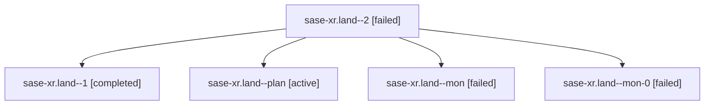

# Family: sase-xr.land

[Agent Hoods](../README.md) / [bbugyi200](../users/bbugyi200/README.md) / [athena](../users/bbugyi200/machines/athena/README.md) / [sase-xr](../users/bbugyi200/machines/athena/hoods/sase-xr/README.md) / sase-xr.land

Owner: `bbugyi200.athena` · Hood: `sase-xr` · Members: 5 · Bead: [sase-xr](https://github.com/sase-org/sase--beads/blob/main/pages/sase-xr/README.md)

## Lineage

The diagram is an optional enhancement; the ordered table below contains the same lineage in accessible text.

| Role | Agent | State | Model / provider | Timing | Commits | Prompt | Chat |
|---|---|---|---|---|---:|---|---|
| 2 | sase-xr.land--2 | failed | claude-fable-5 / claude | 2026-09-07T13:34:58.441286+00:00 → 2026-09-07T14:28:12.212579+00:00 | 0 | [Prompt](../agents/bbugyi200.athena.sase-xr.land--2/prompt.md) | — |
| 1 | sase-xr.land--1 | completed | claude-fable-5 / claude | 2026-09-07T12:54:55.748218+00:00 → 2026-09-07T13:11:34.961127+00:00 | 0 | [Prompt](../agents/bbugyi200.athena.sase-xr.land--1/prompt.md) | [Chat](../agents/bbugyi200.athena.sase-xr.land--1/chat.md) |
| plan | sase-xr.land--plan | active | claude-fable-5 / claude | 2026-09-07T12:41:17.274281+00:00 | 0 | [Prompt](../agents/bbugyi200.athena.sase-xr.land--plan/prompt.md) | [Chat](../agents/bbugyi200.athena.sase-xr.land--plan/chat.md) |
| mon | sase-xr.land--mon | failed | claude-fable-5 / claude | 2026-09-07T12:51:05.423643+00:00 → 2026-09-07T12:54:33.630594+00:00 | 0 | — | [Chat](../agents/bbugyi200.athena.sase-xr.land--mon/chat.md) |
| mon-0 | sase-xr.land--mon-0 | failed | claude-fable-5 / claude | 2026-09-07T13:11:24.731558+00:00 → 2026-09-07T13:34:35.758838+00:00 | 0 | — | [Chat](../agents/bbugyi200.athena.sase-xr.land--mon-0/chat.md) |

## Commits

| Role | Repo | Commit | Subject | Committed |
|---|---|---|---|---|
| — | sase | [`777ec37`](https://github.com/sase-org/sase/commit/777ec37dc0c5cd823772d29412f0eb05d735d04b) | fix(bead): reconcile epic sase-xr fast paths with master signature changes | 2026-09-07 10:32:26 EDT |

## Neighbors

| Agent | Relation | State |
|---|---|---|
| [sase-xr.1](../agents/bbugyi200.athena.sase-xr.1/README.md) | sase-xr hood | active |
| [sase-xr.2](../agents/bbugyi200.athena.sase-xr.2/README.md) | sase-xr hood | active |
| [sase-xr.3](../agents/bbugyi200.athena.sase-xr.3/README.md) | sase-xr hood | active |
| [sase-xr.4](../agents/bbugyi200.athena.sase-xr.4/README.md) | sase-xr hood | active |
| [sase-xr.5](../agents/bbugyi200.athena.sase-xr.5/README.md) | sase-xr hood | active |
| [sase-xr.6](../agents/bbugyi200.athena.sase-xr.6/README.md) | sase-xr hood | active |
