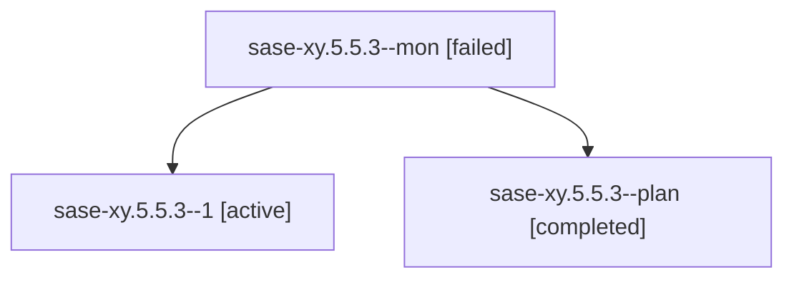

# Family: sase-xy.5.5.3

[Agent Hoods](../README.md) / [bbugyi200](../users/bbugyi200/README.md) / [athena](../users/bbugyi200/machines/athena/README.md) / [sase-xy](../users/bbugyi200/machines/athena/hoods/sase-xy/README.md) / sase-xy.5.5.3

Owner: `bbugyi200.athena` · Hood: `sase-xy` · Members: 3 · Bead: [sase-xy.5.5.3](https://github.com/sase-org/sase--beads/blob/main/pages/sase-xy/sase-xy.5.5.3.md)

## Lineage

The diagram is an optional enhancement; the ordered table below contains the same lineage in accessible text.

| Role | Agent | State | Model / provider | Timing | Commits | Prompt | Chat |
|---|---|---|---|---|---:|---|---|
| mon | sase-xy.5.5.3--mon | failed | sonnet / claude | 2026-09-08T02:32:39.315678+00:00 → 2026-09-08T02:54:16.976108+00:00 | 0 | — | [Chat](../agents/bbugyi200.athena.sase-xy.5.5.3--mon/chat.md) |
| 1 | sase-xy.5.5.3--1 | active | sonnet / claude | 2026-09-08T02:54:39.226436+00:00 | [1](../agents/bbugyi200.athena.sase-xy.5.5.3--1/README.md#commits) | [Prompt](../agents/bbugyi200.athena.sase-xy.5.5.3--1/prompt.md) | — |
| plan | sase-xy.5.5.3--plan | completed | sonnet / claude | 2026-09-08T02:10:36.271543+00:00 → 2026-09-08T02:32:49.790400+00:00 | 0 | [Prompt](../agents/bbugyi200.athena.sase-xy.5.5.3--plan/prompt.md) | [Chat](../agents/bbugyi200.athena.sase-xy.5.5.3--plan/chat.md) |

## Commits

| Role | Repo | Commit | Subject | Committed |
|---|---|---|---|---|
| 1 | sase | [`b67c74c`](https://github.com/sase-org/sase/commit/b67c74ce7ecf2268a3abba0d61e0fdbabf7f56e1) | feat(artifact-ref): ratchet sase-core-rs floor to 0.32.41 and extend contract validation | 2026-09-07 22:58:04 EDT |

## Neighbors

| Agent | Relation | State |
|---|---|---|
| [sase-xy.5.5.1](../agents/bbugyi200.athena.sase-xy.5.5.1/README.md) | sase-xy.5.5 hood | completed |
| [sase-xy.5.5.2](../agents/bbugyi200.athena.sase-xy.5.5.2/README.md) | sase-xy.5.5 hood | completed |
| [sase-xy.5.5.land](../agents/bbugyi200.athena.sase-xy.5.5.land/README.md) | sase-xy.5.5 hood | waiting |
| [sase-xy.5.1](../agents/bbugyi200.athena.sase-xy.5.1/README.md) | sase-xy.5 hood | dismissed |
| [sase-xy.5.2](../agents/bbugyi200.athena.sase-xy.5.2/README.md) | sase-xy.5 hood | completed |
| [sase-xy.5.3](../agents/bbugyi200.athena.sase-xy.5.3/README.md) | sase-xy.5 hood | completed |
| [sase-xy.5.4](../agents/bbugyi200.athena.sase-xy.5.4/README.md) | sase-xy.5 hood | completed |
| [sase-xy.5.land](bbugyi200.athena.sase-xy.5.land.md) (family · 3) | sase-xy.5 hood | failed 3 |
| [sase-xy.1](../agents/bbugyi200.athena.sase-xy.1/README.md) | sase-xy hood | completed |
| [sase-xy.2](../agents/bbugyi200.athena.sase-xy.2/README.md) | sase-xy hood | completed |
| [sase-xy.3](../agents/bbugyi200.athena.sase-xy.3/README.md) | sase-xy hood | completed |
| [sase-xy.4.1](../agents/bbugyi200.athena.sase-xy.4.1/README.md) | sase-xy hood | completed |
| [sase-xy.4.2](../agents/bbugyi200.athena.sase-xy.4.2/README.md) | sase-xy hood | completed |
| [sase-xy.4.land](bbugyi200.athena.sase-xy.4.land.md) (family · 3) | sase-xy hood | completed 2, failed 1 |
| [sase-xy.land](bbugyi200.athena.sase-xy.land.md) (family · 3) | sase-xy hood | failed 3 |
