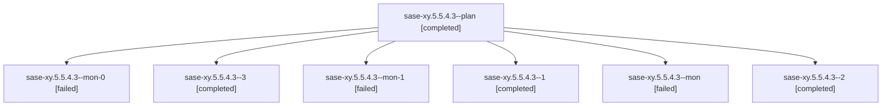

# Family: sase-xy.5.5.4.3

[Agent Hoods](../README.md) / [bbugyi200](../users/bbugyi200/README.md) / [athena](../users/bbugyi200/machines/athena/README.md) / [sase-xy](../users/bbugyi200/machines/athena/hoods/sase-xy/README.md) / sase-xy.5.5.4.3

Owner: `bbugyi200.athena` · Hood: `sase-xy` · Members: 7 · Bead: [sase-xy.5.5.4.3](https://github.com/sase-org/sase--beads/blob/main/pages/sase-xy/sase-xy.5.5.4.3.md)

## Lineage

The diagram is an optional enhancement; the ordered table below contains the same lineage in accessible text.

| Role | Agent | State | Model / provider | Timing | Commits | Prompt | Chat |
|---|---|---|---|---|---:|---|---|
| plan | sase-xy.5.5.4.3--plan | completed | gpt-5.5 / codex | 2026-09-08T03:52:09.280743+00:00 → 2026-09-08T03:58:29.686514+00:00 | 0 | [Prompt](../agents/bbugyi200.athena.sase-xy.5.5.4.3--plan/prompt.md) | [Chat](../agents/bbugyi200.athena.sase-xy.5.5.4.3--plan/chat.md) |
| mon-0 | sase-xy.5.5.4.3--mon-0 | failed | gpt-5.5 / codex | 2026-09-08T04:06:19.209703+00:00 → 2026-09-08T04:19:33.308882+00:00 | 0 | — | [Chat](../agents/bbugyi200.athena.sase-xy.5.5.4.3--mon-0/chat.md) |
| 3 | sase-xy.5.5.4.3--3 | completed | gpt-5.5 / codex | 2026-09-08T05:08:50.678131+00:00 → 2026-09-08T05:13:48.444796+00:00 | [1](../agents/bbugyi200.athena.sase-xy.5.5.4.3--3/README.md#commits) | [Prompt](../agents/bbugyi200.athena.sase-xy.5.5.4.3--3/prompt.md) | [Chat](../agents/bbugyi200.athena.sase-xy.5.5.4.3--3/chat.md) |
| mon-1 | sase-xy.5.5.4.3--mon-1 | failed | gpt-5.5 / codex | 2026-09-08T04:46:13.462456+00:00 → 2026-09-08T05:08:25.698557+00:00 | 0 | — | [Chat](../agents/bbugyi200.athena.sase-xy.5.5.4.3--mon-1/chat.md) |
| 1 | sase-xy.5.5.4.3--1 | completed | gpt-5.5 / codex | 2026-09-08T04:03:02.053142+00:00 → 2026-09-08T04:06:27.498433+00:00 | 0 | [Prompt](../agents/bbugyi200.athena.sase-xy.5.5.4.3--1/prompt.md) | [Chat](../agents/bbugyi200.athena.sase-xy.5.5.4.3--1/chat.md) |
| mon | sase-xy.5.5.4.3--mon | failed | gpt-5.5 / codex | 2026-09-08T03:58:21.979911+00:00 → 2026-09-08T04:02:39.838509+00:00 | 0 | — | [Chat](../agents/bbugyi200.athena.sase-xy.5.5.4.3--mon/chat.md) |
| 2 | sase-xy.5.5.4.3--2 | completed | gpt-5.5 / codex | 2026-09-08T04:19:56.009148+00:00 → 2026-09-08T04:46:24.504037+00:00 | 0 | [Prompt](../agents/bbugyi200.athena.sase-xy.5.5.4.3--2/prompt.md) | [Chat](../agents/bbugyi200.athena.sase-xy.5.5.4.3--2/chat.md) |

## Commits

| Role | Repo | Commit | Subject | Committed |
|---|---|---|---|---|
| 3 | sase | [`ce3d670`](https://github.com/sase-org/sase/commit/ce3d6708714127486f069a04fbba065350e289a6) | chore(deps): ratchet sase-core-rs to 0.32.42 | 2026-09-08 01:11:21 EDT |

## Neighbors

| Agent | Relation | State |
|---|---|---|
| [sase-xy.5.5.4.1](../agents/bbugyi200.athena.sase-xy.5.5.4.1/README.md) | sase-xy.5.5.4 hood | completed |
| [sase-xy.5.5.4.2](../agents/bbugyi200.athena.sase-xy.5.5.4.2/README.md) | sase-xy.5.5.4 hood | completed |
| [sase-xy.5.5.4.land](bbugyi200.athena.sase-xy.5.5.4.land.md) (family · 3) | sase-xy.5.5.4 hood | active 1, completed 1, failed 1 |
| [sase-xy.5.5.1](../agents/bbugyi200.athena.sase-xy.5.5.1/README.md) | sase-xy.5.5 hood | completed |
| [sase-xy.5.5.2](../agents/bbugyi200.athena.sase-xy.5.5.2/README.md) | sase-xy.5.5 hood | completed |
| [sase-xy.5.5.3](bbugyi200.athena.sase-xy.5.5.3.md) (family · 3) | sase-xy.5.5 hood | completed 2, failed 1 |
| [sase-xy.5.5.land](bbugyi200.athena.sase-xy.5.5.land.md) (family · 3) | sase-xy.5.5 hood | failed 3 |
| [sase-xy.5.1](../agents/bbugyi200.athena.sase-xy.5.1/README.md) | sase-xy.5 hood | dismissed |
| [sase-xy.5.2](../agents/bbugyi200.athena.sase-xy.5.2/README.md) | sase-xy.5 hood | completed |
| [sase-xy.5.3](../agents/bbugyi200.athena.sase-xy.5.3/README.md) | sase-xy.5 hood | completed |
| [sase-xy.5.4](../agents/bbugyi200.athena.sase-xy.5.4/README.md) | sase-xy.5 hood | completed |
| [sase-xy.5.land](bbugyi200.athena.sase-xy.5.land.md) (family · 3) | sase-xy.5 hood | failed 3 |
| [sase-xy.1](../agents/bbugyi200.athena.sase-xy.1/README.md) | sase-xy hood | completed |
| [sase-xy.2](../agents/bbugyi200.athena.sase-xy.2/README.md) | sase-xy hood | completed |
| [sase-xy.3](../agents/bbugyi200.athena.sase-xy.3/README.md) | sase-xy hood | completed |
| [sase-xy.4.1](../agents/bbugyi200.athena.sase-xy.4.1/README.md) | sase-xy hood | completed |
| [sase-xy.4.2](../agents/bbugyi200.athena.sase-xy.4.2/README.md) | sase-xy hood | completed |
| [sase-xy.4.land](bbugyi200.athena.sase-xy.4.land.md) (family · 3) | sase-xy hood | completed 2, failed 1 |
| [sase-xy.land](bbugyi200.athena.sase-xy.land.md) (family · 3) | sase-xy hood | failed 3 |
