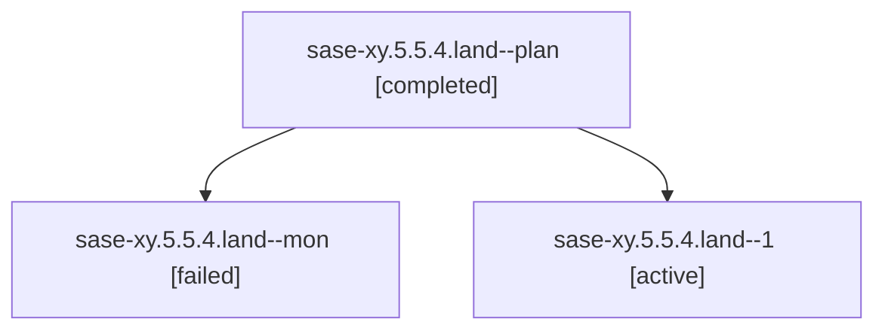

# Family: sase-xy.5.5.4.land

[Agent Hoods](../README.md) / [bbugyi200](../users/bbugyi200/README.md) / [athena](../users/bbugyi200/machines/athena/README.md) / [sase-xy](../users/bbugyi200/machines/athena/hoods/sase-xy/README.md) / sase-xy.5.5.4.land

Owner: `bbugyi200.athena` · Hood: `sase-xy` · Members: 3 · Bead: [sase-xy.5.5.4](https://github.com/sase-org/sase--beads/blob/main/pages/sase-xy/sase-xy.5.5.4.md)

## Lineage

The diagram is an optional enhancement; the ordered table below contains the same lineage in accessible text.

| Role | Agent | State | Model / provider | Timing | Commits | Prompt | Chat |
|---|---|---|---|---|---:|---|---|
| plan | sase-xy.5.5.4.land--plan | completed | opus / claude | 2026-09-08T05:14:04.811255+00:00 → 2026-09-08T05:36:14.128413+00:00 | 0 | [Prompt](../agents/bbugyi200.athena.sase-xy.5.5.4.land--plan/prompt.md) | [Chat](../agents/bbugyi200.athena.sase-xy.5.5.4.land--plan/chat.md) |
| mon | sase-xy.5.5.4.land--mon | failed | opus / claude | 2026-09-08T05:36:05.434070+00:00 → 2026-09-08T05:57:41.468965+00:00 | 0 | — | [Chat](../agents/bbugyi200.athena.sase-xy.5.5.4.land--mon/chat.md) |
| 1 | sase-xy.5.5.4.land--1 | active | opus / claude | 2026-09-08T05:58:05.173806+00:00 | [1](../agents/bbugyi200.athena.sase-xy.5.5.4.land--1/README.md#commits) | [Prompt](../agents/bbugyi200.athena.sase-xy.5.5.4.land--1/prompt.md) | — |

## Commits

| Role | Repo | Commit | Subject | Committed |
|---|---|---|---|---|
| 1 | sase | [`6b7edb2`](https://github.com/sase-org/sase/commit/6b7edb2dda9b54e0ce6d078ab77a231a895c0057) | fix(pager): freeze configured kinds on the ACE commit manifest | 2026-09-08 02:06:51 EDT |

## Neighbors

| Agent | Relation | State |
|---|---|---|
| [sase-xy.5.5.4.1](../agents/bbugyi200.athena.sase-xy.5.5.4.1/README.md) | sase-xy.5.5.4 hood | completed |
| [sase-xy.5.5.4.2](../agents/bbugyi200.athena.sase-xy.5.5.4.2/README.md) | sase-xy.5.5.4 hood | completed |
| [sase-xy.5.5.4.3](bbugyi200.athena.sase-xy.5.5.4.3.md) (family · 7) | sase-xy.5.5.4 hood | completed 4, failed 3 |
| [sase-xy.5.5.1](../agents/bbugyi200.athena.sase-xy.5.5.1/README.md) | sase-xy.5.5 hood | completed |
| [sase-xy.5.5.2](../agents/bbugyi200.athena.sase-xy.5.5.2/README.md) | sase-xy.5.5 hood | completed |
| [sase-xy.5.5.3](bbugyi200.athena.sase-xy.5.5.3.md) (family · 3) | sase-xy.5.5 hood | completed 2, failed 1 |
| [sase-xy.5.5.land](bbugyi200.athena.sase-xy.5.5.land.md) (family · 3) | sase-xy.5.5 hood | failed 3 |
| [sase-xy.5.1](../agents/bbugyi200.athena.sase-xy.5.1/README.md) | sase-xy.5 hood | dismissed |
| [sase-xy.5.2](../agents/bbugyi200.athena.sase-xy.5.2/README.md) | sase-xy.5 hood | completed |
| [sase-xy.5.3](../agents/bbugyi200.athena.sase-xy.5.3/README.md) | sase-xy.5 hood | completed |
| [sase-xy.5.4](../agents/bbugyi200.athena.sase-xy.5.4/README.md) | sase-xy.5 hood | completed |
| [sase-xy.5.land](bbugyi200.athena.sase-xy.5.land.md) (family · 3) | sase-xy.5 hood | failed 3 |
| [sase-xy.1](../agents/bbugyi200.athena.sase-xy.1/README.md) | sase-xy hood | completed |
| [sase-xy.2](../agents/bbugyi200.athena.sase-xy.2/README.md) | sase-xy hood | completed |
| [sase-xy.3](../agents/bbugyi200.athena.sase-xy.3/README.md) | sase-xy hood | completed |
| [sase-xy.4.1](../agents/bbugyi200.athena.sase-xy.4.1/README.md) | sase-xy hood | completed |
| [sase-xy.4.2](../agents/bbugyi200.athena.sase-xy.4.2/README.md) | sase-xy hood | completed |
| [sase-xy.4.land](bbugyi200.athena.sase-xy.4.land.md) (family · 3) | sase-xy hood | completed 2, failed 1 |
| [sase-xy.land](bbugyi200.athena.sase-xy.land.md) (family · 3) | sase-xy hood | failed 3 |
