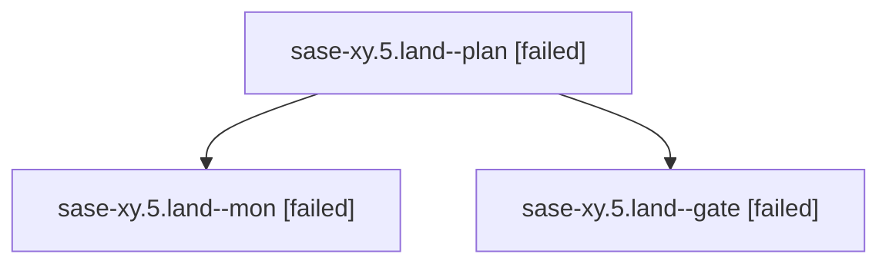

# Family: sase-xy.5.land

[Agent Hoods](../README.md) / [bbugyi200](../users/bbugyi200/README.md) / [athena](../users/bbugyi200/machines/athena/README.md) / [sase-xy](../users/bbugyi200/machines/athena/hoods/sase-xy/README.md) / sase-xy.5.land

Owner: `bbugyi200.athena` · Hood: `sase-xy` · Members: 3 · Bead: [sase-xy.5](https://github.com/sase-org/sase--beads/blob/main/pages/sase-xy/sase-xy.5.md)

## Lineage

The diagram is an optional enhancement; the ordered table below contains the same lineage in accessible text.

| Role | Agent | State | Model / provider | Timing | Commits | Prompt | Chat |
|---|---|---|---|---|---:|---|---|
| plan | sase-xy.5.land--plan | failed | gpt-5.6-sol / codex | 2026-09-07T23:58:12.236662+00:00 → 2026-09-08T00:23:10.108224+00:00 | 0 | [Prompt](../agents/bbugyi200.athena.sase-xy.5.land--plan/prompt.md) | [Chat](../agents/bbugyi200.athena.sase-xy.5.land--plan/chat.md) |
| mon | sase-xy.5.land--mon | failed | gpt-5.6-sol / codex | 2026-09-08T00:23:02.164059+00:00 → 2026-09-08T00:25:43.832732+00:00 | 0 | — | [Chat](../agents/bbugyi200.athena.sase-xy.5.land--mon/chat.md) |
| gate | sase-xy.5.land--gate | failed | gpt-5.6-sol / codex | 2026-09-08T00:22:49.522818+00:00 → 2026-09-08T00:23:03.392554+00:00 | 0 | — | [Chat](../agents/bbugyi200.athena.sase-xy.5.land--gate/chat.md) |

## Neighbors

| Agent | Relation | State |
|---|---|---|
| [sase-xy.5.1](../agents/bbugyi200.athena.sase-xy.5.1/README.md) | sase-xy.5 hood | dismissed |
| [sase-xy.5.2](../agents/bbugyi200.athena.sase-xy.5.2/README.md) | sase-xy.5 hood | completed |
| [sase-xy.5.3](../agents/bbugyi200.athena.sase-xy.5.3/README.md) | sase-xy.5 hood | completed |
| [sase-xy.5.4](../agents/bbugyi200.athena.sase-xy.5.4/README.md) | sase-xy.5 hood | completed |
| [sase-xy.5.5.1](../agents/bbugyi200.athena.sase-xy.5.5.1/README.md) | sase-xy.5 hood | active |
| [sase-xy.5.5.2](../agents/bbugyi200.athena.sase-xy.5.5.2/README.md) | sase-xy.5 hood | waiting |
| [sase-xy.5.5.3](../agents/bbugyi200.athena.sase-xy.5.5.3/README.md) | sase-xy.5 hood | waiting |
| [sase-xy.5.5.land](../agents/bbugyi200.athena.sase-xy.5.5.land/README.md) | sase-xy.5 hood | waiting |
| [sase-xy.1](../agents/bbugyi200.athena.sase-xy.1/README.md) | sase-xy hood | completed |
| [sase-xy.2](../agents/bbugyi200.athena.sase-xy.2/README.md) | sase-xy hood | completed |
| [sase-xy.3](../agents/bbugyi200.athena.sase-xy.3/README.md) | sase-xy hood | completed |
| [sase-xy.4.1](../agents/bbugyi200.athena.sase-xy.4.1/README.md) | sase-xy hood | completed |
| [sase-xy.4.2](../agents/bbugyi200.athena.sase-xy.4.2/README.md) | sase-xy hood | completed |
| [sase-xy.4.land](bbugyi200.athena.sase-xy.4.land.md) (family · 3) | sase-xy hood | completed 2, failed 1 |
| [sase-xy.land](bbugyi200.athena.sase-xy.land.md) (family · 3) | sase-xy hood | failed 3 |
