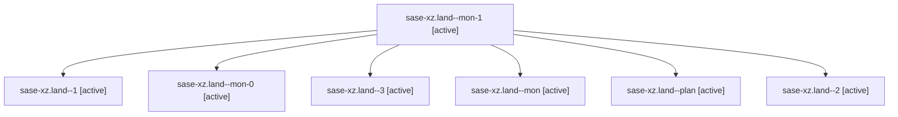

# Family: sase-xz.land

[Agent Hoods](../README.md) / [bbugyi200](../users/bbugyi200/README.md) / [athena](../users/bbugyi200/machines/athena/README.md) / [sase-xz](../users/bbugyi200/machines/athena/hoods/sase-xz/README.md) / sase-xz.land

Owner: `bbugyi200.athena` · Hood: `sase-xz` · Members: 7 · Bead: [sase-xz](https://github.com/sase-org/sase--beads/blob/main/pages/sase-xz/README.md)

## Lineage

The diagram is an optional enhancement; the ordered table below contains the same lineage in accessible text.

| Role | Agent | State | Model / provider | Timing | Commits | Prompt | Chat |
|---|---|---|---|---|---:|---|---|
| mon-1 | sase-xz.land--mon-1 | active | opus / claude | 2026-09-07T21:51:32.226214+00:00 | 0 | — | [Chat](../agents/bbugyi200.athena.sase-xz.land--mon-1/chat.md) |
| 1 | sase-xz.land--1 | active | opus / claude | 2026-09-07T20:38:07.146823+00:00 | 0 | [Prompt](../agents/bbugyi200.athena.sase-xz.land--1/prompt.md) | [Chat](../agents/bbugyi200.athena.sase-xz.land--1/chat.md) |
| mon-0 | sase-xz.land--mon-0 | active | opus / claude | 2026-09-07T20:40:00.810681+00:00 | 0 | — | [Chat](../agents/bbugyi200.athena.sase-xz.land--mon-0/chat.md) |
| 3 | sase-xz.land--3 | active | opus / claude | 2026-09-07T23:01:38.812866+00:00 | 0 | [Prompt](../agents/bbugyi200.athena.sase-xz.land--3/prompt.md) | [Chat](../agents/bbugyi200.athena.sase-xz.land--3/chat.md) |
| mon | sase-xz.land--mon | active | opus / claude | 2026-09-07T20:11:02.364365+00:00 | 0 | — | [Chat](../agents/bbugyi200.athena.sase-xz.land--mon/chat.md) |
| plan | sase-xz.land--plan | active | opus / claude | 2026-09-07T19:54:37.843452+00:00 | 0 | [Prompt](../agents/bbugyi200.athena.sase-xz.land--plan/prompt.md) | [Chat](../agents/bbugyi200.athena.sase-xz.land--plan/chat.md) |
| 2 | sase-xz.land--2 | active | opus / claude | 2026-09-07T21:38:01.255137+00:00 | 0 | [Prompt](../agents/bbugyi200.athena.sase-xz.land--2/prompt.md) | [Chat](../agents/bbugyi200.athena.sase-xz.land--2/chat.md) |

## Commits

| Role | Repo | Commit | Subject | Committed |
|---|---|---|---|---|
| — | sase | [`ddbd1b1`](https://github.com/sase-org/sase/commit/ddbd1b10a7f0778351fe27aa60699d30d814e37d) | test: raise the parser\_create CPU ceiling and own two more flake nodes | 2026-09-07 19:31:04 EDT |

## Neighbors

| Agent | Relation | State |
|---|---|---|
| [sase-xz.1](../agents/bbugyi200.athena.sase-xz.1/README.md) | sase-xz hood | active |
| [sase-xz.2](../agents/bbugyi200.athena.sase-xz.2/README.md) | sase-xz hood | active |
| [sase-xz.3](../agents/bbugyi200.athena.sase-xz.3/README.md) | sase-xz hood | active |
| [sase-xz.4](../agents/bbugyi200.athena.sase-xz.4/README.md) | sase-xz hood | active |
