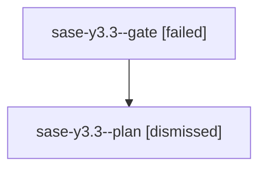

# Family: sase-y3.3

[Agent Hoods](../README.md) / [bbugyi200](../users/bbugyi200/README.md) / [athena](../users/bbugyi200/machines/athena/README.md) / [sase-y3](../users/bbugyi200/machines/athena/hoods/sase-y3/README.md) / sase-y3.3

Owner: `bbugyi200.athena` · Hood: `sase-y3` · Members: 2 · Bead: [sase-y3.3](https://github.com/sase-org/sase--beads/blob/main/pages/sase-y3/sase-y3.3.md)

## Lineage

The diagram is an optional enhancement; the ordered table below contains the same lineage in accessible text.

| Role | Agent | State | Model / provider | Timing | Commits | Prompt | Chat |
|---|---|---|---|---|---:|---|---|
| gate | sase-y3.3--gate | failed | gpt-5.6-sol / codex | 2026-09-07T22:23:45.083785+00:00 → 2026-09-07T22:23:48.999615+00:00 | 0 | — | [Chat](../agents/bbugyi200.athena.sase-y3.3--gate/chat.md) |
| plan | sase-y3.3--plan | dismissed | gpt-5.6-sol / codex | 2026-09-07T18:12:41.965604 → 2026-09-07T18:23:49.074281 | 0 | [Prompt](../agents/bbugyi200.athena.sase-y3.3--plan/prompt.md) | [Chat](../agents/bbugyi200.athena.sase-y3.3--plan/chat.md) |

## Neighbors

| Agent | Relation | State |
|---|---|---|
| [sase-y3.1](../agents/bbugyi200.athena.sase-y3.1/README.md) | sase-y3 hood | completed |
| [sase-y3.2](../agents/bbugyi200.athena.sase-y3.2/README.md) | sase-y3 hood | completed |
| [sase-y3.4](bbugyi200.athena.sase-y3.4.md) (family · 3) | sase-y3 hood | completed 2, failed 1 |
| [sase-y3.land](bbugyi200.athena.sase-y3.land.md) (family · 3) | sase-y3 hood | active 1, completed 1, failed 1 |
