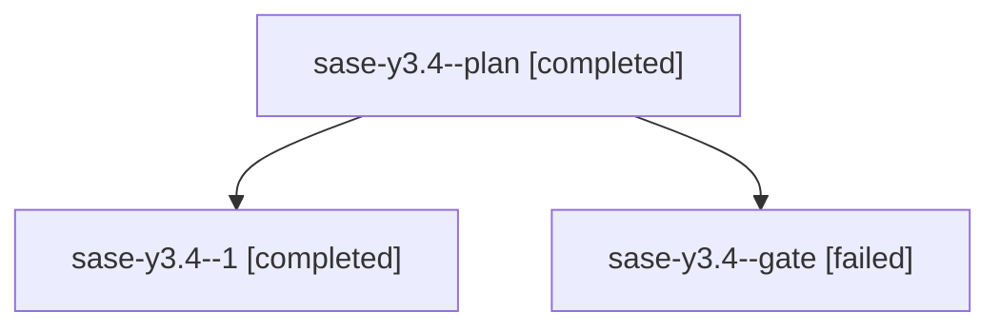

# Family: sase-y3.4

[Agent Hoods](../README.md) / [bbugyi200](../users/bbugyi200/README.md) / [athena](../users/bbugyi200/machines/athena/README.md) / [sase-y3](../users/bbugyi200/machines/athena/hoods/sase-y3/README.md) / sase-y3.4

Owner: `bbugyi200.athena` · Hood: `sase-y3` · Members: 3 · Bead: [sase-y3.4](https://github.com/sase-org/sase--beads/blob/main/pages/sase-y3/sase-y3.4.md)

## Lineage

The diagram is an optional enhancement; the ordered table below contains the same lineage in accessible text.

| Role | Agent | State | Model / provider | Timing | Commits | Prompt | Chat |
|---|---|---|---|---|---:|---|---|
| plan | sase-y3.4--plan | completed | grok-4.6 / grok | 2026-09-07T23:54:56.464166+00:00 → 2026-09-08T00:29:59.884814+00:00 | 0 | [Prompt](../agents/bbugyi200.athena.sase-y3.4--plan/prompt.md) | [Chat](../agents/bbugyi200.athena.sase-y3.4--plan/chat.md) |
| 1 | sase-y3.4--1 | completed | grok-4.6 / grok | 2026-09-08T11:04:12.186343+00:00 → 2026-09-08T11:51:19.150879+00:00 | [1](../agents/bbugyi200.athena.sase-y3.4--1/README.md#commits) | [Prompt](../agents/bbugyi200.athena.sase-y3.4--1/prompt.md) | [Chat](../agents/bbugyi200.athena.sase-y3.4--1/chat.md) |
| gate | sase-y3.4--gate | failed | grok-4.6 / grok | 2026-09-08T00:28:53.425145+00:00 → 2026-09-08T11:03:53.102202+00:00 | 0 | — | [Chat](../agents/bbugyi200.athena.sase-y3.4--gate/chat.md) |

## Commits

| Role | Repo | Commit | Subject | Committed |
|---|---|---|---|---|
| 1 | sase | [`fe58c5e`](https://github.com/sase-org/sase/commit/fe58c5efeeed90e59d393485481e1be5b0c5b758) | feat(doctor): guard primary sidecar link dirt and restore deletions | 2026-09-08 07:49:03 EDT |

## Neighbors

| Agent | Relation | State |
|---|---|---|
| [sase-y3.1](../agents/bbugyi200.athena.sase-y3.1/README.md) | sase-y3 hood | completed |
| [sase-y3.2](../agents/bbugyi200.athena.sase-y3.2/README.md) | sase-y3 hood | completed |
| [sase-y3.3](bbugyi200.athena.sase-y3.3.md) (family · 2) | sase-y3 hood | dismissed 1, failed 1 |
| [sase-y3.land](bbugyi200.athena.sase-y3.land.md) (family · 3) | sase-y3 hood | active 1, completed 1, failed 1 |
