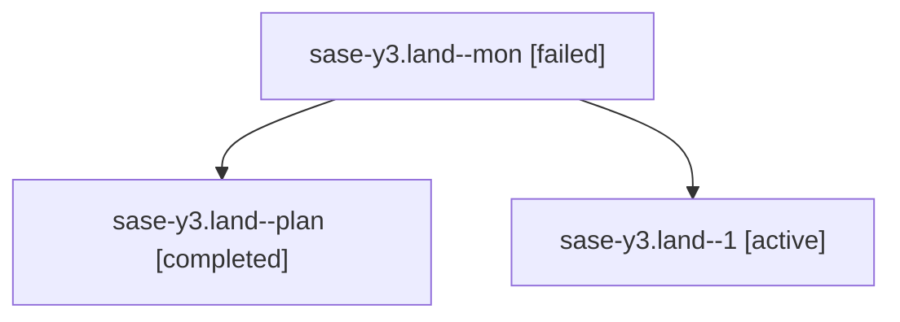

# Family: sase-y3.land

[Agent Hoods](../README.md) / [bbugyi200](../users/bbugyi200/README.md) / [athena](../users/bbugyi200/machines/athena/README.md) / [sase-y3](../users/bbugyi200/machines/athena/hoods/sase-y3/README.md) / sase-y3.land

Owner: `bbugyi200.athena` · Hood: `sase-y3` · Members: 3 · Bead: [sase-y3](https://github.com/sase-org/sase--beads/blob/main/pages/sase-y3/README.md)

## Lineage

The diagram is an optional enhancement; the ordered table below contains the same lineage in accessible text.

| Role | Agent | State | Model / provider | Timing | Commits | Prompt | Chat |
|---|---|---|---|---|---:|---|---|
| mon | sase-y3.land--mon | failed | opus / claude | 2026-09-08T12:18:08.274436+00:00 → 2026-09-08T12:45:07.920362+00:00 | 0 | — | [Chat](../agents/bbugyi200.athena.sase-y3.land--mon/chat.md) |
| plan | sase-y3.land--plan | completed | opus / claude | 2026-09-08T11:51:52.207220+00:00 → 2026-09-08T12:18:44.055335+00:00 | 0 | [Prompt](../agents/bbugyi200.athena.sase-y3.land--plan/prompt.md) | [Chat](../agents/bbugyi200.athena.sase-y3.land--plan/chat.md) |
| 1 | sase-y3.land--1 | active | opus / claude | 2026-09-08T12:45:33.289795+00:00 | [1](../agents/bbugyi200.athena.sase-y3.land--1/README.md#commits) | [Prompt](../agents/bbugyi200.athena.sase-y3.land--1/prompt.md) | — |

## Commits

| Role | Repo | Commit | Subject | Committed |
|---|---|---|---|---|
| 1 | sase | [`2edf986`](https://github.com/sase-org/sase/commit/2edf986b6dc2921ae297d556d12ffaf60d874523) | feat(sdd): route machine artifact-link writes to hidden host-owned clones | 2026-09-08 08:55:45 EDT |

## Neighbors

| Agent | Relation | State |
|---|---|---|
| [sase-y3.1](../agents/bbugyi200.athena.sase-y3.1/README.md) | sase-y3 hood | completed |
| [sase-y3.2](../agents/bbugyi200.athena.sase-y3.2/README.md) | sase-y3 hood | completed |
| [sase-y3.3](bbugyi200.athena.sase-y3.3.md) (family · 2) | sase-y3 hood | dismissed 1, failed 1 |
| [sase-y3.4](bbugyi200.athena.sase-y3.4.md) (family · 3) | sase-y3 hood | completed 2, failed 1 |
