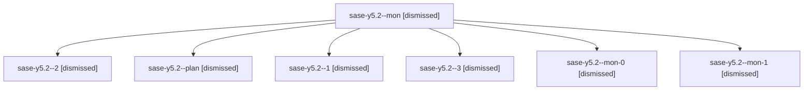

# Family: sase-y5.2

[Agent Hoods](../README.md) / [bbugyi200](../users/bbugyi200/README.md) / [athena](../users/bbugyi200/machines/athena/README.md) / [sase-y5](../users/bbugyi200/machines/athena/hoods/sase-y5/README.md) / sase-y5.2

Owner: `bbugyi200.athena` · Hood: `sase-y5` · Members: 7 · Bead: [sase-y5.2](https://github.com/sase-org/sase--beads/blob/main/pages/sase-y5/sase-y5.2.md)

## Lineage

The diagram is an optional enhancement; the ordered table below contains the same lineage in accessible text.

| Role | Agent | State | Model / provider | Timing | Commits | Prompt | Chat |
|---|---|---|---|---|---:|---|---|
| mon | sase-y5.2--mon | dismissed | gpt-5.5 / codex | 2026-09-07T18:10:31.611745 → 2026-09-07T18:11:14.850744 | 0 | — | [Chat](../agents/bbugyi200.athena.sase-y5.2--mon/chat.md) |
| 2 | sase-y5.2--2 | dismissed | gpt-5.5 / codex | 2026-09-07T20:18:21.448355 → 2026-09-07T20:38:11.716318 | 0 | [Prompt](../agents/bbugyi200.athena.sase-y5.2--2/prompt.md) | [Chat](../agents/bbugyi200.athena.sase-y5.2--2/chat.md) |
| plan | sase-y5.2--plan | dismissed | gpt-5.5 / codex | 2026-09-07T16:59:14.074683 → 2026-09-07T18:10:41.062762 | 0 | [Prompt](../agents/bbugyi200.athena.sase-y5.2--plan/prompt.md) | [Chat](../agents/bbugyi200.athena.sase-y5.2--plan/chat.md) |
| 1 | sase-y5.2--1 | dismissed | gpt-5.5 / codex | 2026-09-07T18:12:50.203104 → 2026-09-07T18:48:18.771462 | 0 | [Prompt](../agents/bbugyi200.athena.sase-y5.2--1/prompt.md) | [Chat](../agents/bbugyi200.athena.sase-y5.2--1/chat.md) |
| 3 | sase-y5.2--3 | dismissed | gpt-5.5 / codex | 2026-09-07T21:00:30.365942 → 2026-09-07T21:05:28.917577 | 0 | [Prompt](../agents/bbugyi200.athena.sase-y5.2--3/prompt.md) | — |
| mon-0 | sase-y5.2--mon-0 | dismissed | gpt-5.5 / codex | 2026-09-07T18:47:54.694391 → 2026-09-07T20:16:38.390228 | 0 | — | [Chat](../agents/bbugyi200.athena.sase-y5.2--mon-0/chat.md) |
| mon-1 | sase-y5.2--mon-1 | dismissed | gpt-5.5 / codex | 2026-09-07T20:38:03.219257 → 2026-09-07T20:58:57.211501 | 0 | — | [Chat](../agents/bbugyi200.athena.sase-y5.2--mon-1/chat.md) |

## Neighbors

| Agent | Relation | State |
|---|---|---|
| [sase-y5.1](../agents/bbugyi200.athena.sase-y5.1/README.md) | sase-y5 hood | dismissed |
| [sase-y5.10](../agents/bbugyi200.athena.sase-y5.10/README.md) | sase-y5 hood | dismissed |
| [sase-y5.11](../agents/bbugyi200.athena.sase-y5.11/README.md) | sase-y5 hood | active |
| [sase-y5.3](../agents/bbugyi200.athena.sase-y5.3/README.md) | sase-y5 hood | dismissed |
| [sase-y5.4](../agents/bbugyi200.athena.sase-y5.4/README.md) | sase-y5 hood | completed |
| [sase-y5.5](../agents/bbugyi200.athena.sase-y5.5/README.md) | sase-y5 hood | completed |
| [sase-y5.6](../agents/bbugyi200.athena.sase-y5.6/README.md) | sase-y5 hood | completed |
| [sase-y5.7](../agents/bbugyi200.athena.sase-y5.7/README.md) | sase-y5 hood | completed |
| [sase-y5.8](../agents/bbugyi200.athena.sase-y5.8/README.md) | sase-y5 hood | completed |
| [sase-y5.9](../agents/bbugyi200.athena.sase-y5.9/README.md) | sase-y5 hood | completed |
| [sase-y5.land](../agents/bbugyi200.athena.sase-y5.land/README.md) | sase-y5 hood | waiting |
