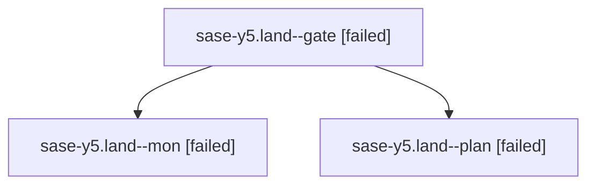

# Family: sase-y5.land

[Agent Hoods](../README.md) / [bbugyi200](../users/bbugyi200/README.md) / [athena](../users/bbugyi200/machines/athena/README.md) / [sase-y5](../users/bbugyi200/machines/athena/hoods/sase-y5/README.md) / sase-y5.land

Owner: `bbugyi200.athena` · Hood: `sase-y5` · Members: 3 · Bead: [sase-y5](https://github.com/sase-org/sase--beads/blob/main/pages/sase-y5/README.md)

## Lineage

The diagram is an optional enhancement; the ordered table below contains the same lineage in accessible text.

| Role | Agent | State | Model / provider | Timing | Commits | Prompt | Chat |
|---|---|---|---|---|---:|---|---|
| gate | sase-y5.land--gate | failed | claude-fable-5 / claude | 2026-09-09T10:11:09.594698+00:00 → 2026-09-09T10:11:22.652052+00:00 | 0 | — | [Chat](../agents/bbugyi200.athena.sase-y5.land--gate/chat.md) |
| mon | sase-y5.land--mon | failed | claude-fable-5 / claude | 2026-09-09T10:11:21.250426+00:00 → 2026-09-09T10:13:11.195715+00:00 | 0 | — | [Chat](../agents/bbugyi200.athena.sase-y5.land--mon/chat.md) |
| plan | sase-y5.land--plan | failed | claude-fable-5 / claude | 2026-09-09T09:33:01.735572+00:00 → 2026-09-09T10:11:28.910034+00:00 | 0 | [Prompt](../agents/bbugyi200.athena.sase-y5.land--plan/prompt.md) | [Chat](../agents/bbugyi200.athena.sase-y5.land--plan/chat.md) |

## Neighbors

| Agent | Relation | State |
|---|---|---|
| [sase-y5.1](../agents/bbugyi200.athena.sase-y5.1/README.md) | sase-y5 hood | dismissed |
| [sase-y5.10](../agents/bbugyi200.athena.sase-y5.10/README.md) | sase-y5 hood | dismissed |
| [sase-y5.11](../agents/bbugyi200.athena.sase-y5.11/README.md) | sase-y5 hood | completed |
| [sase-y5.12.1](../agents/bbugyi200.athena.sase-y5.12.1/README.md) | sase-y5 hood | active |
| [sase-y5.12.2](../agents/bbugyi200.athena.sase-y5.12.2/README.md) | sase-y5 hood | active |
| [sase-y5.12.land](../agents/bbugyi200.athena.sase-y5.12.land/README.md) | sase-y5 hood | waiting |
| [sase-y5.2](bbugyi200.athena.sase-y5.2.md) (family · 7) | sase-y5 hood | dismissed 7 |
| [sase-y5.3](../agents/bbugyi200.athena.sase-y5.3/README.md) | sase-y5 hood | dismissed |
| [sase-y5.4](../agents/bbugyi200.athena.sase-y5.4/README.md) | sase-y5 hood | completed |
| [sase-y5.5](../agents/bbugyi200.athena.sase-y5.5/README.md) | sase-y5 hood | completed |
| [sase-y5.6](../agents/bbugyi200.athena.sase-y5.6/README.md) | sase-y5 hood | completed |
| [sase-y5.7](../agents/bbugyi200.athena.sase-y5.7/README.md) | sase-y5 hood | completed |
| [sase-y5.8](../agents/bbugyi200.athena.sase-y5.8/README.md) | sase-y5 hood | completed |
| [sase-y5.9](../agents/bbugyi200.athena.sase-y5.9/README.md) | sase-y5 hood | completed |
