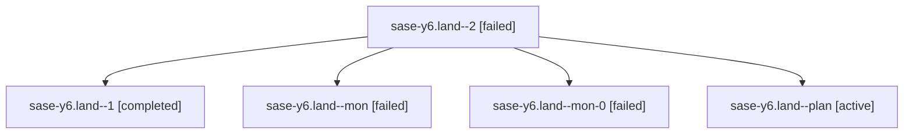

# Family: sase-y6.land

[Agent Hoods](../README.md) / [bbugyi200](../users/bbugyi200/README.md) / [athena](../users/bbugyi200/machines/athena/README.md) / [sase-y6](../users/bbugyi200/machines/athena/hoods/sase-y6/README.md) / sase-y6.land

Owner: `bbugyi200.athena` · Hood: `sase-y6` · Members: 5 · Bead: [sase-y6](https://github.com/sase-org/sase--beads/blob/main/pages/sase-y6/README.md)

## Lineage

The diagram is an optional enhancement; the ordered table below contains the same lineage in accessible text.

| Role | Agent | State | Model / provider | Timing | Commits | Prompt | Chat |
|---|---|---|---|---|---:|---|---|
| 2 | sase-y6.land--2 | failed | claude-fable-5 / claude | 2026-09-08T15:07:33.560178+00:00 → 2026-09-08T15:53:10.135557+00:00 | 0 | [Prompt](../agents/bbugyi200.athena.sase-y6.land--2/prompt.md) | — |
| 1 | sase-y6.land--1 | completed | claude-fable-5 / claude | 2026-09-08T14:27:20.978717+00:00 → 2026-09-08T14:46:15.961990+00:00 | 0 | [Prompt](../agents/bbugyi200.athena.sase-y6.land--1/prompt.md) | [Chat](../agents/bbugyi200.athena.sase-y6.land--1/chat.md) |
| mon | sase-y6.land--mon | failed | claude-fable-5 / claude | 2026-09-08T13:50:06.017067+00:00 → 2026-09-08T14:26:27.802677+00:00 | 0 | — | [Chat](../agents/bbugyi200.athena.sase-y6.land--mon/chat.md) |
| mon-0 | sase-y6.land--mon-0 | failed | claude-fable-5 / claude | 2026-09-08T14:46:05.357117+00:00 → 2026-09-08T15:07:01.930539+00:00 | 0 | — | [Chat](../agents/bbugyi200.athena.sase-y6.land--mon-0/chat.md) |
| plan | sase-y6.land--plan | active | claude-fable-5 / claude | 2026-09-08T12:38:19.148451+00:00 | 0 | [Prompt](../agents/bbugyi200.athena.sase-y6.land--plan/prompt.md) | [Chat](../agents/bbugyi200.athena.sase-y6.land--plan/chat.md) |

## Commits

| Role | Repo | Commit | Subject | Committed |
|---|---|---|---|---|
| — | sase | [`7b93472`](https://github.com/sase-org/sase/commit/7b934722f87355adbe97e4ea22da5ffb353be847) | fix(verify): sync the notify +1 completion spec, re-key the sase-y5.7 epic symbol, and dedupe the flake baseline | 2026-09-08 11:56:17 EDT |

## Neighbors

| Agent | Relation | State |
|---|---|---|
| [sase-y6.1](../agents/bbugyi200.athena.sase-y6.1/README.md) | sase-y6 hood | active |
| [sase-y6.2](../agents/bbugyi200.athena.sase-y6.2/README.md) | sase-y6 hood | active |
| [sase-y6.3](../agents/bbugyi200.athena.sase-y6.3/README.md) | sase-y6 hood | active |
| [sase-y6.4](../agents/bbugyi200.athena.sase-y6.4/README.md) | sase-y6 hood | active |
| [sase-y6.5](../agents/bbugyi200.athena.sase-y6.5/README.md) | sase-y6 hood | active |
