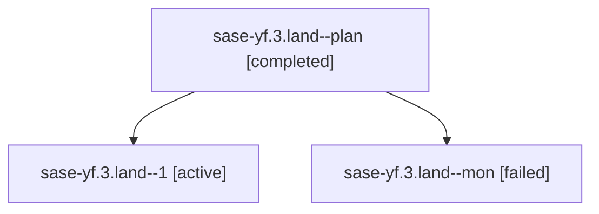

# Family: sase-yf.3.land

[Agent Hoods](../README.md) / [bbugyi200](../users/bbugyi200/README.md) / [athena](../users/bbugyi200/machines/athena/README.md) / [sase-yf](../users/bbugyi200/machines/athena/hoods/sase-yf/README.md) / sase-yf.3.land

Owner: `bbugyi200.athena` · Hood: `sase-yf` · Members: 3 · Bead: [sase-yf.3](https://github.com/sase-org/sase--beads/blob/main/pages/sase-yf/sase-yf.3.md)

## Lineage

The diagram is an optional enhancement; the ordered table below contains the same lineage in accessible text.

| Role | Agent | State | Model / provider | Timing | Commits | Prompt | Chat |
|---|---|---|---|---|---:|---|---|
| plan | sase-yf.3.land--plan | completed | opus / claude | 2026-09-09T08:40:43.526713+00:00 → 2026-09-09T09:29:16.732521+00:00 | 0 | [Prompt](../agents/bbugyi200.athena.sase-yf.3.land--plan/prompt.md) | [Chat](../agents/bbugyi200.athena.sase-yf.3.land--plan/chat.md) |
| 1 | sase-yf.3.land--1 | active | opus / claude | 2026-09-09T09:54:09.479559+00:00 | [1](../agents/bbugyi200.athena.sase-yf.3.land--1/README.md#commits) | [Prompt](../agents/bbugyi200.athena.sase-yf.3.land--1/prompt.md) | — |
| mon | sase-yf.3.land--mon | failed | opus / claude | 2026-09-09T09:28:46.986422+00:00 → 2026-09-09T09:53:42.804706+00:00 | 0 | — | [Chat](../agents/bbugyi200.athena.sase-yf.3.land--mon/chat.md) |

## Commits

| Role | Repo | Commit | Subject | Committed |
|---|---|---|---|---|
| 1 | sase | [`00b8f02`](https://github.com/sase-org/sase/commit/00b8f021650b6a5857c5aadd9af2f20e4c7daaf8) | feat(ace): polish the star model alias completion panel | 2026-09-09 06:15:55 EDT |

## Neighbors

| Agent | Relation | State |
|---|---|---|
| [sase-yf.3.1](../agents/bbugyi200.athena.sase-yf.3.1/README.md) | sase-yf.3 hood | completed |
| [sase-yf.3.2](../agents/bbugyi200.athena.sase-yf.3.2/README.md) | sase-yf.3 hood | failed |
| [sase-yf.1](../agents/bbugyi200.athena.sase-yf.1/README.md) | sase-yf hood | completed |
| [sase-yf.2](../agents/bbugyi200.athena.sase-yf.2/README.md) | sase-yf hood | completed |
| [sase-yf.land](bbugyi200.athena.sase-yf.land.md) (family · 3) | sase-yf hood | failed 3 |
| [sase-yf.land.w0.w0](../agents/bbugyi200.athena.sase-yf.land.w0.w0/README.md) | sase-yf hood | dismissed |
| [sase-yf.land.w0.w1](../agents/bbugyi200.athena.sase-yf.land.w0.w1/README.md) | sase-yf hood | dismissed |
| [sase-yf.land.w1](../agents/bbugyi200.athena.sase-yf.land.w1/README.md) | sase-yf hood | dismissed |
| [sase-yf.land.w2.w0](../agents/bbugyi200.athena.sase-yf.land.w2.w0/README.md) | sase-yf hood | waiting |
| [sase-yf.land.w3](../agents/bbugyi200.athena.sase-yf.land.w3/README.md) | sase-yf hood | active |
