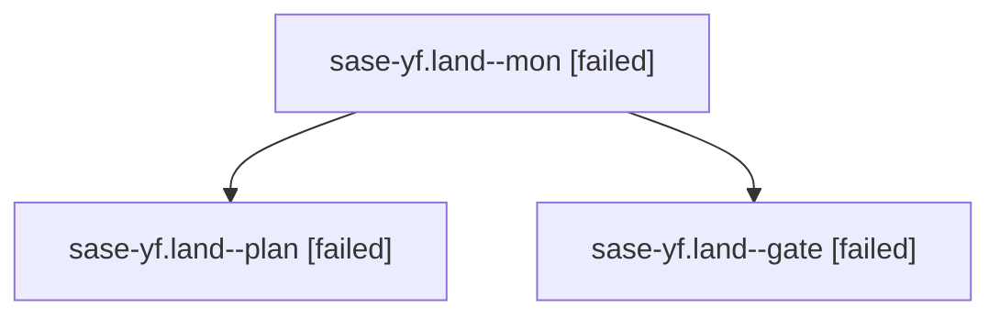

# Family: sase-yf.land

[Agent Hoods](../README.md) / [bbugyi200](../users/bbugyi200/README.md) / [athena](../users/bbugyi200/machines/athena/README.md) / [sase-yf](../users/bbugyi200/machines/athena/hoods/sase-yf/README.md) / sase-yf.land

Owner: `bbugyi200.athena` · Hood: `sase-yf` · Members: 3 · Bead: [sase-yf](https://github.com/sase-org/sase--beads/blob/main/pages/sase-yf/README.md)

## Lineage

The diagram is an optional enhancement; the ordered table below contains the same lineage in accessible text.

| Role | Agent | State | Model / provider | Timing | Commits | Prompt | Chat |
|---|---|---|---|---|---:|---|---|
| mon | sase-yf.land--mon | failed | gpt-5.6-sol / codex | 2026-09-08T16:51:12.122113+00:00 → 2026-09-08T16:53:38.073543+00:00 | 0 | — | [Chat](../agents/bbugyi200.athena.sase-yf.land--mon/chat.md) |
| plan | sase-yf.land--plan | failed | gpt-5.6-sol / codex | 2026-09-08T16:33:03.321933+00:00 → 2026-09-08T16:51:20.308418+00:00 | 0 | [Prompt](../agents/bbugyi200.athena.sase-yf.land--plan/prompt.md) | [Chat](../agents/bbugyi200.athena.sase-yf.land--plan/chat.md) |
| gate | sase-yf.land--gate | failed | gpt-5.6-sol / codex | 2026-09-08T16:50:52.505932+00:00 → 2026-09-08T16:51:16.431189+00:00 | 0 | — | [Chat](../agents/bbugyi200.athena.sase-yf.land--gate/chat.md) |

## Neighbors

| Agent | Relation | State |
|---|---|---|
| [sase-yf.land.w0.w0](../agents/bbugyi200.athena.sase-yf.land.w0.w0/README.md) | descendant | dismissed |
| [sase-yf.land.w0.w1](../agents/bbugyi200.athena.sase-yf.land.w0.w1/README.md) | descendant | dismissed |
| [sase-yf.land.w1](../agents/bbugyi200.athena.sase-yf.land.w1/README.md) | descendant | dismissed |
| [sase-yf.land.w2.w0](../agents/bbugyi200.athena.sase-yf.land.w2.w0/README.md) | descendant | waiting |
| [sase-yf.land.w3](../agents/bbugyi200.athena.sase-yf.land.w3/README.md) | descendant | active |
| [sase-yf.1](../agents/bbugyi200.athena.sase-yf.1/README.md) | sase-yf hood | completed |
| [sase-yf.2](../agents/bbugyi200.athena.sase-yf.2/README.md) | sase-yf hood | completed |
| [sase-yf.3.1](../agents/bbugyi200.athena.sase-yf.3.1/README.md) | sase-yf hood | completed |
| [sase-yf.3.2](../agents/bbugyi200.athena.sase-yf.3.2/README.md) | sase-yf hood | failed |
| [sase-yf.3.land](bbugyi200.athena.sase-yf.3.land.md) (family · 3) | sase-yf hood | active 1, completed 1, failed 1 |
| [sase-yf.3.land](../agents/bbugyi200.athena.sase-yf.3.land/README.md) | sase-yf hood | waiting |
