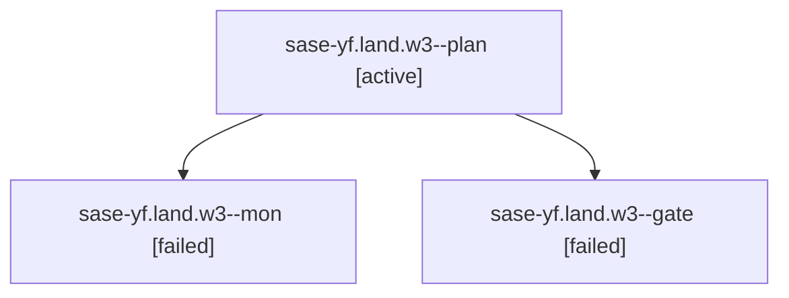

# Family: sase-yf.land.w3

[Agent Hoods](../README.md) / [bbugyi200](../users/bbugyi200/README.md) / [athena](../users/bbugyi200/machines/athena/README.md) / [sase-yf](../users/bbugyi200/machines/athena/hoods/sase-yf/README.md) / sase-yf.land.w3

Owner: `bbugyi200.athena` · Hood: `sase-yf` · Members: 3

## Lineage

The diagram is an optional enhancement; the ordered table below contains the same lineage in accessible text.

| Role | Agent | State | Model / provider | Timing | Commits | Prompt | Chat |
|---|---|---|---|---|---:|---|---|
| plan | sase-yf.land.w3--plan | active | gpt-5.6-sol / codex | 2026-09-09T10:14:38.005091+00:00 | 0 | [Prompt](../agents/bbugyi200.athena.sase-yf.land.w3--plan/prompt.md) | [Chat](../agents/bbugyi200.athena.sase-yf.land.w3--plan/chat.md) |
| mon | sase-yf.land.w3--mon | failed | gpt-5.6-sol / codex | 2026-09-09T10:57:04.690186+00:00 → 2026-09-09T10:59:26.760493+00:00 | 0 | — | [Chat](../agents/bbugyi200.athena.sase-yf.land.w3--mon/chat.md) |
| gate | sase-yf.land.w3--gate | failed | gpt-5.6-sol / codex | 2026-09-09T10:51:41.102318+00:00 → 2026-09-09T10:57:07.287682+00:00 | 0 | — | [Chat](../agents/bbugyi200.athena.sase-yf.land.w3--gate/chat.md) |

## Neighbors

| Agent | Relation | State |
|---|---|---|
| [sase-yf.land](bbugyi200.athena.sase-yf.land.md) (family · 3) | ancestor | active 3 |
| [sase-yf.land.w0.w0](../agents/bbugyi200.athena.sase-yf.land.w0.w0/README.md) | sase-yf.land hood | waiting |
| [sase-yf.land.w0.w1](../agents/bbugyi200.athena.sase-yf.land.w0.w1/README.md) | sase-yf.land hood | active |
| [sase-yf.land.w1](../agents/bbugyi200.athena.sase-yf.land.w1/README.md) | sase-yf.land hood | waiting |
| [sase-yf.land.w2.w0](../agents/bbugyi200.athena.sase-yf.land.w2.w0/README.md) | sase-yf.land hood | waiting |
| [sase-yf.1](../agents/bbugyi200.athena.sase-yf.1/README.md) | sase-yf hood | active |
| [sase-yf.2](../agents/bbugyi200.athena.sase-yf.2/README.md) | sase-yf hood | active |
| [sase-yf.3.1](../agents/bbugyi200.athena.sase-yf.3.1/README.md) | sase-yf hood | active |
| [sase-yf.3.2](../agents/bbugyi200.athena.sase-yf.3.2/README.md) | sase-yf hood | active |
| [sase-yf.3.land](bbugyi200.athena.sase-yf.3.land.md) (family · 3) | sase-yf hood | active 1, completed 1, failed 1 |
| [sase-yf.3.land](../agents/bbugyi200.athena.sase-yf.3.land/README.md) | sase-yf hood | waiting |
