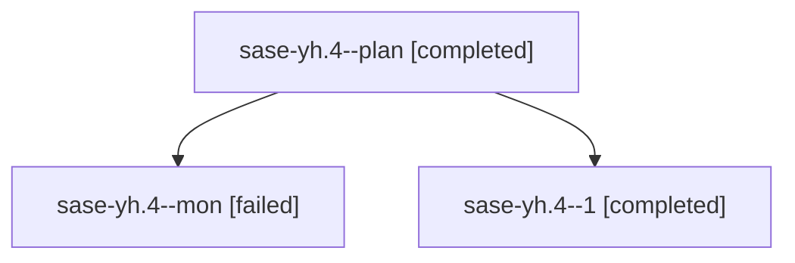

# Family: sase-yh.4

[Agent Hoods](../README.md) / [bbugyi200](../users/bbugyi200/README.md) / [athena](../users/bbugyi200/machines/athena/README.md) / [sase-yh](../users/bbugyi200/machines/athena/hoods/sase-yh/README.md) / sase-yh.4

Owner: `bbugyi200.athena` · Hood: `sase-yh` · Members: 3 · Bead: [sase-yh.4](https://github.com/sase-org/sase--beads/blob/main/pages/sase-yh/sase-yh.4.md)

## Lineage

The diagram is an optional enhancement; the ordered table below contains the same lineage in accessible text.

| Role | Agent | State | Model / provider | Timing | Commits | Prompt | Chat |
|---|---|---|---|---|---:|---|---|
| plan | sase-yh.4--plan | completed | grok-4.6 / grok | 2026-09-09T08:38:53.679789+00:00 → 2026-09-09T09:56:57.460410+00:00 | 0 | [Prompt](../agents/bbugyi200.athena.sase-yh.4--plan/prompt.md) | [Chat](../agents/bbugyi200.athena.sase-yh.4--plan/chat.md) |
| mon | sase-yh.4--mon | failed | grok-4.6 / grok | 2026-09-09T09:56:22.398150+00:00 → 2026-09-09T10:00:39.740660+00:00 | 0 | — | [Chat](../agents/bbugyi200.athena.sase-yh.4--mon/chat.md) |
| 1 | sase-yh.4--1 | completed | grok-4.6 / grok | 2026-09-09T10:01:05.391978+00:00 → 2026-09-09T10:47:38.256054+00:00 | [1](../agents/bbugyi200.athena.sase-yh.4--1/README.md#commits) | [Prompt](../agents/bbugyi200.athena.sase-yh.4--1/prompt.md) | [Chat](../agents/bbugyi200.athena.sase-yh.4--1/chat.md) |

## Commits

| Role | Repo | Commit | Subject | Committed |
|---|---|---|---|---|
| 1 | sase | [`4068437`](https://github.com/sase-org/sase/commit/4068437a2c231e9b0826f18db33b48890cc83c7c) | fix(commit): resume pending checkpoints and record unpushed stitch evidence | 2026-09-09 06:43:20 EDT |

## Neighbors

| Agent | Relation | State |
|---|---|---|
| [sase-yh.1](../agents/bbugyi200.athena.sase-yh.1/README.md) | sase-yh hood | completed |
| [sase-yh.2](../agents/bbugyi200.athena.sase-yh.2/README.md) | sase-yh hood | dismissed |
| [sase-yh.3](../agents/bbugyi200.athena.sase-yh.3/README.md) | sase-yh hood | completed |
| [sase-yh.5.1](../agents/bbugyi200.athena.sase-yh.5.1/README.md) | sase-yh hood | active |
| [sase-yh.5.2](../agents/bbugyi200.athena.sase-yh.5.2/README.md) | sase-yh hood | active |
| [sase-yh.5.3](../agents/bbugyi200.athena.sase-yh.5.3/README.md) | sase-yh hood | waiting |
| [sase-yh.5.land](../agents/bbugyi200.athena.sase-yh.5.land/README.md) | sase-yh hood | waiting |
| [sase-yh.land](bbugyi200.athena.sase-yh.land.md) (family · 3) | sase-yh hood | failed 3 |
