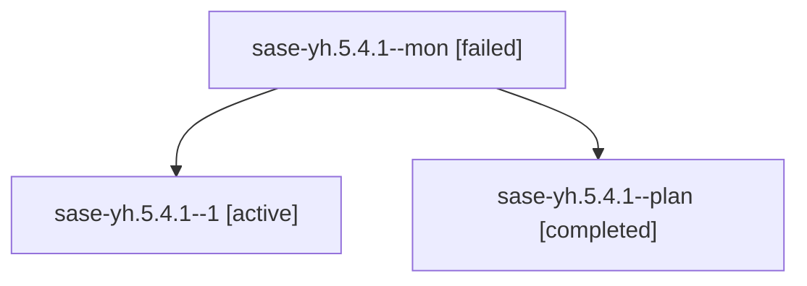

# Family: sase-yh.5.4.1

[Agent Hoods](../README.md) / [bbugyi200](../users/bbugyi200/README.md) / [athena](../users/bbugyi200/machines/athena/README.md) / [sase-yh](../users/bbugyi200/machines/athena/hoods/sase-yh/README.md) / sase-yh.5.4.1

Owner: `bbugyi200.athena` · Hood: `sase-yh` · Members: 3 · Bead: [sase-yh.5.4.1](https://github.com/sase-org/sase--beads/blob/main/pages/sase-yh/sase-yh.5.4.1.md)

## Lineage

The diagram is an optional enhancement; the ordered table below contains the same lineage in accessible text.

| Role | Agent | State | Model / provider | Timing | Commits | Prompt | Chat |
|---|---|---|---|---|---:|---|---|
| mon | sase-yh.5.4.1--mon | failed | gpt-5.5 / codex | 2026-09-09T14:13:56.719252+00:00 → 2026-09-09T14:40:00.554394+00:00 | 0 | — | [Chat](../agents/bbugyi200.athena.sase-yh.5.4.1--mon/chat.md) |
| 1 | sase-yh.5.4.1--1 | active | gpt-5.5 / codex | 2026-09-09T14:40:24.423266+00:00 | 0 | [Prompt](../agents/bbugyi200.athena.sase-yh.5.4.1--1/prompt.md) | — |
| plan | sase-yh.5.4.1--plan | completed | gpt-5.5 / codex | 2026-09-09T13:29:06.634200+00:00 → 2026-09-09T14:14:09.603917+00:00 | 0 | [Prompt](../agents/bbugyi200.athena.sase-yh.5.4.1--plan/prompt.md) | [Chat](../agents/bbugyi200.athena.sase-yh.5.4.1--plan/chat.md) |

## Neighbors

| Agent | Relation | State |
|---|---|---|
| [sase-yh.5.4.land](../agents/bbugyi200.athena.sase-yh.5.4.land/README.md) | sase-yh.5.4 hood | waiting |
| [sase-yh.5.1](../agents/bbugyi200.athena.sase-yh.5.1/README.md) | sase-yh.5 hood | completed |
| [sase-yh.5.2](../agents/bbugyi200.athena.sase-yh.5.2/README.md) | sase-yh.5 hood | completed |
| [sase-yh.5.3](../agents/bbugyi200.athena.sase-yh.5.3/README.md) | sase-yh.5 hood | completed |
| [sase-yh.5.land](bbugyi200.athena.sase-yh.5.land.md) (family · 3) | sase-yh.5 hood | failed 3 |
| [sase-yh.1](../agents/bbugyi200.athena.sase-yh.1/README.md) | sase-yh hood | completed |
| [sase-yh.2](../agents/bbugyi200.athena.sase-yh.2/README.md) | sase-yh hood | dismissed |
| [sase-yh.3](../agents/bbugyi200.athena.sase-yh.3/README.md) | sase-yh hood | completed |
| [sase-yh.4](bbugyi200.athena.sase-yh.4.md) (family · 3) | sase-yh hood | completed 2, failed 1 |
| [sase-yh.4](../agents/bbugyi200.athena.sase-yh.4/README.md) | sase-yh hood | waiting |
| [sase-yh.land](bbugyi200.athena.sase-yh.land.md) (family · 3) | sase-yh hood | failed 3 |
