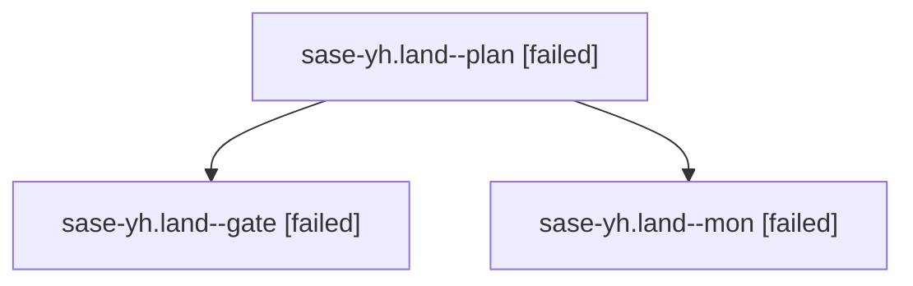

# Family: sase-yh.land

[Agent Hoods](../README.md) / [bbugyi200](../users/bbugyi200/README.md) / [athena](../users/bbugyi200/machines/athena/README.md) / [sase-yh](../users/bbugyi200/machines/athena/hoods/sase-yh/README.md) / sase-yh.land

Owner: `bbugyi200.athena` · Hood: `sase-yh` · Members: 3 · Bead: [sase-yh](https://github.com/sase-org/sase--beads/blob/main/pages/sase-yh/README.md)

## Lineage

The diagram is an optional enhancement; the ordered table below contains the same lineage in accessible text.

| Role | Agent | State | Model / provider | Timing | Commits | Prompt | Chat |
|---|---|---|---|---|---:|---|---|
| plan | sase-yh.land--plan | failed | gpt-5.6-sol / codex | 2026-09-09T10:47:43.256813+00:00 → 2026-09-09T11:14:14.447873+00:00 | 0 | [Prompt](../agents/bbugyi200.athena.sase-yh.land--plan/prompt.md) | [Chat](../agents/bbugyi200.athena.sase-yh.land--plan/chat.md) |
| gate | sase-yh.land--gate | failed | gpt-5.6-sol / codex | 2026-09-09T11:13:58.581667+00:00 → 2026-09-09T11:14:10.089903+00:00 | 0 | — | [Chat](../agents/bbugyi200.athena.sase-yh.land--gate/chat.md) |
| mon | sase-yh.land--mon | failed | gpt-5.6-sol / codex | 2026-09-09T11:14:09.131279+00:00 → 2026-09-09T11:15:50.277709+00:00 | 0 | — | [Chat](../agents/bbugyi200.athena.sase-yh.land--mon/chat.md) |

## Neighbors

| Agent | Relation | State |
|---|---|---|
| [sase-yh.1](../agents/bbugyi200.athena.sase-yh.1/README.md) | sase-yh hood | completed |
| [sase-yh.2](../agents/bbugyi200.athena.sase-yh.2/README.md) | sase-yh hood | dismissed |
| [sase-yh.3](../agents/bbugyi200.athena.sase-yh.3/README.md) | sase-yh hood | completed |
| [sase-yh.4](bbugyi200.athena.sase-yh.4.md) (family · 3) | sase-yh hood | completed 2, failed 1 |
| [sase-yh.4](../agents/bbugyi200.athena.sase-yh.4/README.md) | sase-yh hood | waiting |
| [sase-yh.5.1](../agents/bbugyi200.athena.sase-yh.5.1/README.md) | sase-yh hood | active |
| [sase-yh.5.2](../agents/bbugyi200.athena.sase-yh.5.2/README.md) | sase-yh hood | active |
| [sase-yh.5.3](../agents/bbugyi200.athena.sase-yh.5.3/README.md) | sase-yh hood | waiting |
| [sase-yh.5.land](../agents/bbugyi200.athena.sase-yh.5.land/README.md) | sase-yh hood | waiting |
