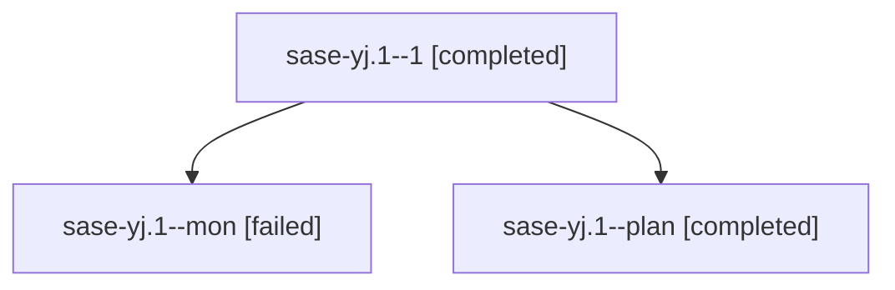

# Family: sase-yj.1

[Agent Hoods](../README.md) / [bbugyi200](../users/bbugyi200/README.md) / [athena](../users/bbugyi200/machines/athena/README.md) / [sase-yj](../users/bbugyi200/machines/athena/hoods/sase-yj/README.md) / sase-yj.1

Owner: `bbugyi200.athena` · Hood: `sase-yj` · Members: 3 · Bead: [sase-yj.1](https://github.com/sase-org/sase--beads/blob/main/pages/sase-yj/sase-yj.1.md)

## Lineage

The diagram is an optional enhancement; the ordered table below contains the same lineage in accessible text.

| Role | Agent | State | Model / provider | Timing | Commits | Prompt | Chat |
|---|---|---|---|---|---:|---|---|
| 1 | sase-yj.1--1 | completed | grok-4.6 / grok | 2026-09-08T23:31:16.594797+00:00 → 2026-09-08T23:57:54.193049+00:00 | [1](../agents/bbugyi200.athena.sase-yj.1--1/README.md#commits) | [Prompt](../agents/bbugyi200.athena.sase-yj.1--1/prompt.md) | [Chat](../agents/bbugyi200.athena.sase-yj.1--1/chat.md) |
| mon | sase-yj.1--mon | failed | grok-4.6 / grok | 2026-09-08T23:17:55.813401+00:00 → 2026-09-08T23:30:53.239668+00:00 | 0 | — | [Chat](../agents/bbugyi200.athena.sase-yj.1--mon/chat.md) |
| plan | sase-yj.1--plan | completed | grok-4.6 / grok | 2026-09-08T21:58:36.782612+00:00 → 2026-09-08T23:18:20.115308+00:00 | 0 | [Prompt](../agents/bbugyi200.athena.sase-yj.1--plan/prompt.md) | [Chat](../agents/bbugyi200.athena.sase-yj.1--plan/chat.md) |

## Commits

| Role | Repo | Commit | Subject | Committed |
|---|---|---|---|---|
| 1 | sase | [`c235300`](https://github.com/sase-org/sase/commit/c235300c6228bdd28f806760bdbd15284aa242c9) | feat(xprompt): add thin Python adapter for shared %queue/%q contract | 2026-09-08 19:51:35 EDT |

## Neighbors

| Agent | Relation | State |
|---|---|---|
| [sase-yj.2](../agents/bbugyi200.athena.sase-yj.2/README.md) | sase-yj hood | completed |
| [sase-yj.3](../agents/bbugyi200.athena.sase-yj.3/README.md) | sase-yj hood | active |
| [sase-yj.4](../agents/bbugyi200.athena.sase-yj.4/README.md) | sase-yj hood | waiting |
| [sase-yj.land](../agents/bbugyi200.athena.sase-yj.land/README.md) | sase-yj hood | waiting |
