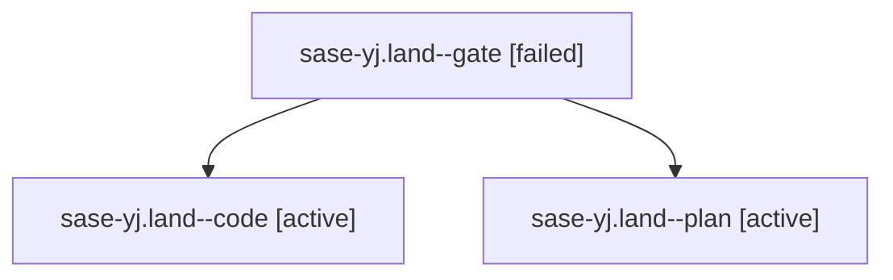

# Family: sase-yj.land

[Agent Hoods](../README.md) / [bbugyi200](../users/bbugyi200/README.md) / [athena](../users/bbugyi200/machines/athena/README.md) / [sase-yj](../users/bbugyi200/machines/athena/hoods/sase-yj/README.md) / sase-yj.land

Owner: `bbugyi200.athena` · Hood: `sase-yj` · Members: 3 · Bead: [sase-yj](https://github.com/sase-org/sase--beads/blob/main/pages/sase-yj/README.md)

## Lineage

The diagram is an optional enhancement; the ordered table below contains the same lineage in accessible text.

| Role | Agent | State | Model / provider | Timing | Commits | Prompt | Chat |
|---|---|---|---|---|---:|---|---|
| gate | sase-yj.land--gate | failed | gpt-5.6-sol / codex | 2026-09-09T10:57:51.360357+00:00 → 2026-09-09T10:57:59.798292+00:00 | 0 | — | [Chat](../agents/bbugyi200.athena.sase-yj.land--gate/chat.md) |
| code | sase-yj.land--code | active | gpt-5.5 / codex | 2026-09-09T10:58:13.006242+00:00 | [1](../agents/bbugyi200.athena.sase-yj.land--code/README.md#commits) | — | — |
| plan | sase-yj.land--plan | active | gpt-5.6-sol / codex | 2026-09-09T10:37:59.315771+00:00 | 0 | [Prompt](../agents/bbugyi200.athena.sase-yj.land--plan/prompt.md) | [Chat](../agents/bbugyi200.athena.sase-yj.land--plan/chat.md) |

## Commits

| Role | Repo | Commit | Subject | Committed |
|---|---|---|---|---|
| code | sase | [`f4ca78c`](https://github.com/sase-org/sase/commit/f4ca78c0ff3413aad43086051d892a0ae1e5fea0) | fix(queue): land directive core floor | 2026-09-09 08:50:49 EDT |

## Neighbors

| Agent | Relation | State |
|---|---|---|
| [sase-yj.1](bbugyi200.athena.sase-yj.1.md) (family · 3) | sase-yj hood | completed 2, failed 1 |
| [sase-yj.2](../agents/bbugyi200.athena.sase-yj.2/README.md) | sase-yj hood | completed |
| [sase-yj.3](../agents/bbugyi200.athena.sase-yj.3/README.md) | sase-yj hood | dismissed |
| [sase-yj.4](../agents/bbugyi200.athena.sase-yj.4/README.md) | sase-yj hood | completed |
