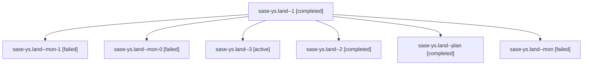

# Family: sase-ys.land

[Agent Hoods](../README.md) / [bbugyi200](../users/bbugyi200/README.md) / [athena](../users/bbugyi200/machines/athena/README.md) / [sase-ys](../users/bbugyi200/machines/athena/hoods/sase-ys/README.md) / sase-ys.land

Owner: `bbugyi200.athena` · Hood: `sase-ys` · Members: 7 · Bead: [sase-ys](https://github.com/sase-org/sase--beads/blob/main/pages/sase-ys/README.md)

## Lineage

The diagram is an optional enhancement; the ordered table below contains the same lineage in accessible text.

| Role | Agent | State | Model / provider | Timing | Commits | Prompt | Chat |
|---|---|---|---|---|---:|---|---|
| 1 | sase-ys.land--1 | completed | gpt-5.6-sol / codex | 2026-09-09T13:22:24.375747+00:00 → 2026-09-09T13:26:00.857351+00:00 | 0 | [Prompt](../agents/bbugyi200.athena.sase-ys.land--1/prompt.md) | [Chat](../agents/bbugyi200.athena.sase-ys.land--1/chat.md) |
| mon-1 | sase-ys.land--mon-1 | failed | gpt-5.6-sol / codex | 2026-09-09T14:08:04.556577+00:00 → 2026-09-09T14:34:32.717775+00:00 | 0 | — | [Chat](../agents/bbugyi200.athena.sase-ys.land--mon-1/chat.md) |
| mon-0 | sase-ys.land--mon-0 | failed | gpt-5.6-sol / codex | 2026-09-09T13:25:52.170334+00:00 → 2026-09-09T14:05:15.900323+00:00 | 0 | — | [Chat](../agents/bbugyi200.athena.sase-ys.land--mon-0/chat.md) |
| 3 | sase-ys.land--3 | active | gpt-5.6-sol / codex | 2026-09-09T14:34:56.215094+00:00 | [1](../agents/bbugyi200.athena.sase-ys.land--3/README.md#commits) | [Prompt](../agents/bbugyi200.athena.sase-ys.land--3/prompt.md) | — |
| 2 | sase-ys.land--2 | completed | gpt-5.6-sol / codex | 2026-09-09T14:05:35.215913+00:00 → 2026-09-09T14:08:15.253881+00:00 | 0 | [Prompt](../agents/bbugyi200.athena.sase-ys.land--2/prompt.md) | [Chat](../agents/bbugyi200.athena.sase-ys.land--2/chat.md) |
| plan | sase-ys.land--plan | completed | gpt-5.6-sol / codex | 2026-09-09T12:30:52.713601+00:00 → 2026-09-09T12:55:39.708111+00:00 | 0 | [Prompt](../agents/bbugyi200.athena.sase-ys.land--plan/prompt.md) | [Chat](../agents/bbugyi200.athena.sase-ys.land--plan/chat.md) |
| mon | sase-ys.land--mon | failed | gpt-5.6-sol / codex | 2026-09-09T12:55:29.651421+00:00 → 2026-09-09T13:21:59.696946+00:00 | 0 | — | [Chat](../agents/bbugyi200.athena.sase-ys.land--mon/chat.md) |

## Commits

| Role | Repo | Commit | Subject | Committed |
|---|---|---|---|---|
| 3 | sase | [`20c7b98`](https://github.com/sase-org/sase/commit/20c7b9804577b7db315f42131b5702379f4d1c49) | feat(dispatch): integrate core setup policy and durable activation | 2026-09-09 10:13:15 EDT |

## Neighbors

| Agent | Relation | State |
|---|---|---|
| [sase-ys.1](../agents/bbugyi200.athena.sase-ys.1/README.md) | sase-ys hood | completed |
| [sase-ys.2](../agents/bbugyi200.athena.sase-ys.2/README.md) | sase-ys hood | completed |
