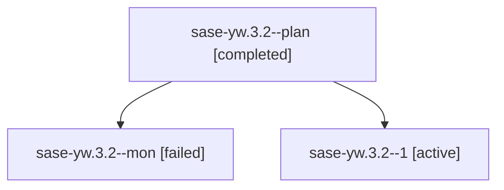

# Family: sase-yw.3.2

[Agent Hoods](../README.md) / [bbugyi200](../users/bbugyi200/README.md) / [athena](../users/bbugyi200/machines/athena/README.md) / [sase-yw](../users/bbugyi200/machines/athena/hoods/sase-yw/README.md) / sase-yw.3.2

Owner: `bbugyi200.athena` · Hood: `sase-yw` · Members: 3 · Bead: [sase-yw.3.2](https://github.com/sase-org/sase--beads/blob/main/pages/sase-yw/sase-yw.3.2.md)

## Lineage

The diagram is an optional enhancement; the ordered table below contains the same lineage in accessible text.

| Role | Agent | State | Model / provider | Timing | Commits | Prompt | Chat |
|---|---|---|---|---|---:|---|---|
| plan | sase-yw.3.2--plan | completed | gpt-5.5 / codex | 2026-09-09T17:34:57.469906+00:00 → 2026-09-09T18:58:41.491811+00:00 | 0 | [Prompt](../agents/bbugyi200.athena.sase-yw.3.2--plan/prompt.md) | [Chat](../agents/bbugyi200.athena.sase-yw.3.2--plan/chat.md) |
| mon | sase-yw.3.2--mon | failed | gpt-5.5 / codex | 2026-09-09T18:58:05.305264+00:00 → 2026-09-09T19:23:53.021979+00:00 | 0 | — | [Chat](../agents/bbugyi200.athena.sase-yw.3.2--mon/chat.md) |
| 1 | sase-yw.3.2--1 | active | gpt-5.5 / codex | 2026-09-09T19:24:16.137360+00:00 | [1](../agents/bbugyi200.athena.sase-yw.3.2--1/README.md#commits) | [Prompt](../agents/bbugyi200.athena.sase-yw.3.2--1/prompt.md) | — |

## Commits

| Role | Repo | Commit | Subject | Committed |
|---|---|---|---|---|
| 1 | sase | [`fb3ff15`](https://github.com/sase-org/sase/commit/fb3ff15893d507832ab28c0e4684d0ea66d44af9) | feat(ace): add model directive completion | 2026-09-09 16:38:37 EDT |

## Neighbors

| Agent | Relation | State |
|---|---|---|
| [sase-yw.3.1](../agents/bbugyi200.athena.sase-yw.3.1/README.md) | sase-yw.3 hood | completed |
| [sase-yw.3.land](../agents/bbugyi200.athena.sase-yw.3.land/README.md) | sase-yw.3 hood | waiting |
| [sase-yw.1](../agents/bbugyi200.athena.sase-yw.1/README.md) | sase-yw hood | completed |
| [sase-yw.2](../agents/bbugyi200.athena.sase-yw.2/README.md) | sase-yw hood | completed |
| [sase-yw.land](bbugyi200.athena.sase-yw.land.md) (family · 3) | sase-yw hood | failed 3 |
