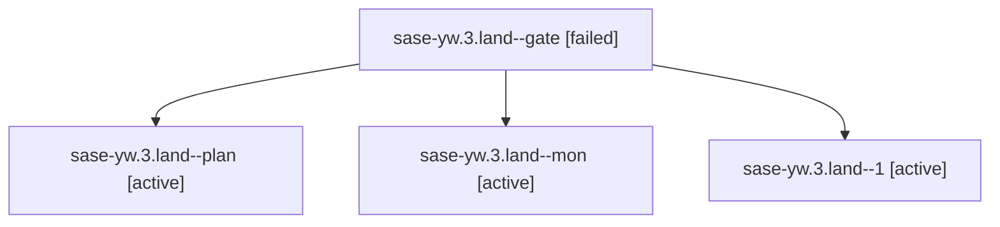

# Family: sase-yw.3.land

[Agent Hoods](../README.md) / [bbugyi200](../users/bbugyi200/README.md) / [athena](../users/bbugyi200/machines/athena/README.md) / [sase-yw](../users/bbugyi200/machines/athena/hoods/sase-yw/README.md) / sase-yw.3.land

Owner: `bbugyi200.athena` · Hood: `sase-yw` · Members: 4 · Bead: [sase-yw.3](https://github.com/sase-org/sase--beads/blob/main/pages/sase-yw/sase-yw.3.md)

## Lineage

The diagram is an optional enhancement; the ordered table below contains the same lineage in accessible text.

| Role | Agent | State | Model / provider | Timing | Commits | Prompt | Chat |
|---|---|---|---|---|---:|---|---|
| gate | sase-yw.3.land--gate | failed | gpt-5.6-sol / codex | 2026-09-09T21:51:51.022383+00:00 → 2026-09-10T22:26:41.964609+00:00 | 0 | — | [Chat](../agents/bbugyi200.athena.sase-yw.3.land--gate/chat.md) |
| plan | sase-yw.3.land--plan | active | gpt-5.6-sol / codex | 2026-09-09T20:52:01.611911+00:00 | 0 | [Prompt](../agents/bbugyi200.athena.sase-yw.3.land--plan/prompt.md) | [Chat](../agents/bbugyi200.athena.sase-yw.3.land--plan/chat.md) |
| mon | sase-yw.3.land--mon | active | gpt-5.6-sol / codex | 2026-09-09T20:59:54.616147+00:00 | 0 | — | [Chat](../agents/bbugyi200.athena.sase-yw.3.land--mon/chat.md) |
| 1 | sase-yw.3.land--1 | active | gpt-5.6-sol / codex | 2026-09-09T21:30:14.445272+00:00 | 0 | [Prompt](../agents/bbugyi200.athena.sase-yw.3.land--1/prompt.md) | [Chat](../agents/bbugyi200.athena.sase-yw.3.land--1/chat.md) |

## Neighbors

| Agent | Relation | State |
|---|---|---|
| [sase-yw.3.1](../agents/bbugyi200.athena.sase-yw.3.1/README.md) | sase-yw.3 hood | active |
| [sase-yw.3.2](bbugyi200.athena.sase-yw.3.2.md) (family · 3) | sase-yw.3 hood | active 3 |
| [sase-yw.1](../agents/bbugyi200.athena.sase-yw.1/README.md) | sase-yw hood | active |
| [sase-yw.2](../agents/bbugyi200.athena.sase-yw.2/README.md) | sase-yw hood | active |
| [sase-yw.land](bbugyi200.athena.sase-yw.land.md) (family · 3) | sase-yw hood | active 3 |
