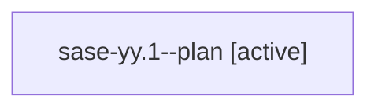

# Family: sase-yy.1

[Agent Hoods](../README.md) / [bbugyi200](../users/bbugyi200/README.md) / [athena](../users/bbugyi200/machines/athena/README.md) / [sase-yy](../users/bbugyi200/machines/athena/hoods/sase-yy/README.md) / sase-yy.1

Owner: `bbugyi200.athena` · Hood: `sase-yy` · Members: 1 · Bead: [sase-yy.1](https://github.com/sase-org/sase--beads/blob/main/pages/sase-yy/sase-yy.1.md)

## Lineage

The diagram is an optional enhancement; the ordered table below contains the same lineage in accessible text.

| Role | Agent | State | Model / provider | Timing | Commits | Prompt | Chat |
|---|---|---|---|---|---:|---|---|
| plan | sase-yy.1--plan | active | gpt-5.6-sol / codex | 2026-09-09T15:50:07.617241+00:00 | 0 | [Prompt](../agents/bbugyi200.athena.sase-yy.1--plan/prompt.md) | [Chat](../agents/bbugyi200.athena.sase-yy.1--plan/chat.md) |

## Neighbors

| Agent | Relation | State |
|---|---|---|
| [sase-yy.2](bbugyi200.athena.sase-yy.2.md) (family · 3) | sase-yy hood | active 2, failed 1 |
| [sase-yy.3](../agents/bbugyi200.athena.sase-yy.3/README.md) | sase-yy hood | waiting |
| [sase-yy.4](../agents/bbugyi200.athena.sase-yy.4/README.md) | sase-yy hood | waiting |
| [sase-yy.5](../agents/bbugyi200.athena.sase-yy.5/README.md) | sase-yy hood | waiting |
| [sase-yy.6](../agents/bbugyi200.athena.sase-yy.6/README.md) | sase-yy hood | waiting |
| [sase-yy.7](../agents/bbugyi200.athena.sase-yy.7/README.md) | sase-yy hood | waiting |
| [sase-yy.land](../agents/bbugyi200.athena.sase-yy.land/README.md) | sase-yy hood | waiting |
