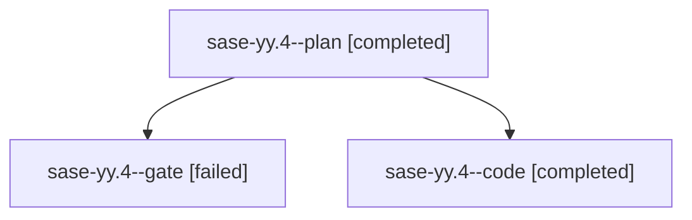

# Family: sase-yy.4

[Agent Hoods](../README.md) / [bbugyi200](../users/bbugyi200/README.md) / [athena](../users/bbugyi200/machines/athena/README.md) / [sase-yy](../users/bbugyi200/machines/athena/hoods/sase-yy/README.md) / sase-yy.4

Owner: `bbugyi200.athena` · Hood: `sase-yy` · Members: 3 · Bead: [sase-yy.4](https://github.com/sase-org/sase--beads/blob/main/pages/sase-yy/sase-yy.4.md)

## Lineage

The diagram is an optional enhancement; the ordered table below contains the same lineage in accessible text.

| Role | Agent | State | Model / provider | Timing | Commits | Prompt | Chat |
|---|---|---|---|---|---:|---|---|
| plan | sase-yy.4--plan | completed | gpt-5.6-sol / codex | 2026-09-09T18:32:25.090212+00:00 → 2026-09-09T20:32:16.284711+00:00 | 0 | [Prompt](../agents/bbugyi200.athena.sase-yy.4--plan/prompt.md) | [Chat](../agents/bbugyi200.athena.sase-yy.4--plan/chat.md) |
| gate | sase-yy.4--gate | failed | gpt-5.6-sol / codex | 2026-09-09T18:44:11.699515+00:00 → 2026-09-09T18:44:17.985320+00:00 | 0 | — | [Chat](../agents/bbugyi200.athena.sase-yy.4--gate/chat.md) |
| code | sase-yy.4--code | completed | gpt-5.5 / codex | 2026-09-09T18:44:36.418305+00:00 → 2026-09-09T20:32:16.284711+00:00 | [1](../agents/bbugyi200.athena.sase-yy.4--code/README.md#commits) | — | [Chat](../agents/bbugyi200.athena.sase-yy.4--code/chat.md) |

## Commits

| Role | Repo | Commit | Subject | Committed |
|---|---|---|---|---|
| code | sase | [`37ab56b`](https://github.com/sase-org/sase/commit/37ab56bd93a84d851c80cc5c50e63c75747f4aa6) | feat(artifact-links): publish immutable link events | 2026-09-09 16:23:43 EDT |

## Neighbors

| Agent | Relation | State |
|---|---|---|
| [sase-yy.1](bbugyi200.athena.sase-yy.1.md) (family · 3) | sase-yy hood | completed 2, failed 1 |
| [sase-yy.2](bbugyi200.athena.sase-yy.2.md) (family · 3) | sase-yy hood | completed 2, failed 1 |
| [sase-yy.3](../agents/bbugyi200.athena.sase-yy.3/README.md) | sase-yy hood | completed |
| [sase-yy.5](bbugyi200.athena.sase-yy.5.md) (family · 5) | sase-yy hood | completed 1, dismissed 1, failed 3 |
| [sase-yy.6](bbugyi200.athena.sase-yy.6.md) (family · 3) | sase-yy hood | completed 2, failed 1 |
| [sase-yy.6](../agents/bbugyi200.athena.sase-yy.6/README.md) | sase-yy hood | waiting |
| [sase-yy.7](../agents/bbugyi200.athena.sase-yy.7/README.md) | sase-yy hood | completed |
| [sase-yy.8.1](../agents/bbugyi200.athena.sase-yy.8.1/README.md) | sase-yy hood | completed |
| [sase-yy.8.2](bbugyi200.athena.sase-yy.8.2.md) (family · 3) | sase-yy hood | active 2, failed 1 |
| [sase-yy.8.3](../agents/bbugyi200.athena.sase-yy.8.3/README.md) | sase-yy hood | waiting |
| [sase-yy.8.4](../agents/bbugyi200.athena.sase-yy.8.4/README.md) | sase-yy hood | waiting |
| [sase-yy.8.5](../agents/bbugyi200.athena.sase-yy.8.5/README.md) | sase-yy hood | waiting |
| [sase-yy.8.land](../agents/bbugyi200.athena.sase-yy.8.land/README.md) | sase-yy hood | waiting |
| [sase-yy.land](bbugyi200.athena.sase-yy.land.md) (family · 3) | sase-yy hood | failed 3 |
