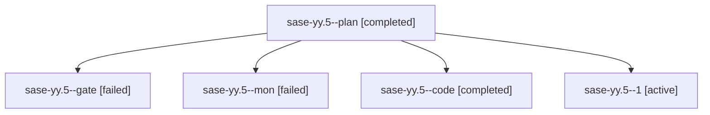

# Family: sase-yy.5

[Agent Hoods](../README.md) / [bbugyi200](../users/bbugyi200/README.md) / [athena](../users/bbugyi200/machines/athena/README.md) / [sase-yy](../users/bbugyi200/machines/athena/hoods/sase-yy/README.md) / sase-yy.5

Owner: `bbugyi200.athena` · Hood: `sase-yy` · Members: 5 · Bead: [sase-yy.5](https://github.com/sase-org/sase--beads/blob/main/pages/sase-yy/sase-yy.5.md)

## Lineage

The diagram is an optional enhancement; the ordered table below contains the same lineage in accessible text.

| Role | Agent | State | Model / provider | Timing | Commits | Prompt | Chat |
|---|---|---|---|---|---:|---|---|
| plan | sase-yy.5--plan | completed | gpt-5.6-sol / codex | 2026-09-09T18:28:08.367676+00:00 → 2026-09-09T19:48:35.380998+00:00 | 0 | [Prompt](../agents/bbugyi200.athena.sase-yy.5--plan/prompt.md) | [Chat](../agents/bbugyi200.athena.sase-yy.5--plan/chat.md) |
| gate | sase-yy.5--gate | failed | gpt-5.6-sol / codex | 2026-09-09T18:35:44.651646+00:00 → 2026-09-09T18:35:57.740951+00:00 | 0 | — | [Chat](../agents/bbugyi200.athena.sase-yy.5--gate/chat.md) |
| mon | sase-yy.5--mon | failed | gpt-5.5 / codex | 2026-09-09T19:48:08.910193+00:00 → 2026-09-09T20:21:59.845005+00:00 | 0 | — | [Chat](../agents/bbugyi200.athena.sase-yy.5--mon/chat.md) |
| code | sase-yy.5--code | completed | gpt-5.5 / codex | 2026-09-09T18:36:37.999896+00:00 → 2026-09-09T19:48:35.380998+00:00 | 0 | — | [Chat](../agents/bbugyi200.athena.sase-yy.5--code/chat.md) |
| 1 | sase-yy.5--1 | active | gpt-5.5 / codex | 2026-09-09T20:22:27.866347+00:00 | 0 | [Prompt](../agents/bbugyi200.athena.sase-yy.5--1/prompt.md) | — |

## Neighbors

| Agent | Relation | State |
|---|---|---|
| [sase-yy.1](bbugyi200.athena.sase-yy.1.md) (family · 3) | sase-yy hood | completed 2, failed 1 |
| [sase-yy.2](bbugyi200.athena.sase-yy.2.md) (family · 3) | sase-yy hood | completed 2, failed 1 |
| [sase-yy.3](../agents/bbugyi200.athena.sase-yy.3/README.md) | sase-yy hood | completed |
| [sase-yy.4](bbugyi200.athena.sase-yy.4.md) (family · 3) | sase-yy hood | completed 2, failed 1 |
| [sase-yy.6](../agents/bbugyi200.athena.sase-yy.6/README.md) | sase-yy hood | waiting |
| [sase-yy.7](../agents/bbugyi200.athena.sase-yy.7/README.md) | sase-yy hood | waiting |
| [sase-yy.land](../agents/bbugyi200.athena.sase-yy.land/README.md) | sase-yy hood | waiting |
