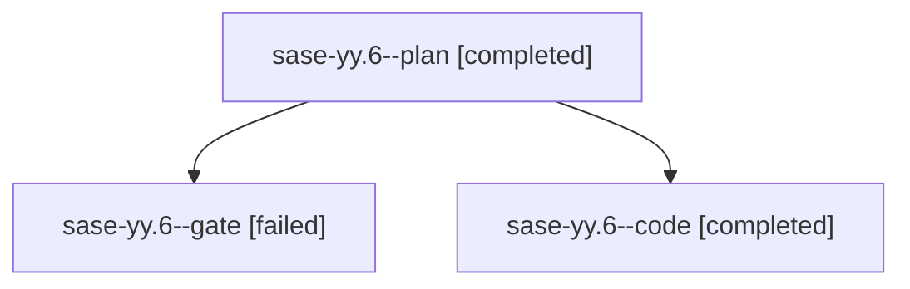

# Family: sase-yy.6

[Agent Hoods](../README.md) / [bbugyi200](../users/bbugyi200/README.md) / [athena](../users/bbugyi200/machines/athena/README.md) / [sase-yy](../users/bbugyi200/machines/athena/hoods/sase-yy/README.md) / sase-yy.6

Owner: `bbugyi200.athena` · Hood: `sase-yy` · Members: 3 · Bead: [sase-yy.6](https://github.com/sase-org/sase--beads/blob/main/pages/sase-yy/sase-yy.6.md)

## Lineage

The diagram is an optional enhancement; the ordered table below contains the same lineage in accessible text.

| Role | Agent | State | Model / provider | Timing | Commits | Prompt | Chat |
|---|---|---|---|---|---:|---|---|
| plan | sase-yy.6--plan | completed | gpt-5.6-sol / codex | 2026-09-10T14:07:12.147492+00:00 → 2026-09-10T17:37:56.175079+00:00 | 0 | [Prompt](../agents/bbugyi200.athena.sase-yy.6--plan/prompt.md) | [Chat](../agents/bbugyi200.athena.sase-yy.6--plan/chat.md) |
| gate | sase-yy.6--gate | failed | gpt-5.6-sol / codex | 2026-09-10T14:19:02.346412+00:00 → 2026-09-10T14:19:11.211577+00:00 | 0 | — | [Chat](../agents/bbugyi200.athena.sase-yy.6--gate/chat.md) |
| code | sase-yy.6--code | completed | gpt-5.5 / codex | 2026-09-10T14:19:40.736926+00:00 → 2026-09-10T17:37:56.175079+00:00 | [1](../agents/bbugyi200.athena.sase-yy.6--code/README.md#commits) | — | [Chat](../agents/bbugyi200.athena.sase-yy.6--code/chat.md) |

## Commits

| Role | Repo | Commit | Subject | Committed |
|---|---|---|---|---|
| code | sase | [`74de0fa`](https://github.com/sase-org/sase/commit/74de0fa7cc5e36dd153f72e2901863ccb5d4ca43) | fix(sdd): retry sidecar clones without local object reference on any failure | 2026-09-10 12:44:54 EDT |
| — | sase | [`a8d99d2`](https://github.com/sase-org/sase/commit/a8d99d2952681d2aed4e755a30942e8cc82a0424) | feat(artifact-links): cut over legacy indexes to events | 2026-09-10 13:34:12 EDT |

## Neighbors

| Agent | Relation | State |
|---|---|---|
| [sase-yy.1](bbugyi200.athena.sase-yy.1.md) (family · 3) | sase-yy hood | completed 2, failed 1 |
| [sase-yy.2](bbugyi200.athena.sase-yy.2.md) (family · 3) | sase-yy hood | completed 2, failed 1 |
| [sase-yy.3](../agents/bbugyi200.athena.sase-yy.3/README.md) | sase-yy hood | completed |
| [sase-yy.4](bbugyi200.athena.sase-yy.4.md) (family · 3) | sase-yy hood | completed 2, failed 1 |
| [sase-yy.5](bbugyi200.athena.sase-yy.5.md) (family · 5) | sase-yy hood | active 1, completed 1, failed 3 |
| [sase-yy.7](../agents/bbugyi200.athena.sase-yy.7/README.md) | sase-yy hood | completed |
| [sase-yy.8.1](../agents/bbugyi200.athena.sase-yy.8.1/README.md) | sase-yy hood | completed |
| [sase-yy.8.2](bbugyi200.athena.sase-yy.8.2.md) (family · 3) | sase-yy hood | completed 2, failed 1 |
| [sase-yy.8.3](bbugyi200.athena.sase-yy.8.3.md) (family · 3) | sase-yy hood | completed 2, failed 1 |
| [sase-yy.8.4](bbugyi200.athena.sase-yy.8.4.md) (family · 3) | sase-yy hood | completed 2, failed 1 |
| [sase-yy.8.5](bbugyi200.athena.sase-yy.8.5.md) (family · 3) | sase-yy hood | completed 2, failed 1 |
| [sase-yy.8.6.1](../agents/bbugyi200.athena.sase-yy.8.6.1/README.md) | sase-yy hood | completed |
| [sase-yy.8.6.2](../agents/bbugyi200.athena.sase-yy.8.6.2/README.md) | sase-yy hood | active |
| [sase-yy.8.6.3](../agents/bbugyi200.athena.sase-yy.8.6.3/README.md) | sase-yy hood | waiting |
| [sase-yy.8.6.4](../agents/bbugyi200.athena.sase-yy.8.6.4/README.md) | sase-yy hood | waiting |
| [sase-yy.8.6.5](../agents/bbugyi200.athena.sase-yy.8.6.5/README.md) | sase-yy hood | completed |
| [sase-yy.8.6.6](../agents/bbugyi200.athena.sase-yy.8.6.6/README.md) | sase-yy hood | waiting |
| [sase-yy.8.6.land](../agents/bbugyi200.athena.sase-yy.8.6.land/README.md) | sase-yy hood | waiting |
| [sase-yy.8.land](bbugyi200.athena.sase-yy.8.land.md) (family · 5) | sase-yy hood | completed 2, failed 3 |
| [sase-yy.land](bbugyi200.athena.sase-yy.land.md) (family · 3) | sase-yy hood | failed 3 |
