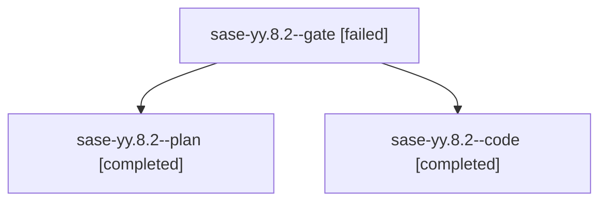

# Family: sase-yy.8.2

[Agent Hoods](../README.md) / [bbugyi200](../users/bbugyi200/README.md) / [athena](../users/bbugyi200/machines/athena/README.md) / [sase-yy](../users/bbugyi200/machines/athena/hoods/sase-yy/README.md) / sase-yy.8.2

Owner: `bbugyi200.athena` · Hood: `sase-yy` · Members: 3 · Bead: [sase-yy.8.2](https://github.com/sase-org/sase--beads/blob/main/pages/sase-yy/sase-yy.8.2.md)

## Lineage

The diagram is an optional enhancement; the ordered table below contains the same lineage in accessible text.

| Role | Agent | State | Model / provider | Timing | Commits | Prompt | Chat |
|---|---|---|---|---|---:|---|---|
| gate | sase-yy.8.2--gate | failed | opus / claude | 2026-09-10T19:36:47.561159+00:00 → 2026-09-10T19:37:10.091654+00:00 | 0 | — | [Chat](../agents/bbugyi200.athena.sase-yy.8.2--gate/chat.md) |
| plan | sase-yy.8.2--plan | completed | opus / claude | 2026-09-10T19:14:35.924973+00:00 → 2026-09-10T20:49:17.305386+00:00 | 0 | [Prompt](../agents/bbugyi200.athena.sase-yy.8.2--plan/prompt.md) | [Chat](../agents/bbugyi200.athena.sase-yy.8.2--plan/chat.md) |
| code | sase-yy.8.2--code | completed | gpt-5.5 / codex | 2026-09-10T19:37:19.619023+00:00 → 2026-09-10T20:49:17.305386+00:00 | [1](../agents/bbugyi200.athena.sase-yy.8.2--code/README.md#commits) | — | [Chat](../agents/bbugyi200.athena.sase-yy.8.2--code/chat.md) |

## Commits

| Role | Repo | Commit | Subject | Committed |
|---|---|---|---|---|
| code | sase | [`811700b`](https://github.com/sase-org/sase/commit/811700bc3830558df0db9ff7eaefecb2b6e7614b) | fix(artifact-links): require durable publication receipts | 2026-09-10 16:42:07 EDT |

## Neighbors

| Agent | Relation | State |
|---|---|---|
| [sase-yy.8.1](../agents/bbugyi200.athena.sase-yy.8.1/README.md) | sase-yy.8 hood | completed |
| [sase-yy.8.3](bbugyi200.athena.sase-yy.8.3.md) (family · 3) | sase-yy.8 hood | completed 2, failed 1 |
| [sase-yy.8.4](bbugyi200.athena.sase-yy.8.4.md) (family · 3) | sase-yy.8 hood | completed 2, failed 1 |
| [sase-yy.8.5](bbugyi200.athena.sase-yy.8.5.md) (family · 3) | sase-yy.8 hood | completed 2, failed 1 |
| [sase-yy.8.land](bbugyi200.athena.sase-yy.8.land.md) (family · 3) | sase-yy.8 hood | active 1, completed 1, failed 1 |
| [sase-yy.1](bbugyi200.athena.sase-yy.1.md) (family · 3) | sase-yy hood | completed 2, failed 1 |
| [sase-yy.2](bbugyi200.athena.sase-yy.2.md) (family · 3) | sase-yy hood | completed 2, failed 1 |
| [sase-yy.3](../agents/bbugyi200.athena.sase-yy.3/README.md) | sase-yy hood | completed |
| [sase-yy.4](bbugyi200.athena.sase-yy.4.md) (family · 3) | sase-yy hood | completed 2, failed 1 |
| [sase-yy.5](bbugyi200.athena.sase-yy.5.md) (family · 5) | sase-yy hood | active 1, completed 1, failed 3 |
| [sase-yy.6](bbugyi200.athena.sase-yy.6.md) (family · 3) | sase-yy hood | completed 2, failed 1 |
| [sase-yy.6](../agents/bbugyi200.athena.sase-yy.6/README.md) | sase-yy hood | waiting |
| [sase-yy.7](../agents/bbugyi200.athena.sase-yy.7/README.md) | sase-yy hood | completed |
| [sase-yy.land](bbugyi200.athena.sase-yy.land.md) (family · 3) | sase-yy hood | failed 3 |
