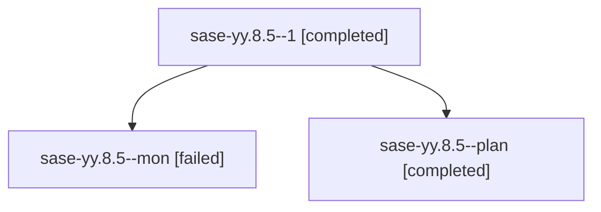

# Family: sase-yy.8.5

[Agent Hoods](../README.md) / [bbugyi200](../users/bbugyi200/README.md) / [athena](../users/bbugyi200/machines/athena/README.md) / [sase-yy](../users/bbugyi200/machines/athena/hoods/sase-yy/README.md) / sase-yy.8.5

Owner: `bbugyi200.athena` · Hood: `sase-yy` · Members: 3 · Bead: [sase-yy.8.5](https://github.com/sase-org/sase--beads/blob/main/pages/sase-yy/sase-yy.8.5.md)

## Lineage

The diagram is an optional enhancement; the ordered table below contains the same lineage in accessible text.

| Role | Agent | State | Model / provider | Timing | Commits | Prompt | Chat |
|---|---|---|---|---|---:|---|---|
| 1 | sase-yy.8.5--1 | completed | sonnet / claude | 2026-09-11T00:26:17.185684+00:00 → 2026-09-11T00:32:09.166411+00:00 | [1](../agents/bbugyi200.athena.sase-yy.8.5--1/README.md#commits) | [Prompt](../agents/bbugyi200.athena.sase-yy.8.5--1/prompt.md) | [Chat](../agents/bbugyi200.athena.sase-yy.8.5--1/chat.md) |
| mon | sase-yy.8.5--mon | failed | sonnet / claude | 2026-09-11T00:22:32.402580+00:00 → 2026-09-11T00:25:22.828659+00:00 | 0 | — | [Chat](../agents/bbugyi200.athena.sase-yy.8.5--mon/chat.md) |
| plan | sase-yy.8.5--plan | completed | sonnet / claude | 2026-09-10T23:43:30.888219+00:00 → 2026-09-11T00:22:56.975417+00:00 | 0 | [Prompt](../agents/bbugyi200.athena.sase-yy.8.5--plan/prompt.md) | [Chat](../agents/bbugyi200.athena.sase-yy.8.5--plan/chat.md) |

## Commits

| Role | Repo | Commit | Subject | Committed |
|---|---|---|---|---|
| 1 | sase | [`8eabf9e`](https://github.com/sase-org/sase/commit/8eabf9ecf82518d960cadb41f9cc17318e6d6558) | test(artifact-links): cover process death, mutation isolation, and cutover resume | 2026-09-10 20:28:17 EDT |

## Neighbors

| Agent | Relation | State |
|---|---|---|
| [sase-yy.8.1](../agents/bbugyi200.athena.sase-yy.8.1/README.md) | sase-yy.8 hood | completed |
| [sase-yy.8.2](bbugyi200.athena.sase-yy.8.2.md) (family · 3) | sase-yy.8 hood | completed 2, failed 1 |
| [sase-yy.8.3](bbugyi200.athena.sase-yy.8.3.md) (family · 3) | sase-yy.8 hood | completed 2, failed 1 |
| [sase-yy.8.4](bbugyi200.athena.sase-yy.8.4.md) (family · 3) | sase-yy.8 hood | completed 2, failed 1 |
| [sase-yy.8.6.1](../agents/bbugyi200.athena.sase-yy.8.6.1/README.md) | sase-yy.8 hood | completed |
| [sase-yy.8.6.2](../agents/bbugyi200.athena.sase-yy.8.6.2/README.md) | sase-yy.8 hood | completed |
| [sase-yy.8.6.3](../agents/bbugyi200.athena.sase-yy.8.6.3/README.md) | sase-yy.8 hood | completed |
| [sase-yy.8.6.4](../agents/bbugyi200.athena.sase-yy.8.6.4/README.md) | sase-yy.8 hood | completed |
| [sase-yy.8.6.5](../agents/bbugyi200.athena.sase-yy.8.6.5/README.md) | sase-yy.8 hood | completed |
| [sase-yy.8.6.6](../agents/bbugyi200.athena.sase-yy.8.6.6/README.md) | sase-yy.8 hood | active |
| [sase-yy.8.6.land](../agents/bbugyi200.athena.sase-yy.8.6.land/README.md) | sase-yy.8 hood | waiting |
| [sase-yy.8.land](bbugyi200.athena.sase-yy.8.land.md) (family · 5) | sase-yy.8 hood | completed 2, failed 3 |
| [sase-yy.1](bbugyi200.athena.sase-yy.1.md) (family · 3) | sase-yy hood | completed 1, dismissed 2 |
| [sase-yy.2](bbugyi200.athena.sase-yy.2.md) (family · 3) | sase-yy hood | completed 1, dismissed 2 |
| [sase-yy.3](../agents/bbugyi200.athena.sase-yy.3/README.md) | sase-yy hood | dismissed |
| [sase-yy.4](bbugyi200.athena.sase-yy.4.md) (family · 3) | sase-yy hood | completed 1, dismissed 2 |
| [sase-yy.5](bbugyi200.athena.sase-yy.5.md) (family · 5) | sase-yy hood | active 1, completed 1, failed 3 |
| [sase-yy.6](bbugyi200.athena.sase-yy.6.md) (family · 3) | sase-yy hood | completed 1, dismissed 2 |
| [sase-yy.6](../agents/bbugyi200.athena.sase-yy.6/README.md) | sase-yy hood | waiting |
| [sase-yy.7](../agents/bbugyi200.athena.sase-yy.7/README.md) | sase-yy hood | dismissed |
| [sase-yy.land](bbugyi200.athena.sase-yy.land.md) (family · 3) | sase-yy hood | dismissed 3 |
