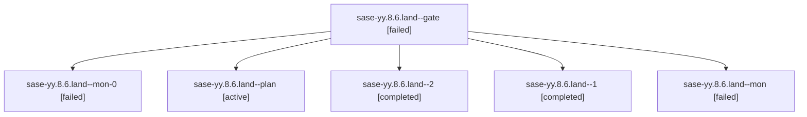

# Family: sase-yy.8.6.land

[Agent Hoods](../README.md) / [bbugyi200](../users/bbugyi200/README.md) / [athena](../users/bbugyi200/machines/athena/README.md) / [sase-yy](../users/bbugyi200/machines/athena/hoods/sase-yy/README.md) / sase-yy.8.6.land

Owner: `bbugyi200.athena` · Hood: `sase-yy` · Members: 6 · Bead: [sase-yy.8.6](https://github.com/sase-org/sase--beads/blob/main/pages/sase-yy/sase-yy.8.6.md)

## Lineage

The diagram is an optional enhancement; the ordered table below contains the same lineage in accessible text.

| Role | Agent | State | Model / provider | Timing | Commits | Prompt | Chat |
|---|---|---|---|---|---:|---|---|
| gate | sase-yy.8.6.land--gate | failed | gpt-6-astra / codex | 2026-09-11T15:19:54.406813+00:00 → 2026-09-12T15:42:55.998960+00:00 | 0 | — | [Chat](../agents/bbugyi200.athena.sase-yy.8.6.land--gate/chat.md) |
| mon-0 | sase-yy.8.6.land--mon-0 | failed | gpt-6-astra / codex | 2026-09-11T14:40:28.672114+00:00 → 2026-09-11T15:01:20.444053+00:00 | 0 | — | [Chat](../agents/bbugyi200.athena.sase-yy.8.6.land--mon-0/chat.md) |
| plan | sase-yy.8.6.land--plan | active | gpt-6-astra / codex | 2026-09-11T14:23:22.999933+00:00 | 0 | [Prompt](../agents/bbugyi200.athena.sase-yy.8.6.land--plan/prompt.md) | [Chat](../agents/bbugyi200.athena.sase-yy.8.6.land--plan/chat.md) |
| 2 | sase-yy.8.6.land--2 | completed | gpt-6-astra / codex | 2026-09-11T15:02:37.366017+00:00 → 2026-09-11T15:20:04.173506+00:00 | 0 | [Prompt](../agents/bbugyi200.athena.sase-yy.8.6.land--2/prompt.md) | [Chat](../agents/bbugyi200.athena.sase-yy.8.6.land--2/chat.md) |
| 1 | sase-yy.8.6.land--1 | completed | gpt-6-astra / codex | 2026-09-11T14:38:13.050299+00:00 → 2026-09-11T14:40:50.929509+00:00 | 0 | [Prompt](../agents/bbugyi200.athena.sase-yy.8.6.land--1/prompt.md) | [Chat](../agents/bbugyi200.athena.sase-yy.8.6.land--1/chat.md) |
| mon | sase-yy.8.6.land--mon | failed | gpt-6-astra / codex | 2026-09-11T14:34:34.613466+00:00 → 2026-09-11T14:37:22.517197+00:00 | 0 | — | [Chat](../agents/bbugyi200.athena.sase-yy.8.6.land--mon/chat.md) |

## Neighbors

| Agent | Relation | State |
|---|---|---|
| [sase-yy.8.6.1](../agents/bbugyi200.athena.sase-yy.8.6.1/README.md) | sase-yy.8.6 hood | active |
| [sase-yy.8.6.2](../agents/bbugyi200.athena.sase-yy.8.6.2/README.md) | sase-yy.8.6 hood | active |
| [sase-yy.8.6.3](../agents/bbugyi200.athena.sase-yy.8.6.3/README.md) | sase-yy.8.6 hood | active |
| [sase-yy.8.6.4](../agents/bbugyi200.athena.sase-yy.8.6.4/README.md) | sase-yy.8.6 hood | active |
| [sase-yy.8.6.5](../agents/bbugyi200.athena.sase-yy.8.6.5/README.md) | sase-yy.8.6 hood | active |
| [sase-yy.8.6.6](../agents/bbugyi200.athena.sase-yy.8.6.6/README.md) | sase-yy.8.6 hood | active |
| [sase-yy.8.1](../agents/bbugyi200.athena.sase-yy.8.1/README.md) | sase-yy.8 hood | active |
| [sase-yy.8.2](bbugyi200.athena.sase-yy.8.2.md) (family · 3) | sase-yy.8 hood | active 2, completed 1 |
| [sase-yy.8.3](bbugyi200.athena.sase-yy.8.3.md) (family · 3) | sase-yy.8 hood | active 2, completed 1 |
| [sase-yy.8.4](bbugyi200.athena.sase-yy.8.4.md) (family · 3) | sase-yy.8 hood | active 2, completed 1 |
| [sase-yy.8.5](bbugyi200.athena.sase-yy.8.5.md) (family · 3) | sase-yy.8 hood | active 3 |
| [sase-yy.8.land](bbugyi200.athena.sase-yy.8.land.md) (family · 5) | sase-yy.8 hood | active 5 |
| [sase-yy.1](bbugyi200.athena.sase-yy.1.md) (family · 3) | sase-yy hood | active 2, completed 1 |
| [sase-yy.2](bbugyi200.athena.sase-yy.2.md) (family · 3) | sase-yy hood | active 2, completed 1 |
| [sase-yy.3](../agents/bbugyi200.athena.sase-yy.3/README.md) | sase-yy hood | active |
| [sase-yy.4](bbugyi200.athena.sase-yy.4.md) (family · 3) | sase-yy hood | active 2, completed 1 |
| [sase-yy.5](bbugyi200.athena.sase-yy.5.md) (family · 5) | sase-yy hood | active 1, completed 1, failed 3 |
| [sase-yy.6](bbugyi200.athena.sase-yy.6.md) (family · 3) | sase-yy hood | active 2, completed 1 |
| [sase-yy.6](../agents/bbugyi200.athena.sase-yy.6/README.md) | sase-yy hood | waiting |
| [sase-yy.7](../agents/bbugyi200.athena.sase-yy.7/README.md) | sase-yy hood | active |
| [sase-yy.land](bbugyi200.athena.sase-yy.land.md) (family · 3) | sase-yy hood | active 3 |
