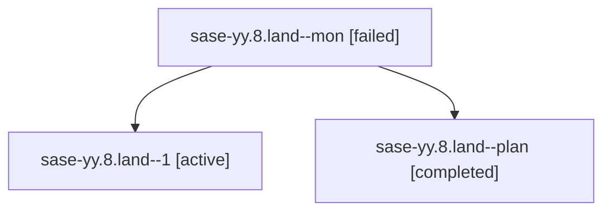

# Family: sase-yy.8.land

[Agent Hoods](../README.md) / [bbugyi200](../users/bbugyi200/README.md) / [athena](../users/bbugyi200/machines/athena/README.md) / [sase-yy](../users/bbugyi200/machines/athena/hoods/sase-yy/README.md) / sase-yy.8.land

Owner: `bbugyi200.athena` · Hood: `sase-yy` · Members: 3 · Bead: [sase-yy.8](https://github.com/sase-org/sase--beads/blob/main/pages/sase-yy/sase-yy.8.md)

## Lineage

The diagram is an optional enhancement; the ordered table below contains the same lineage in accessible text.

| Role | Agent | State | Model / provider | Timing | Commits | Prompt | Chat |
|---|---|---|---|---|---:|---|---|
| mon | sase-yy.8.land--mon | failed | gpt-6-astra / codex | 2026-09-11T00:41:20.603084+00:00 → 2026-09-11T00:44:42.074939+00:00 | 0 | — | [Chat](../agents/bbugyi200.athena.sase-yy.8.land--mon/chat.md) |
| 1 | sase-yy.8.land--1 | active | gpt-6-astra / codex | 2026-09-11T00:45:36.300790+00:00 | 0 | [Prompt](../agents/bbugyi200.athena.sase-yy.8.land--1/prompt.md) | — |
| plan | sase-yy.8.land--plan | completed | gpt-6-astra / codex | 2026-09-11T00:32:32.205553+00:00 → 2026-09-11T00:41:29.526337+00:00 | 0 | [Prompt](../agents/bbugyi200.athena.sase-yy.8.land--plan/prompt.md) | [Chat](../agents/bbugyi200.athena.sase-yy.8.land--plan/chat.md) |

## Neighbors

| Agent | Relation | State |
|---|---|---|
| [sase-yy.8.1](../agents/bbugyi200.athena.sase-yy.8.1/README.md) | sase-yy.8 hood | completed |
| [sase-yy.8.2](bbugyi200.athena.sase-yy.8.2.md) (family · 3) | sase-yy.8 hood | completed 2, failed 1 |
| [sase-yy.8.3](bbugyi200.athena.sase-yy.8.3.md) (family · 3) | sase-yy.8 hood | completed 2, failed 1 |
| [sase-yy.8.4](bbugyi200.athena.sase-yy.8.4.md) (family · 3) | sase-yy.8 hood | completed 2, failed 1 |
| [sase-yy.8.5](bbugyi200.athena.sase-yy.8.5.md) (family · 3) | sase-yy.8 hood | completed 2, failed 1 |
| [sase-yy.1](bbugyi200.athena.sase-yy.1.md) (family · 3) | sase-yy hood | completed 2, failed 1 |
| [sase-yy.2](bbugyi200.athena.sase-yy.2.md) (family · 3) | sase-yy hood | completed 2, failed 1 |
| [sase-yy.3](../agents/bbugyi200.athena.sase-yy.3/README.md) | sase-yy hood | completed |
| [sase-yy.4](bbugyi200.athena.sase-yy.4.md) (family · 3) | sase-yy hood | completed 2, failed 1 |
| [sase-yy.5](bbugyi200.athena.sase-yy.5.md) (family · 5) | sase-yy hood | active 1, completed 1, failed 3 |
| [sase-yy.6](bbugyi200.athena.sase-yy.6.md) (family · 3) | sase-yy hood | completed 2, failed 1 |
| [sase-yy.6](../agents/bbugyi200.athena.sase-yy.6/README.md) | sase-yy hood | waiting |
| [sase-yy.7](../agents/bbugyi200.athena.sase-yy.7/README.md) | sase-yy hood | completed |
| [sase-yy.land](bbugyi200.athena.sase-yy.land.md) (family · 3) | sase-yy hood | failed 3 |
