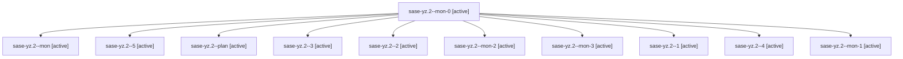

# Family: sase-yz.2

[Agent Hoods](../README.md) / [bbugyi200](../users/bbugyi200/README.md) / [athena](../users/bbugyi200/machines/athena/README.md) / [sase-yz](../users/bbugyi200/machines/athena/hoods/sase-yz/README.md) / sase-yz.2

Owner: `bbugyi200.athena` · Hood: `sase-yz` · Members: 11 · Bead: [sase-yz.2](https://github.com/sase-org/sase--beads/blob/main/pages/sase-yz/sase-yz.2.md)

## Lineage

The diagram is an optional enhancement; the ordered table below contains the same lineage in accessible text.

| Role | Agent | State | Model / provider | Timing | Commits | Prompt | Chat |
|---|---|---|---|---|---:|---|---|
| mon-0 | sase-yz.2--mon-0 | active | gpt-5.5 / codex | 2026-09-09T20:36:29.549617+00:00 | 0 | — | [Chat](../agents/bbugyi200.athena.sase-yz.2--mon-0/chat.md) |
| mon | sase-yz.2--mon | active | gpt-5.5 / codex | 2026-09-09T19:32:09.377653+00:00 | 0 | — | [Chat](../agents/bbugyi200.athena.sase-yz.2--mon/chat.md) |
| 5 | sase-yz.2--5 | active | gpt-5.5 / codex | 2026-09-09T23:55:48.141698+00:00 | [1](../agents/bbugyi200.athena.sase-yz.2--5/README.md#commits) | [Prompt](../agents/bbugyi200.athena.sase-yz.2--5/prompt.md) | [Chat](../agents/bbugyi200.athena.sase-yz.2--5/chat.md) |
| plan | sase-yz.2--plan | active | gpt-5.5 / codex | 2026-09-09T18:46:10.308349+00:00 | 0 | [Prompt](../agents/bbugyi200.athena.sase-yz.2--plan/prompt.md) | [Chat](../agents/bbugyi200.athena.sase-yz.2--plan/chat.md) |
| 3 | sase-yz.2--3 | active | gpt-5.5 / codex | 2026-09-09T21:06:35.348818+00:00 | 0 | [Prompt](../agents/bbugyi200.athena.sase-yz.2--3/prompt.md) | [Chat](../agents/bbugyi200.athena.sase-yz.2--3/chat.md) |
| 2 | sase-yz.2--2 | active | gpt-5.5 / codex | 2026-09-09T20:40:01.176812+00:00 | 0 | [Prompt](../agents/bbugyi200.athena.sase-yz.2--2/prompt.md) | [Chat](../agents/bbugyi200.athena.sase-yz.2--2/chat.md) |
| mon-2 | sase-yz.2--mon-2 | active | gpt-5.5 / codex | 2026-09-09T21:09:39.733615+00:00 | 0 | — | [Chat](../agents/bbugyi200.athena.sase-yz.2--mon-2/chat.md) |
| mon-3 | sase-yz.2--mon-3 | active | gpt-5.5 / codex | 2026-09-09T21:46:27.438704+00:00 | 0 | — | [Chat](../agents/bbugyi200.athena.sase-yz.2--mon-3/chat.md) |
| 1 | sase-yz.2--1 | active | gpt-5.5 / codex | 2026-09-09T20:34:24.318381+00:00 | 0 | [Prompt](../agents/bbugyi200.athena.sase-yz.2--1/prompt.md) | [Chat](../agents/bbugyi200.athena.sase-yz.2--1/chat.md) |
| 4 | sase-yz.2--4 | active | gpt-5.5 / codex | 2026-09-09T21:35:41.163028+00:00 | 0 | [Prompt](../agents/bbugyi200.athena.sase-yz.2--4/prompt.md) | [Chat](../agents/bbugyi200.athena.sase-yz.2--4/chat.md) |
| mon-1 | sase-yz.2--mon-1 | active | gpt-5.5 / codex | 2026-09-09T21:02:26.791356+00:00 | 0 | — | [Chat](../agents/bbugyi200.athena.sase-yz.2--mon-1/chat.md) |

## Commits

| Role | Repo | Commit | Subject | Committed |
|---|---|---|---|---|
| 5 | sase | [`afc5226`](https://github.com/sase-org/sase/commit/afc52262f4dcaa9b4144c772c8795b3373870230) | feat(usage): add drift-classifying probe strategies | 2026-09-09 20:32:47 EDT |

## Neighbors

| Agent | Relation | State |
|---|---|---|
| [sase-yz.1](../agents/bbugyi200.athena.sase-yz.1/README.md) | sase-yz hood | active |
| [sase-yz.3](../agents/bbugyi200.athena.sase-yz.3/README.md) | sase-yz hood | active |
| [sase-yz.4](../agents/bbugyi200.athena.sase-yz.4/README.md) | sase-yz hood | active |
| [sase-yz.5](bbugyi200.athena.sase-yz.5.md) (family · 11) | sase-yz hood | active 11 |
| [sase-yz.land](../agents/bbugyi200.athena.sase-yz.land/README.md) | sase-yz hood | waiting |
