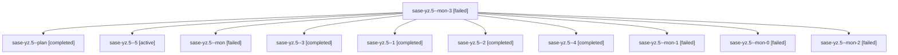

# Family: sase-yz.5

[Agent Hoods](../README.md) / [bbugyi200](../users/bbugyi200/README.md) / [athena](../users/bbugyi200/machines/athena/README.md) / [sase-yz](../users/bbugyi200/machines/athena/hoods/sase-yz/README.md) / sase-yz.5

Owner: `bbugyi200.athena` · Hood: `sase-yz` · Members: 11 · Bead: [sase-yz.5](https://github.com/sase-org/sase--beads/blob/main/pages/sase-yz/sase-yz.5.md)

## Lineage

The diagram is an optional enhancement; the ordered table below contains the same lineage in accessible text.

| Role | Agent | State | Model / provider | Timing | Commits | Prompt | Chat |
|---|---|---|---|---|---:|---|---|
| mon-3 | sase-yz.5--mon-3 | failed | grok-4.6 / grok | 2026-09-10T08:53:59.811694+00:00 → 2026-09-10T09:17:32.889621+00:00 | 0 | — | [Chat](../agents/bbugyi200.athena.sase-yz.5--mon-3/chat.md) |
| plan | sase-yz.5--plan | completed | gpt-5.5 / codex | 2026-09-10T02:59:15.479450+00:00 → 2026-09-10T03:13:59.135186+00:00 | 0 | [Prompt](../agents/bbugyi200.athena.sase-yz.5--plan/prompt.md) | [Chat](../agents/bbugyi200.athena.sase-yz.5--plan/chat.md) |
| 5 | sase-yz.5--5 | active | grok-4.6 / grok | 2026-09-10T09:17:55.515663+00:00 | [1](../agents/bbugyi200.athena.sase-yz.5--5/README.md#commits) | [Prompt](../agents/bbugyi200.athena.sase-yz.5--5/prompt.md) | — |
| mon | sase-yz.5--mon | failed | gpt-5.5 / codex | 2026-09-10T03:13:32.415994+00:00 → 2026-09-10T04:00:20.881967+00:00 | 0 | — | [Chat](../agents/bbugyi200.athena.sase-yz.5--mon/chat.md) |
| 3 | sase-yz.5--3 | completed | gpt-5.5 / codex | 2026-09-10T06:35:48.121945+00:00 → 2026-09-10T06:41:51.592451+00:00 | 0 | [Prompt](../agents/bbugyi200.athena.sase-yz.5--3/prompt.md) | [Chat](../agents/bbugyi200.athena.sase-yz.5--3/chat.md) |
| 1 | sase-yz.5--1 | completed | gpt-5.5 / codex | 2026-09-10T04:00:46.493124+00:00 → 2026-09-10T04:29:59.758468+00:00 | 0 | [Prompt](../agents/bbugyi200.athena.sase-yz.5--1/prompt.md) | [Chat](../agents/bbugyi200.athena.sase-yz.5--1/chat.md) |
| 2 | sase-yz.5--2 | completed | gpt-5.5 / codex | 2026-09-10T05:46:37.448185+00:00 → 2026-09-10T05:49:16.822802+00:00 | 0 | [Prompt](../agents/bbugyi200.athena.sase-yz.5--2/prompt.md) | [Chat](../agents/bbugyi200.athena.sase-yz.5--2/chat.md) |
| 4 | sase-yz.5--4 | completed | grok-4.6 / grok | 2026-09-10T08:38:53.317147+00:00 → 2026-09-10T08:54:17.120706+00:00 | 0 | [Prompt](../agents/bbugyi200.athena.sase-yz.5--4/prompt.md) | [Chat](../agents/bbugyi200.athena.sase-yz.5--4/chat.md) |
| mon-1 | sase-yz.5--mon-1 | failed | gpt-5.5 / codex | 2026-09-10T05:49:01.230733+00:00 → 2026-09-10T06:34:43.981867+00:00 | 0 | — | [Chat](../agents/bbugyi200.athena.sase-yz.5--mon-1/chat.md) |
| mon-0 | sase-yz.5--mon-0 | failed | gpt-5.5 / codex | 2026-09-10T04:29:30.725951+00:00 → 2026-09-10T05:45:48.296709+00:00 | 0 | — | [Chat](../agents/bbugyi200.athena.sase-yz.5--mon-0/chat.md) |
| mon-2 | sase-yz.5--mon-2 | failed | gpt-5.5 / codex | 2026-09-10T06:41:25.021204+00:00 → 2026-09-10T08:38:30.596889+00:00 | 0 | — | [Chat](../agents/bbugyi200.athena.sase-yz.5--mon-2/chat.md) |

## Commits

| Role | Repo | Commit | Subject | Committed |
|---|---|---|---|---|
| 5 | sase | [`5aef515`](https://github.com/sase-org/sase/commit/5aef515e688e98736a9a0417e39fb28923a9aa28) | docs(usage): document collector health and land health-verify | 2026-09-10 05:23:57 EDT |

## Neighbors

| Agent | Relation | State |
|---|---|---|
| [sase-yz.1](../agents/bbugyi200.athena.sase-yz.1/README.md) | sase-yz hood | completed |
| [sase-yz.2](bbugyi200.athena.sase-yz.2.md) (family · 11) | sase-yz hood | completed 6, failed 5 |
| [sase-yz.3](../agents/bbugyi200.athena.sase-yz.3/README.md) | sase-yz hood | completed |
| [sase-yz.4](../agents/bbugyi200.athena.sase-yz.4/README.md) | sase-yz hood | completed |
| [sase-yz.land](../agents/bbugyi200.athena.sase-yz.land/README.md) | sase-yz hood | waiting |
