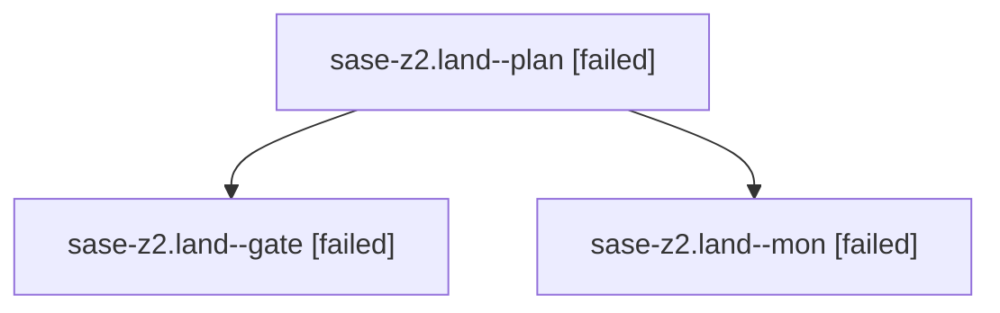

# Family: sase-z2.land

[Agent Hoods](../README.md) / [bbugyi200](../users/bbugyi200/README.md) / [athena](../users/bbugyi200/machines/athena/README.md) / [sase-z2](../users/bbugyi200/machines/athena/hoods/sase-z2/README.md) / sase-z2.land

Owner: `bbugyi200.athena` · Hood: `sase-z2` · Members: 3 · Bead: [sase-z2](https://github.com/sase-org/sase--beads/blob/main/pages/sase-z2/README.md)

## Lineage

The diagram is an optional enhancement; the ordered table below contains the same lineage in accessible text.

| Role | Agent | State | Model / provider | Timing | Commits | Prompt | Chat |
|---|---|---|---|---|---:|---|---|
| plan | sase-z2.land--plan | failed | gpt-5.6-sol / codex | 2026-09-10T16:13:26.408781+00:00 → 2026-09-10T16:49:02.810660+00:00 | 0 | [Prompt](../agents/bbugyi200.athena.sase-z2.land--plan/prompt.md) | [Chat](../agents/bbugyi200.athena.sase-z2.land--plan/chat.md) |
| gate | sase-z2.land--gate | failed | gpt-5.6-sol / codex | 2026-09-10T16:48:39.292439+00:00 → 2026-09-10T16:48:56.470013+00:00 | 0 | — | [Chat](../agents/bbugyi200.athena.sase-z2.land--gate/chat.md) |
| mon | sase-z2.land--mon | failed | gpt-5.6-sol / codex | 2026-09-10T16:48:54.324592+00:00 → 2026-09-10T16:50:44.345704+00:00 | 0 | — | [Chat](../agents/bbugyi200.athena.sase-z2.land--mon/chat.md) |

## Neighbors

| Agent | Relation | State |
|---|---|---|
| [sase-z2.1](../agents/bbugyi200.athena.sase-z2.1/README.md) | sase-z2 hood | completed |
| [sase-z2.2](../agents/bbugyi200.athena.sase-z2.2/README.md) | sase-z2 hood | completed |
| [sase-z2.3](../agents/bbugyi200.athena.sase-z2.3/README.md) | sase-z2 hood | completed |
| [sase-z2.4](../agents/bbugyi200.athena.sase-z2.4/README.md) | sase-z2 hood | completed |
| [sase-z2.5.1](../agents/bbugyi200.athena.sase-z2.5.1/README.md) | sase-z2 hood | completed |
| [sase-z2.5.land](../agents/bbugyi200.athena.sase-z2.5.land/README.md) | sase-z2 hood | active |
