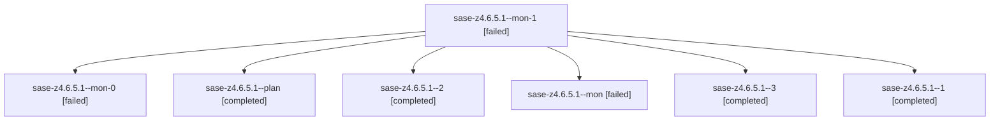

# Family: sase-z4.6.5.1

[Agent Hoods](../README.md) / [bbugyi200](../users/bbugyi200/README.md) / [athena](../users/bbugyi200/machines/athena/README.md) / [sase-z4](../users/bbugyi200/machines/athena/hoods/sase-z4/README.md) / sase-z4.6.5.1

Owner: `bbugyi200.athena` · Hood: `sase-z4` · Members: 7 · Bead: [sase-z4.6.5.1](https://github.com/sase-org/sase--beads/blob/main/pages/sase-z4/sase-z4.6.5.1.md)

## Lineage

The diagram is an optional enhancement; the ordered table below contains the same lineage in accessible text.

| Role | Agent | State | Model / provider | Timing | Commits | Prompt | Chat |
|---|---|---|---|---|---:|---|---|
| mon-1 | sase-z4.6.5.1--mon-1 | failed | sonnet / claude | 2026-09-10T19:31:39.159056+00:00 → 2026-09-10T19:42:28.012115+00:00 | 0 | — | [Chat](../agents/bbugyi200.athena.sase-z4.6.5.1--mon-1/chat.md) |
| mon-0 | sase-z4.6.5.1--mon-0 | failed | sonnet / claude | 2026-09-10T19:20:07.012296+00:00 → 2026-09-10T19:22:18.729474+00:00 | 0 | — | [Chat](../agents/bbugyi200.athena.sase-z4.6.5.1--mon-0/chat.md) |
| plan | sase-z4.6.5.1--plan | completed | sonnet / claude | 2026-09-10T17:27:24.556858+00:00 → 2026-09-10T18:43:53.593903+00:00 | 0 | [Prompt](../agents/bbugyi200.athena.sase-z4.6.5.1--plan/prompt.md) | [Chat](../agents/bbugyi200.athena.sase-z4.6.5.1--plan/chat.md) |
| 2 | sase-z4.6.5.1--2 | completed | sonnet / claude | 2026-09-10T19:23:49.867789+00:00 → 2026-09-10T19:31:55.039494+00:00 | 0 | [Prompt](../agents/bbugyi200.athena.sase-z4.6.5.1--2/prompt.md) | [Chat](../agents/bbugyi200.athena.sase-z4.6.5.1--2/chat.md) |
| mon | sase-z4.6.5.1--mon | failed | sonnet / claude | 2026-09-10T18:43:40.322818+00:00 → 2026-09-10T18:54:26.163241+00:00 | 0 | — | [Chat](../agents/bbugyi200.athena.sase-z4.6.5.1--mon/chat.md) |
| 3 | sase-z4.6.5.1--3 | completed | sonnet / claude | 2026-09-10T19:45:12.052130+00:00 → 2026-09-10T19:54:00.490645+00:00 | [1](../agents/bbugyi200.athena.sase-z4.6.5.1--3/README.md#commits) | [Prompt](../agents/bbugyi200.athena.sase-z4.6.5.1--3/prompt.md) | [Chat](../agents/bbugyi200.athena.sase-z4.6.5.1--3/chat.md) |
| 1 | sase-z4.6.5.1--1 | completed | sonnet / claude | 2026-09-10T18:55:58.774781+00:00 → 2026-09-10T19:20:18.919701+00:00 | 0 | [Prompt](../agents/bbugyi200.athena.sase-z4.6.5.1--1/prompt.md) | [Chat](../agents/bbugyi200.athena.sase-z4.6.5.1--1/chat.md) |

## Commits

| Role | Repo | Commit | Subject | Committed |
|---|---|---|---|---|
| 3 | sase | [`3260f6a`](https://github.com/sase-org/sase/commit/3260f6a42b5f6ae22a5cab4473aacd7c6e2ebac1) | feat(runner-slots): make Rust candidate lineage authoritative at admission | 2026-09-10 15:49:06 EDT |

## Neighbors

| Agent | Relation | State |
|---|---|---|
| [sase-z4.6.5.2](../agents/bbugyi200.athena.sase-z4.6.5.2/README.md) | sase-z4.6.5 hood | completed |
| [sase-z4.6.5.3](../agents/bbugyi200.athena.sase-z4.6.5.3/README.md) | sase-z4.6.5 hood | completed |
| [sase-z4.6.5.4.1](../agents/bbugyi200.athena.sase-z4.6.5.4.1/README.md) | sase-z4.6.5 hood | active |
| [sase-z4.6.5.4.2](../agents/bbugyi200.athena.sase-z4.6.5.4.2/README.md) | sase-z4.6.5 hood | waiting |
| [sase-z4.6.5.4.3](../agents/bbugyi200.athena.sase-z4.6.5.4.3/README.md) | sase-z4.6.5 hood | waiting |
| [sase-z4.6.5.4.4](../agents/bbugyi200.athena.sase-z4.6.5.4.4/README.md) | sase-z4.6.5 hood | waiting |
| [sase-z4.6.5.4.5](../agents/bbugyi200.athena.sase-z4.6.5.4.5/README.md) | sase-z4.6.5 hood | waiting |
| [sase-z4.6.5.4.land](../agents/bbugyi200.athena.sase-z4.6.5.4.land/README.md) | sase-z4.6.5 hood | waiting |
| [sase-z4.6.5.land](bbugyi200.athena.sase-z4.6.5.land.md) (family · 3) | sase-z4.6.5 hood | failed 3 |
| [sase-z4.6.1](../agents/bbugyi200.athena.sase-z4.6.1/README.md) | sase-z4.6 hood | completed |
| [sase-z4.6.2](../agents/bbugyi200.athena.sase-z4.6.2/README.md) | sase-z4.6 hood | completed |
| [sase-z4.6.3](../agents/bbugyi200.athena.sase-z4.6.3/README.md) | sase-z4.6 hood | completed |
| [sase-z4.6.4](../agents/bbugyi200.athena.sase-z4.6.4/README.md) | sase-z4.6 hood | completed |
| [sase-z4.6.land](bbugyi200.athena.sase-z4.6.land.md) (family · 3) | sase-z4.6 hood | failed 3 |
| [sase-z4.1](../agents/bbugyi200.athena.sase-z4.1/README.md) | sase-z4 hood | completed |
| [sase-z4.2](../agents/bbugyi200.athena.sase-z4.2/README.md) | sase-z4 hood | completed |
| [sase-z4.3](../agents/bbugyi200.athena.sase-z4.3/README.md) | sase-z4 hood | completed |
| [sase-z4.4](../agents/bbugyi200.athena.sase-z4.4/README.md) | sase-z4 hood | completed |
| [sase-z4.5](../agents/bbugyi200.athena.sase-z4.5/README.md) | sase-z4 hood | completed |
| [sase-z4.land](bbugyi200.athena.sase-z4.land.md) (family · 3) | sase-z4 hood | failed 3 |
