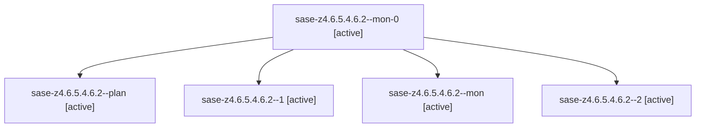

# Family: sase-z4.6.5.4.6.2

[Agent Hoods](../README.md) / [bbugyi200](../users/bbugyi200/README.md) / [athena](../users/bbugyi200/machines/athena/README.md) / [sase-z4](../users/bbugyi200/machines/athena/hoods/sase-z4/README.md) / sase-z4.6.5.4.6.2

Owner: `bbugyi200.athena` · Hood: `sase-z4` · Members: 5 · Bead: [sase-z4.6.5.4.6.2](https://github.com/sase-org/sase--beads/blob/main/pages/sase-z4/sase-z4.6.5.4.6.2.md)

## Lineage

The diagram is an optional enhancement; the ordered table below contains the same lineage in accessible text.

| Role | Agent | State | Model / provider | Timing | Commits | Prompt | Chat |
|---|---|---|---|---|---:|---|---|
| mon-0 | sase-z4.6.5.4.6.2--mon-0 | active | grok-4.6 / grok | 2026-09-13T22:31:49.348915+00:00 | 0 | — | [Chat](../agents/bbugyi200.athena.sase-z4.6.5.4.6.2--mon-0/chat.md) |
| plan | sase-z4.6.5.4.6.2--plan | active | grok-4.6 / grok | 2026-09-13T21:58:21.153109+00:00 | 0 | [Prompt](../agents/bbugyi200.athena.sase-z4.6.5.4.6.2--plan/prompt.md) | [Chat](../agents/bbugyi200.athena.sase-z4.6.5.4.6.2--plan/chat.md) |
| 1 | sase-z4.6.5.4.6.2--1 | active | grok-4.6 / grok | 2026-09-13T22:21:25.805232+00:00 | 0 | [Prompt](../agents/bbugyi200.athena.sase-z4.6.5.4.6.2--1/prompt.md) | [Chat](../agents/bbugyi200.athena.sase-z4.6.5.4.6.2--1/chat.md) |
| mon | sase-z4.6.5.4.6.2--mon | active | grok-4.6 / grok | 2026-09-13T22:10:01.658464+00:00 | 0 | — | [Chat](../agents/bbugyi200.athena.sase-z4.6.5.4.6.2--mon/chat.md) |
| 2 | sase-z4.6.5.4.6.2--2 | active | grok-4.6 / grok | 2026-09-13T22:48:58.942803+00:00 | 0 | [Prompt](../agents/bbugyi200.athena.sase-z4.6.5.4.6.2--2/prompt.md) | [Chat](../agents/bbugyi200.athena.sase-z4.6.5.4.6.2--2/chat.md) |

## Neighbors

| Agent | Relation | State |
|---|---|---|
| [sase-z4.6.5.4.6.1](../agents/bbugyi200.athena.sase-z4.6.5.4.6.1/README.md) | sase-z4.6.5.4.6 hood | active |
| [sase-z4.6.5.4.6.3](../agents/bbugyi200.athena.sase-z4.6.5.4.6.3/README.md) | sase-z4.6.5.4.6 hood | active |
| [sase-z4.6.5.4.6.land](../agents/bbugyi200.athena.sase-z4.6.5.4.6.land/README.md) | sase-z4.6.5.4.6 hood | active |
| [sase-z4.6.5.4.6.land.f0](../agents/bbugyi200.athena.sase-z4.6.5.4.6.land.f0/README.md) | sase-z4.6.5.4.6 hood | active |
| [sase-z4.6.5.4.1](../agents/bbugyi200.athena.sase-z4.6.5.4.1/README.md) | sase-z4.6.5.4 hood | active |
| [sase-z4.6.5.4.2](../agents/bbugyi200.athena.sase-z4.6.5.4.2/README.md) | sase-z4.6.5.4 hood | active |
| [sase-z4.6.5.4.3](../agents/bbugyi200.athena.sase-z4.6.5.4.3/README.md) | sase-z4.6.5.4 hood | active |
| [sase-z4.6.5.4.4](../agents/bbugyi200.athena.sase-z4.6.5.4.4/README.md) | sase-z4.6.5.4 hood | active |
| [sase-z4.6.5.4.5](../agents/bbugyi200.athena.sase-z4.6.5.4.5/README.md) | sase-z4.6.5.4 hood | active |
| [sase-z4.6.5.4.land](bbugyi200.athena.sase-z4.6.5.4.land.md) (family · 3) | sase-z4.6.5.4 hood | active 3 |
| [sase-z4.6.5.1](bbugyi200.athena.sase-z4.6.5.1.md) (family · 7) | sase-z4.6.5 hood | active 7 |
| [sase-z4.6.5.2](../agents/bbugyi200.athena.sase-z4.6.5.2/README.md) | sase-z4.6.5 hood | active |
| [sase-z4.6.5.3](../agents/bbugyi200.athena.sase-z4.6.5.3/README.md) | sase-z4.6.5 hood | active |
| [sase-z4.6.5.land](bbugyi200.athena.sase-z4.6.5.land.md) (family · 3) | sase-z4.6.5 hood | active 3 |
| [sase-z4.6.1](../agents/bbugyi200.athena.sase-z4.6.1/README.md) | sase-z4.6 hood | active |
| [sase-z4.6.2](../agents/bbugyi200.athena.sase-z4.6.2/README.md) | sase-z4.6 hood | active |
| [sase-z4.6.3](../agents/bbugyi200.athena.sase-z4.6.3/README.md) | sase-z4.6 hood | active |
| [sase-z4.6.4](../agents/bbugyi200.athena.sase-z4.6.4/README.md) | sase-z4.6 hood | active |
| [sase-z4.6.land](bbugyi200.athena.sase-z4.6.land.md) (family · 3) | sase-z4.6 hood | active 3 |
| [sase-z4.1](../agents/bbugyi200.athena.sase-z4.1/README.md) | sase-z4 hood | active |
| [sase-z4.2](../agents/bbugyi200.athena.sase-z4.2/README.md) | sase-z4 hood | active |
| [sase-z4.3](../agents/bbugyi200.athena.sase-z4.3/README.md) | sase-z4 hood | active |
| [sase-z4.4](../agents/bbugyi200.athena.sase-z4.4/README.md) | sase-z4 hood | active |
| [sase-z4.5](../agents/bbugyi200.athena.sase-z4.5/README.md) | sase-z4 hood | active |
| [sase-z4.land](bbugyi200.athena.sase-z4.land.md) (family · 3) | sase-z4 hood | active 3 |
