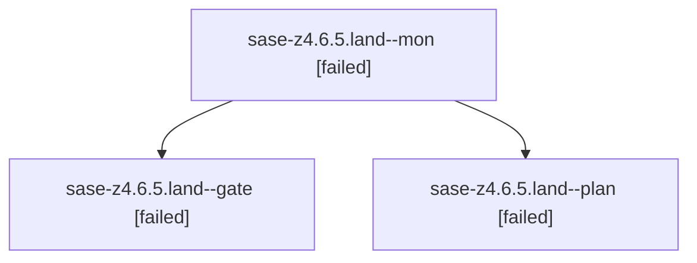

# Family: sase-z4.6.5.land

[Agent Hoods](../README.md) / [bbugyi200](../users/bbugyi200/README.md) / [athena](../users/bbugyi200/machines/athena/README.md) / [sase-z4](../users/bbugyi200/machines/athena/hoods/sase-z4/README.md) / sase-z4.6.5.land

Owner: `bbugyi200.athena` · Hood: `sase-z4` · Members: 3 · Bead: [sase-z4.6.5](https://github.com/sase-org/sase--beads/blob/main/pages/sase-z4/sase-z4.6.5.md)

## Lineage

The diagram is an optional enhancement; the ordered table below contains the same lineage in accessible text.

| Role | Agent | State | Model / provider | Timing | Commits | Prompt | Chat |
|---|---|---|---|---|---:|---|---|
| mon | sase-z4.6.5.land--mon | failed | opus / claude | 2026-09-10T21:42:06.880234+00:00 → 2026-09-10T21:43:56.366583+00:00 | 0 | — | [Chat](../agents/bbugyi200.athena.sase-z4.6.5.land--mon/chat.md) |
| gate | sase-z4.6.5.land--gate | failed | opus / claude | 2026-09-10T21:41:53.240676+00:00 → 2026-09-10T21:42:09.518708+00:00 | 0 | — | [Chat](../agents/bbugyi200.athena.sase-z4.6.5.land--gate/chat.md) |
| plan | sase-z4.6.5.land--plan | failed | opus / claude | 2026-09-10T21:20:05.857570+00:00 → 2026-09-10T21:42:17.298409+00:00 | 0 | [Prompt](../agents/bbugyi200.athena.sase-z4.6.5.land--plan/prompt.md) | [Chat](../agents/bbugyi200.athena.sase-z4.6.5.land--plan/chat.md) |

## Neighbors

| Agent | Relation | State |
|---|---|---|
| [sase-z4.6.5.1](bbugyi200.athena.sase-z4.6.5.1.md) (family · 7) | sase-z4.6.5 hood | completed 4, failed 3 |
| [sase-z4.6.5.2](../agents/bbugyi200.athena.sase-z4.6.5.2/README.md) | sase-z4.6.5 hood | completed |
| [sase-z4.6.5.3](../agents/bbugyi200.athena.sase-z4.6.5.3/README.md) | sase-z4.6.5 hood | completed |
| [sase-z4.6.5.4.1](../agents/bbugyi200.athena.sase-z4.6.5.4.1/README.md) | sase-z4.6.5 hood | active |
| [sase-z4.6.5.4.2](../agents/bbugyi200.athena.sase-z4.6.5.4.2/README.md) | sase-z4.6.5 hood | waiting |
| [sase-z4.6.5.4.3](../agents/bbugyi200.athena.sase-z4.6.5.4.3/README.md) | sase-z4.6.5 hood | waiting |
| [sase-z4.6.5.4.4](../agents/bbugyi200.athena.sase-z4.6.5.4.4/README.md) | sase-z4.6.5 hood | waiting |
| [sase-z4.6.5.4.5](../agents/bbugyi200.athena.sase-z4.6.5.4.5/README.md) | sase-z4.6.5 hood | waiting |
| [sase-z4.6.5.4.land](../agents/bbugyi200.athena.sase-z4.6.5.4.land/README.md) | sase-z4.6.5 hood | waiting |
| [sase-z4.6.1](../agents/bbugyi200.athena.sase-z4.6.1/README.md) | sase-z4.6 hood | completed |
| [sase-z4.6.2](../agents/bbugyi200.athena.sase-z4.6.2/README.md) | sase-z4.6 hood | completed |
| [sase-z4.6.3](../agents/bbugyi200.athena.sase-z4.6.3/README.md) | sase-z4.6 hood | completed |
| [sase-z4.6.4](../agents/bbugyi200.athena.sase-z4.6.4/README.md) | sase-z4.6 hood | completed |
| [sase-z4.6.land](bbugyi200.athena.sase-z4.6.land.md) (family · 3) | sase-z4.6 hood | failed 3 |
| [sase-z4.1](../agents/bbugyi200.athena.sase-z4.1/README.md) | sase-z4 hood | completed |
| [sase-z4.2](../agents/bbugyi200.athena.sase-z4.2/README.md) | sase-z4 hood | completed |
| [sase-z4.3](../agents/bbugyi200.athena.sase-z4.3/README.md) | sase-z4 hood | completed |
| [sase-z4.4](../agents/bbugyi200.athena.sase-z4.4/README.md) | sase-z4 hood | completed |
| [sase-z4.5](../agents/bbugyi200.athena.sase-z4.5/README.md) | sase-z4 hood | completed |
| [sase-z4.land](bbugyi200.athena.sase-z4.land.md) (family · 3) | sase-z4 hood | failed 3 |
