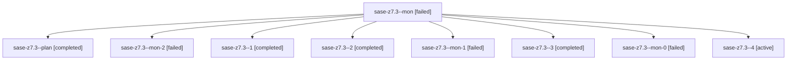

# Family: sase-z7.3

[Agent Hoods](../README.md) / [bbugyi200](../users/bbugyi200/README.md) / [athena](../users/bbugyi200/machines/athena/README.md) / [sase-z7](../users/bbugyi200/machines/athena/hoods/sase-z7/README.md) / sase-z7.3

Owner: `bbugyi200.athena` · Hood: `sase-z7` · Members: 9 · Bead: [sase-z7.3](https://github.com/sase-org/sase--beads/blob/main/pages/sase-z7/sase-z7.3.md)

## Lineage

The diagram is an optional enhancement; the ordered table below contains the same lineage in accessible text.

| Role | Agent | State | Model / provider | Timing | Commits | Prompt | Chat |
|---|---|---|---|---|---:|---|---|
| mon | sase-z7.3--mon | failed | sonnet / claude | 2026-09-10T19:02:53.761797+00:00 → 2026-09-10T19:04:31.856809+00:00 | 0 | — | [Chat](../agents/bbugyi200.athena.sase-z7.3--mon/chat.md) |
| plan | sase-z7.3--plan | completed | sonnet / claude | 2026-09-10T18:21:33.599824+00:00 → 2026-09-10T19:03:15.486763+00:00 | 0 | [Prompt](../agents/bbugyi200.athena.sase-z7.3--plan/prompt.md) | [Chat](../agents/bbugyi200.athena.sase-z7.3--plan/chat.md) |
| mon-2 | sase-z7.3--mon-2 | failed | opus / claude | 2026-09-10T19:18:35.058744+00:00 → 2026-09-10T19:30:54.521378+00:00 | 0 | — | [Chat](../agents/bbugyi200.athena.sase-z7.3--mon-2/chat.md) |
| 1 | sase-z7.3--1 | completed | opus / claude | 2026-09-10T19:06:00.950766+00:00 → 2026-09-10T19:07:28.327891+00:00 | 0 | [Prompt](../agents/bbugyi200.athena.sase-z7.3--1/prompt.md) | [Chat](../agents/bbugyi200.athena.sase-z7.3--1/chat.md) |
| 2 | sase-z7.3--2 | completed | opus / claude | 2026-09-10T19:10:11.077689+00:00 → 2026-09-10T19:11:34.384951+00:00 | 0 | [Prompt](../agents/bbugyi200.athena.sase-z7.3--2/prompt.md) | [Chat](../agents/bbugyi200.athena.sase-z7.3--2/chat.md) |
| mon-1 | sase-z7.3--mon-1 | failed | opus / claude | 2026-09-10T19:11:19.111813+00:00 → 2026-09-10T19:14:09.206405+00:00 | 0 | — | [Chat](../agents/bbugyi200.athena.sase-z7.3--mon-1/chat.md) |
| 3 | sase-z7.3--3 | completed | opus / claude | 2026-09-10T19:15:43.853707+00:00 → 2026-09-10T19:18:52.139288+00:00 | 0 | [Prompt](../agents/bbugyi200.athena.sase-z7.3--3/prompt.md) | [Chat](../agents/bbugyi200.athena.sase-z7.3--3/chat.md) |
| mon-0 | sase-z7.3--mon-0 | failed | opus / claude | 2026-09-10T19:07:11.165820+00:00 → 2026-09-10T19:08:43.884332+00:00 | 0 | — | [Chat](../agents/bbugyi200.athena.sase-z7.3--mon-0/chat.md) |
| 4 | sase-z7.3--4 | active | opus / claude | 2026-09-10T19:32:34.255436+00:00 | [1](../agents/bbugyi200.athena.sase-z7.3--4/README.md#commits) | [Prompt](../agents/bbugyi200.athena.sase-z7.3--4/prompt.md) | — |

## Commits

| Role | Repo | Commit | Subject | Committed |
|---|---|---|---|---|
| 4 | sase | [`1ef9c09`](https://github.com/sase-org/sase/commit/1ef9c092e35cdeba38fed1fa76799dc661d15295) | feat(ace): render compact provider usage window badges | 2026-09-10 16:17:34 EDT |

## Neighbors

| Agent | Relation | State |
|---|---|---|
| [sase-z7.1](../agents/bbugyi200.athena.sase-z7.1/README.md) | sase-z7 hood | completed |
| [sase-z7.2](../agents/bbugyi200.athena.sase-z7.2/README.md) | sase-z7 hood | completed |
| [sase-z7.land](../agents/bbugyi200.athena.sase-z7.land/README.md) | sase-z7 hood | waiting |
