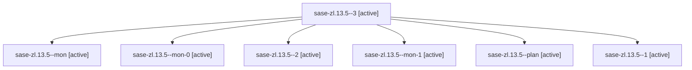

# Family: sase-zl.13.5

[Agent Hoods](../README.md) / [bbugyi200](../users/bbugyi200/README.md) / [athena](../users/bbugyi200/machines/athena/README.md) / [sase-zl](../users/bbugyi200/machines/athena/hoods/sase-zl/README.md) / sase-zl.13.5

Owner: `bbugyi200.athena` · Hood: `sase-zl` · Members: 7 · Bead: [sase-zl.13.5](https://github.com/sase-org/sase--beads/blob/main/pages/sase-zl/sase-zl.13.5.md)

## Lineage

The diagram is an optional enhancement; the ordered table below contains the same lineage in accessible text.

| Role | Agent | State | Model / provider | Timing | Commits | Prompt | Chat |
|---|---|---|---|---|---:|---|---|
| 3 | sase-zl.13.5--3 | active | grok-4.6 / grok | 2026-09-12T08:01:30.796582+00:00 | [1](../agents/bbugyi200.athena.sase-zl.13.5--3/README.md#commits) | [Prompt](../agents/bbugyi200.athena.sase-zl.13.5--3/prompt.md) | [Chat](../agents/bbugyi200.athena.sase-zl.13.5--3/chat.md) |
| mon | sase-zl.13.5--mon | active | grok-4.6 / grok | 2026-09-12T07:24:06.049334+00:00 | 0 | — | [Chat](../agents/bbugyi200.athena.sase-zl.13.5--mon/chat.md) |
| mon-0 | sase-zl.13.5--mon-0 | active | grok-4.6 / grok | 2026-09-12T07:41:03.440950+00:00 | 0 | — | [Chat](../agents/bbugyi200.athena.sase-zl.13.5--mon-0/chat.md) |
| 2 | sase-zl.13.5--2 | active | grok-4.6 / grok | 2026-09-12T07:55:37.994453+00:00 | 0 | [Prompt](../agents/bbugyi200.athena.sase-zl.13.5--2/prompt.md) | [Chat](../agents/bbugyi200.athena.sase-zl.13.5--2/chat.md) |
| mon-1 | sase-zl.13.5--mon-1 | active | grok-4.6 / grok | 2026-09-12T07:59:31.441796+00:00 | 0 | — | [Chat](../agents/bbugyi200.athena.sase-zl.13.5--mon-1/chat.md) |
| plan | sase-zl.13.5--plan | active | grok-4.6 / grok | 2026-09-12T06:45:17.065395+00:00 | 0 | [Prompt](../agents/bbugyi200.athena.sase-zl.13.5--plan/prompt.md) | [Chat](../agents/bbugyi200.athena.sase-zl.13.5--plan/chat.md) |
| 1 | sase-zl.13.5--1 | active | grok-4.6 / grok | 2026-09-12T07:32:37.572488+00:00 | 0 | [Prompt](../agents/bbugyi200.athena.sase-zl.13.5--1/prompt.md) | [Chat](../agents/bbugyi200.athena.sase-zl.13.5--1/chat.md) |

## Commits

| Role | Repo | Commit | Subject | Committed |
|---|---|---|---|---|
| 3 | sase | [`56ceab3`](https://github.com/sase-org/sase/commit/56ceab3f99952c4959717a3230cf4f27e8bdc915) | feat(monitor): reserve and adopt ordinary continuation deliveries | 2026-09-12 04:06:38 EDT |

## Neighbors

| Agent | Relation | State |
|---|---|---|
| [sase-zl.13.1](../agents/bbugyi200.athena.sase-zl.13.1/README.md) | sase-zl.13 hood | active |
| [sase-zl.13.10](bbugyi200.athena.sase-zl.13.10.md) (family · 3) | sase-zl.13 hood | active 3 |
| [sase-zl.13.11.1](../agents/bbugyi200.athena.sase-zl.13.11.1/README.md) | sase-zl.13 hood | active |
| [sase-zl.13.11.2](../agents/bbugyi200.athena.sase-zl.13.11.2/README.md) | sase-zl.13 hood | active |
| [sase-zl.13.11.3](bbugyi200.athena.sase-zl.13.11.3.md) (family · 5) | sase-zl.13 hood | active 5 |
| [sase-zl.13.11.4](../agents/bbugyi200.athena.sase-zl.13.11.4/README.md) | sase-zl.13 hood | active |
| [sase-zl.13.11.5](bbugyi200.athena.sase-zl.13.11.5.md) (family · 9) | sase-zl.13 hood | active 9 |
| [sase-zl.13.11.6](../agents/bbugyi200.athena.sase-zl.13.11.6/README.md) | sase-zl.13 hood | active |
| [sase-zl.13.11.land](bbugyi200.athena.sase-zl.13.11.land.md) (family · 3) | sase-zl.13 hood | active 1, failed 2 |
| [sase-zl.13.2](../agents/bbugyi200.athena.sase-zl.13.2/README.md) | sase-zl.13 hood | active |
| [sase-zl.13.3](../agents/bbugyi200.athena.sase-zl.13.3/README.md) | sase-zl.13 hood | active |
| [sase-zl.13.4](../agents/bbugyi200.athena.sase-zl.13.4/README.md) | sase-zl.13 hood | active |
| [sase-zl.13.6](../agents/bbugyi200.athena.sase-zl.13.6/README.md) | sase-zl.13 hood | active |
| [sase-zl.13.7](../agents/bbugyi200.athena.sase-zl.13.7/README.md) | sase-zl.13 hood | active |
| [sase-zl.13.8](../agents/bbugyi200.athena.sase-zl.13.8/README.md) | sase-zl.13 hood | active |
| [sase-zl.13.9](../agents/bbugyi200.athena.sase-zl.13.9/README.md) | sase-zl.13 hood | active |
| [sase-zl.13.land](bbugyi200.athena.sase-zl.13.land.md) (family · 3) | sase-zl.13 hood | active 3 |
| [sase-zl.1](../agents/bbugyi200.athena.sase-zl.1/README.md) | sase-zl hood | active |
| [sase-zl.10](../agents/bbugyi200.athena.sase-zl.10/README.md) | sase-zl hood | active |
| [sase-zl.11](../agents/bbugyi200.athena.sase-zl.11/README.md) | sase-zl hood | active |
| [sase-zl.12](bbugyi200.athena.sase-zl.12.md) (family · 3) | sase-zl hood | active 3 |
| [sase-zl.2](../agents/bbugyi200.athena.sase-zl.2/README.md) | sase-zl hood | active |
| [sase-zl.3](../agents/bbugyi200.athena.sase-zl.3/README.md) | sase-zl hood | active |
| [sase-zl.4](../agents/bbugyi200.athena.sase-zl.4/README.md) | sase-zl hood | active |
| [sase-zl.5](../agents/bbugyi200.athena.sase-zl.5/README.md) | sase-zl hood | active |
| [sase-zl.6](../agents/bbugyi200.athena.sase-zl.6/README.md) | sase-zl hood | active |
| [sase-zl.7](../agents/bbugyi200.athena.sase-zl.7/README.md) | sase-zl hood | active |
| [sase-zl.8](../agents/bbugyi200.athena.sase-zl.8/README.md) | sase-zl hood | active |
| [sase-zl.9](../agents/bbugyi200.athena.sase-zl.9/README.md) | sase-zl hood | active |
| [sase-zl.land](bbugyi200.athena.sase-zl.land.md) (family · 3) | sase-zl hood | active 3 |
