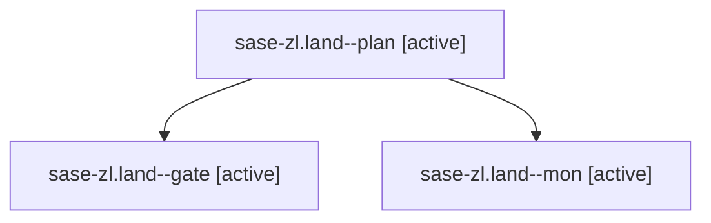

# Family: sase-zl.land

[Agent Hoods](../README.md) / [bbugyi200](../users/bbugyi200/README.md) / [athena](../users/bbugyi200/machines/athena/README.md) / [sase-zl](../users/bbugyi200/machines/athena/hoods/sase-zl/README.md) / sase-zl.land

Owner: `bbugyi200.athena` · Hood: `sase-zl` · Members: 3 · Bead: [sase-zl](https://github.com/sase-org/sase--beads/blob/main/pages/sase-zl/README.md)

## Lineage

The diagram is an optional enhancement; the ordered table below contains the same lineage in accessible text.

| Role | Agent | State | Model / provider | Timing | Commits | Prompt | Chat |
|---|---|---|---|---|---:|---|---|
| plan | sase-zl.land--plan | active | gpt-6-astra / codex | 2026-09-12T03:26:09.378099+00:00 | 0 | [Prompt](../agents/bbugyi200.athena.sase-zl.land--plan/prompt.md) | [Chat](../agents/bbugyi200.athena.sase-zl.land--plan/chat.md) |
| gate | sase-zl.land--gate | active | gpt-6-astra / codex | 2026-09-12T03:43:01.277603+00:00 | 0 | — | [Chat](../agents/bbugyi200.athena.sase-zl.land--gate/chat.md) |
| mon | sase-zl.land--mon | active | gpt-6-astra / codex | 2026-09-12T03:43:16.758432+00:00 | 0 | — | [Chat](../agents/bbugyi200.athena.sase-zl.land--mon/chat.md) |

## Neighbors

| Agent | Relation | State |
|---|---|---|
| [sase-zl.1](../agents/bbugyi200.athena.sase-zl.1/README.md) | sase-zl hood | active |
| [sase-zl.10](../agents/bbugyi200.athena.sase-zl.10/README.md) | sase-zl hood | active |
| [sase-zl.11](../agents/bbugyi200.athena.sase-zl.11/README.md) | sase-zl hood | active |
| [sase-zl.12](bbugyi200.athena.sase-zl.12.md) (family · 3) | sase-zl hood | active 3 |
| [sase-zl.13.1](../agents/bbugyi200.athena.sase-zl.13.1/README.md) | sase-zl hood | active |
| [sase-zl.13.10](bbugyi200.athena.sase-zl.13.10.md) (family · 3) | sase-zl hood | active 3 |
| [sase-zl.13.11.1](../agents/bbugyi200.athena.sase-zl.13.11.1/README.md) | sase-zl hood | active |
| [sase-zl.13.11.2](../agents/bbugyi200.athena.sase-zl.13.11.2/README.md) | sase-zl hood | active |
| [sase-zl.13.11.3](bbugyi200.athena.sase-zl.13.11.3.md) (family · 5) | sase-zl hood | active 5 |
| [sase-zl.13.11.4](../agents/bbugyi200.athena.sase-zl.13.11.4/README.md) | sase-zl hood | active |
| [sase-zl.13.11.5](bbugyi200.athena.sase-zl.13.11.5.md) (family · 9) | sase-zl hood | active 9 |
| [sase-zl.13.11.6](../agents/bbugyi200.athena.sase-zl.13.11.6/README.md) | sase-zl hood | active |
| [sase-zl.13.11.land](bbugyi200.athena.sase-zl.13.11.land.md) (family · 3) | sase-zl hood | active 1, failed 2 |
| [sase-zl.13.2](../agents/bbugyi200.athena.sase-zl.13.2/README.md) | sase-zl hood | active |
| [sase-zl.13.3](../agents/bbugyi200.athena.sase-zl.13.3/README.md) | sase-zl hood | active |
| [sase-zl.13.4](../agents/bbugyi200.athena.sase-zl.13.4/README.md) | sase-zl hood | active |
| [sase-zl.13.5](bbugyi200.athena.sase-zl.13.5.md) (family · 7) | sase-zl hood | active 7 |
| [sase-zl.13.6](../agents/bbugyi200.athena.sase-zl.13.6/README.md) | sase-zl hood | active |
| [sase-zl.13.7](../agents/bbugyi200.athena.sase-zl.13.7/README.md) | sase-zl hood | active |
| [sase-zl.13.8](../agents/bbugyi200.athena.sase-zl.13.8/README.md) | sase-zl hood | active |
| [sase-zl.13.9](../agents/bbugyi200.athena.sase-zl.13.9/README.md) | sase-zl hood | active |
| [sase-zl.13.land](bbugyi200.athena.sase-zl.13.land.md) (family · 3) | sase-zl hood | active 3 |
| [sase-zl.2](../agents/bbugyi200.athena.sase-zl.2/README.md) | sase-zl hood | active |
| [sase-zl.3](../agents/bbugyi200.athena.sase-zl.3/README.md) | sase-zl hood | active |
| [sase-zl.4](../agents/bbugyi200.athena.sase-zl.4/README.md) | sase-zl hood | active |
| [sase-zl.5](../agents/bbugyi200.athena.sase-zl.5/README.md) | sase-zl hood | active |
| [sase-zl.6](../agents/bbugyi200.athena.sase-zl.6/README.md) | sase-zl hood | active |
| [sase-zl.7](../agents/bbugyi200.athena.sase-zl.7/README.md) | sase-zl hood | active |
| [sase-zl.8](../agents/bbugyi200.athena.sase-zl.8/README.md) | sase-zl hood | active |
| [sase-zl.9](../agents/bbugyi200.athena.sase-zl.9/README.md) | sase-zl hood | active |
