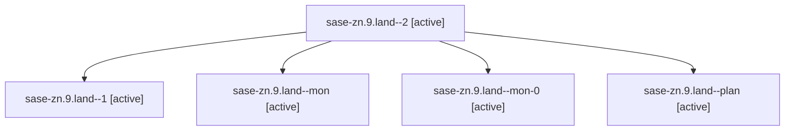

# Family: sase-zn.9.land

[Agent Hoods](../README.md) / [bbugyi200](../users/bbugyi200/README.md) / [athena](../users/bbugyi200/machines/athena/README.md) / [sase-zn](../users/bbugyi200/machines/athena/hoods/sase-zn/README.md) / sase-zn.9.land

Owner: `bbugyi200.athena` · Hood: `sase-zn` · Members: 5 · Bead: [sase-zn.9](https://github.com/sase-org/sase--beads/blob/main/pages/sase-zn/sase-zn.9.md)

## Lineage

The diagram is an optional enhancement; the ordered table below contains the same lineage in accessible text.

| Role | Agent | State | Model / provider | Timing | Commits | Prompt | Chat |
|---|---|---|---|---|---:|---|---|
| 2 | sase-zn.9.land--2 | active | claude-fable-5 / claude | 2026-09-14T12:10:06.905511+00:00 | [1](../agents/bbugyi200.athena.sase-zn.9.land--2/README.md#commits) | [Prompt](../agents/bbugyi200.athena.sase-zn.9.land--2/prompt.md) | [Chat](../agents/bbugyi200.athena.sase-zn.9.land--2/chat.md) |
| 1 | sase-zn.9.land--1 | active | claude-fable-5 / claude | 2026-09-14T11:39:50.709774+00:00 | 0 | [Prompt](../agents/bbugyi200.athena.sase-zn.9.land--1/prompt.md) | [Chat](../agents/bbugyi200.athena.sase-zn.9.land--1/chat.md) |
| mon | sase-zn.9.land--mon | active | claude-fable-5 / claude | 2026-09-14T11:36:13.045640+00:00 | 0 | — | [Chat](../agents/bbugyi200.athena.sase-zn.9.land--mon/chat.md) |
| mon-0 | sase-zn.9.land--mon-0 | active | claude-fable-5 / claude | 2026-09-14T11:45:21.122168+00:00 | 0 | — | [Chat](../agents/bbugyi200.athena.sase-zn.9.land--mon-0/chat.md) |
| plan | sase-zn.9.land--plan | active | claude-fable-5 / claude | 2026-09-14T11:12:52.750115+00:00 | 0 | [Prompt](../agents/bbugyi200.athena.sase-zn.9.land--plan/prompt.md) | [Chat](../agents/bbugyi200.athena.sase-zn.9.land--plan/chat.md) |

## Commits

| Role | Repo | Commit | Subject | Committed |
|---|---|---|---|---|
| 2 | sase | [`8987960`](https://github.com/sase-org/sase/commit/89879609d10a65c49c5cec2e591458455bfc3be5) | refactor(core): land sase-zn.9 typing-lag epic integration | 2026-09-14 09:08:21 EDT |

## Neighbors

| Agent | Relation | State |
|---|---|---|
| [sase-zn.9.1](../agents/bbugyi200.athena.sase-zn.9.1/README.md) | sase-zn.9 hood | active |
| [sase-zn.9.2](../agents/bbugyi200.athena.sase-zn.9.2/README.md) | sase-zn.9 hood | active |
| [sase-zn.9.3](../agents/bbugyi200.athena.sase-zn.9.3/README.md) | sase-zn.9 hood | active |
| [sase-zn.9.4](../agents/bbugyi200.athena.sase-zn.9.4/README.md) | sase-zn.9 hood | active |
| [sase-zn.9.5](../agents/bbugyi200.athena.sase-zn.9.5/README.md) | sase-zn.9 hood | active |
| [sase-zn.1](../agents/bbugyi200.athena.sase-zn.1/README.md) | sase-zn hood | active |
| [sase-zn.2](../agents/bbugyi200.athena.sase-zn.2/README.md) | sase-zn hood | active |
| [sase-zn.3](../agents/bbugyi200.athena.sase-zn.3/README.md) | sase-zn hood | active |
| [sase-zn.4](../agents/bbugyi200.athena.sase-zn.4/README.md) | sase-zn hood | active |
| [sase-zn.5](../agents/bbugyi200.athena.sase-zn.5/README.md) | sase-zn hood | active |
| [sase-zn.6](../agents/bbugyi200.athena.sase-zn.6/README.md) | sase-zn hood | active |
| [sase-zn.7](../agents/bbugyi200.athena.sase-zn.7/README.md) | sase-zn hood | active |
| [sase-zn.8](../agents/bbugyi200.athena.sase-zn.8/README.md) | sase-zn hood | active |
| [sase-zn.land](bbugyi200.athena.sase-zn.land.md) (family · 3) | sase-zn hood | active 3 |
| [sase-zn.land](../agents/bbugyi200.athena.sase-zn.land/README.md) | sase-zn hood | waiting |
