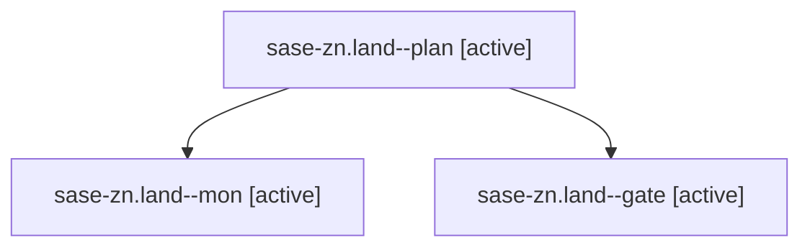

# Family: sase-zn.land

[Agent Hoods](../README.md) / [bbugyi200](../users/bbugyi200/README.md) / [athena](../users/bbugyi200/machines/athena/README.md) / [sase-zn](../users/bbugyi200/machines/athena/hoods/sase-zn/README.md) / sase-zn.land

Owner: `bbugyi200.athena` · Hood: `sase-zn` · Members: 3 · Bead: [sase-zn](https://github.com/sase-org/sase--beads/blob/main/pages/sase-zn/README.md)

## Lineage

The diagram is an optional enhancement; the ordered table below contains the same lineage in accessible text.

| Role | Agent | State | Model / provider | Timing | Commits | Prompt | Chat |
|---|---|---|---|---|---:|---|---|
| plan | sase-zn.land--plan | active | gpt-6-astra / codex | 2026-09-12T21:06:13.787351+00:00 | 0 | [Prompt](../agents/bbugyi200.athena.sase-zn.land--plan/prompt.md) | [Chat](../agents/bbugyi200.athena.sase-zn.land--plan/chat.md) |
| mon | sase-zn.land--mon | active | gpt-6-astra / codex | 2026-09-12T21:28:56.420488+00:00 | 0 | — | [Chat](../agents/bbugyi200.athena.sase-zn.land--mon/chat.md) |
| gate | sase-zn.land--gate | active | gpt-6-astra / codex | 2026-09-12T21:28:37.071206+00:00 | 0 | — | [Chat](../agents/bbugyi200.athena.sase-zn.land--gate/chat.md) |

## Neighbors

| Agent | Relation | State |
|---|---|---|
| [sase-zn.1](../agents/bbugyi200.athena.sase-zn.1/README.md) | sase-zn hood | active |
| [sase-zn.2](../agents/bbugyi200.athena.sase-zn.2/README.md) | sase-zn hood | active |
| [sase-zn.3](../agents/bbugyi200.athena.sase-zn.3/README.md) | sase-zn hood | active |
| [sase-zn.4](../agents/bbugyi200.athena.sase-zn.4/README.md) | sase-zn hood | active |
| [sase-zn.5](../agents/bbugyi200.athena.sase-zn.5/README.md) | sase-zn hood | active |
| [sase-zn.6](../agents/bbugyi200.athena.sase-zn.6/README.md) | sase-zn hood | active |
| [sase-zn.7](../agents/bbugyi200.athena.sase-zn.7/README.md) | sase-zn hood | active |
| [sase-zn.8](../agents/bbugyi200.athena.sase-zn.8/README.md) | sase-zn hood | active |
| [sase-zn.9.1](../agents/bbugyi200.athena.sase-zn.9.1/README.md) | sase-zn hood | active |
| [sase-zn.9.2](../agents/bbugyi200.athena.sase-zn.9.2/README.md) | sase-zn hood | active |
| [sase-zn.9.3](../agents/bbugyi200.athena.sase-zn.9.3/README.md) | sase-zn hood | active |
| [sase-zn.9.4](../agents/bbugyi200.athena.sase-zn.9.4/README.md) | sase-zn hood | active |
| [sase-zn.9.5](../agents/bbugyi200.athena.sase-zn.9.5/README.md) | sase-zn hood | active |
| [sase-zn.9.land](bbugyi200.athena.sase-zn.9.land.md) (family · 5) | sase-zn hood | active 5 |
