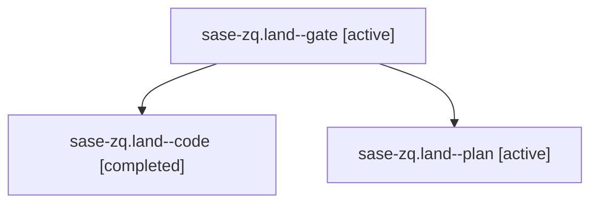

# Family: sase-zq.land

[Agent Hoods](../README.md) / [bbugyi200](../users/bbugyi200/README.md) / [athena](../users/bbugyi200/machines/athena/README.md) / [sase-zq](../users/bbugyi200/machines/athena/hoods/sase-zq/README.md) / sase-zq.land

Owner: `bbugyi200.athena` · Hood: `sase-zq` · Members: 3 · Bead: [sase-zq](https://github.com/sase-org/sase--beads/blob/main/pages/sase-zq/README.md)

## Lineage

The diagram is an optional enhancement; the ordered table below contains the same lineage in accessible text.

| Role | Agent | State | Model / provider | Timing | Commits | Prompt | Chat |
|---|---|---|---|---|---:|---|---|
| gate | sase-zq.land--gate | active | gpt-5.6-sol / codex | 2026-09-12T17:46:32.143484+00:00 | 0 | — | [Chat](../agents/bbugyi200.athena.sase-zq.land--gate/chat.md) |
| code | sase-zq.land--code | completed | gpt-5.5 / codex | 2026-09-12T17:46:55.575412+00:00 → 2026-09-12T19:10:51.789067+00:00 | [1](../agents/bbugyi200.athena.sase-zq.land--code/README.md#commits) | — | [Chat](../agents/bbugyi200.athena.sase-zq.land--code/chat.md) |
| plan | sase-zq.land--plan | active | gpt-5.6-sol / codex | 2026-09-12T17:20:24.375039+00:00 | 0 | [Prompt](../agents/bbugyi200.athena.sase-zq.land--plan/prompt.md) | [Chat](../agents/bbugyi200.athena.sase-zq.land--plan/chat.md) |

## Commits

| Role | Repo | Commit | Subject | Committed |
|---|---|---|---|---|
| code | sase | [`92f99bc`](https://github.com/sase-org/sase/commit/92f99bc14ce9b8e72f83c98c9f7c6f396439ad79) | fix(final): finish explicit bead action integration | 2026-09-12 15:09:26 EDT |

## Neighbors

| Agent | Relation | State |
|---|---|---|
| [sase-zq.1](../agents/bbugyi200.athena.sase-zq.1/README.md) | sase-zq hood | active |
| [sase-zq.2](../agents/bbugyi200.athena.sase-zq.2/README.md) | sase-zq hood | active |
| [sase-zq.3](../agents/bbugyi200.athena.sase-zq.3/README.md) | sase-zq hood | active |
