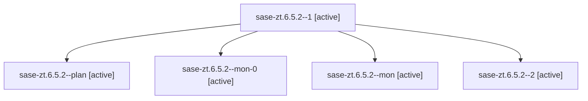

# Family: sase-zt.6.5.2

[Agent Hoods](../README.md) / [bbugyi200](../users/bbugyi200/README.md) / [athena](../users/bbugyi200/machines/athena/README.md) / [sase-zt](../users/bbugyi200/machines/athena/hoods/sase-zt/README.md) / sase-zt.6.5.2

Owner: `bbugyi200.athena` · Hood: `sase-zt` · Members: 5 · Bead: [sase-zt.6.5.2](https://github.com/sase-org/sase--beads/blob/main/pages/sase-zt/sase-zt.6.5.2.md)

## Lineage

The diagram is an optional enhancement; the ordered table below contains the same lineage in accessible text.

| Role | Agent | State | Model / provider | Timing | Commits | Prompt | Chat |
|---|---|---|---|---|---:|---|---|
| 1 | sase-zt.6.5.2--1 | active | grok-4.6 / grok | 2026-09-13T19:25:36.789070+00:00 | 0 | [Prompt](../agents/bbugyi200.athena.sase-zt.6.5.2--1/prompt.md) | [Chat](../agents/bbugyi200.athena.sase-zt.6.5.2--1/chat.md) |
| plan | sase-zt.6.5.2--plan | active | grok-4.6 / grok | 2026-09-13T18:54:16.215064+00:00 | 0 | [Prompt](../agents/bbugyi200.athena.sase-zt.6.5.2--plan/prompt.md) | [Chat](../agents/bbugyi200.athena.sase-zt.6.5.2--plan/chat.md) |
| mon-0 | sase-zt.6.5.2--mon-0 | active | grok-4.6 / grok | 2026-09-13T19:36:29.381612+00:00 | 0 | — | [Chat](../agents/bbugyi200.athena.sase-zt.6.5.2--mon-0/chat.md) |
| mon | sase-zt.6.5.2--mon | active | grok-4.6 / grok | 2026-09-13T19:11:09.727346+00:00 | 0 | — | [Chat](../agents/bbugyi200.athena.sase-zt.6.5.2--mon/chat.md) |
| 2 | sase-zt.6.5.2--2 | active | gpt-5.5 / codex | 2026-09-13T19:54:39.556634+00:00 | [1](../agents/bbugyi200.athena.sase-zt.6.5.2--2/README.md#commits) | [Prompt](../agents/bbugyi200.athena.sase-zt.6.5.2--2/prompt.md) | [Chat](../agents/bbugyi200.athena.sase-zt.6.5.2--2/chat.md) |

## Commits

| Role | Repo | Commit | Subject | Committed |
|---|---|---|---|---|
| 2 | sase | [`3224d46`](https://github.com/sase-org/sase/commit/3224d4611d43a88be0ec4849693ee574b1c95ea9) | fix(agent): preserve launch approval queue capacity | 2026-09-13 16:31:14 EDT |

## Neighbors

| Agent | Relation | State |
|---|---|---|
| [sase-zt.6.5.1](../agents/bbugyi200.athena.sase-zt.6.5.1/README.md) | sase-zt.6.5 hood | active |
| [sase-zt.6.5.3](bbugyi200.athena.sase-zt.6.5.3.md) (family · 10) | sase-zt.6.5 hood | active 10 |
| [sase-zt.6.5.4.1](../agents/bbugyi200.athena.sase-zt.6.5.4.1/README.md) | sase-zt.6.5 hood | active |
| [sase-zt.6.5.4.2](../agents/bbugyi200.athena.sase-zt.6.5.4.2/README.md) | sase-zt.6.5 hood | active |
| [sase-zt.6.5.4.3](bbugyi200.athena.sase-zt.6.5.4.3.md) (family · 3) | sase-zt.6.5 hood | active 3 |
| [sase-zt.6.5.4.land](../agents/bbugyi200.athena.sase-zt.6.5.4.land/README.md) | sase-zt.6.5 hood | active |
| [sase-zt.6.5.land](bbugyi200.athena.sase-zt.6.5.land.md) (family · 3) | sase-zt.6.5 hood | active 3 |
| [sase-zt.6.1](../agents/bbugyi200.athena.sase-zt.6.1/README.md) | sase-zt.6 hood | active |
| [sase-zt.6.2](../agents/bbugyi200.athena.sase-zt.6.2/README.md) | sase-zt.6 hood | active |
| [sase-zt.6.3](../agents/bbugyi200.athena.sase-zt.6.3/README.md) | sase-zt.6 hood | active |
| [sase-zt.6.4](../agents/bbugyi200.athena.sase-zt.6.4/README.md) | sase-zt.6 hood | active |
| [sase-zt.6.land](bbugyi200.athena.sase-zt.6.land.md) (family · 3) | sase-zt.6 hood | active 3 |
| [sase-zt.1](../agents/bbugyi200.athena.sase-zt.1/README.md) | sase-zt hood | active |
| [sase-zt.2](../agents/bbugyi200.athena.sase-zt.2/README.md) | sase-zt hood | active |
| [sase-zt.3](../agents/bbugyi200.athena.sase-zt.3/README.md) | sase-zt hood | active |
| [sase-zt.4](../agents/bbugyi200.athena.sase-zt.4/README.md) | sase-zt hood | active |
| [sase-zt.5](bbugyi200.athena.sase-zt.5.md) (family · 4) | sase-zt hood | active 4 |
| [sase-zt.land](bbugyi200.athena.sase-zt.land.md) (family · 3) | sase-zt hood | active 3 |
